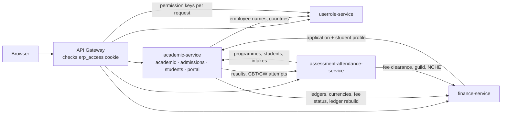
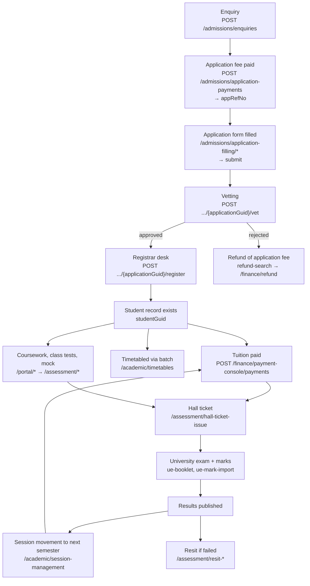
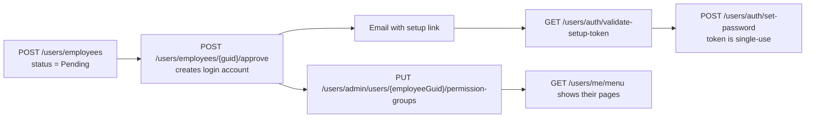
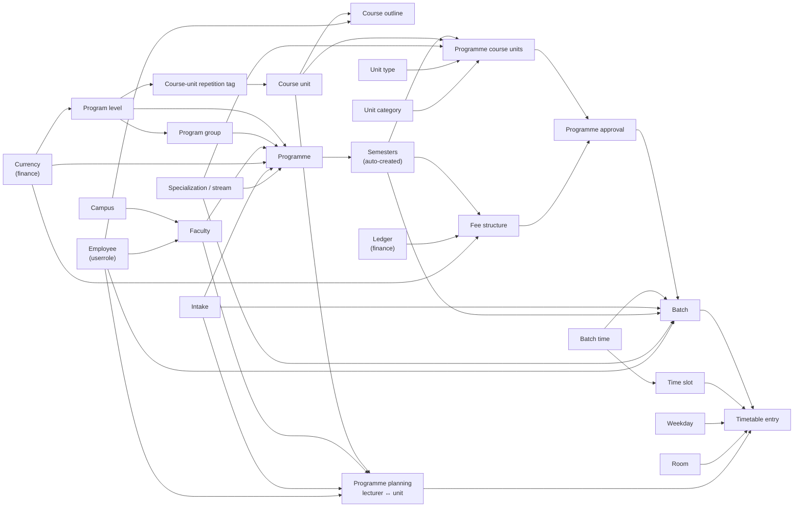
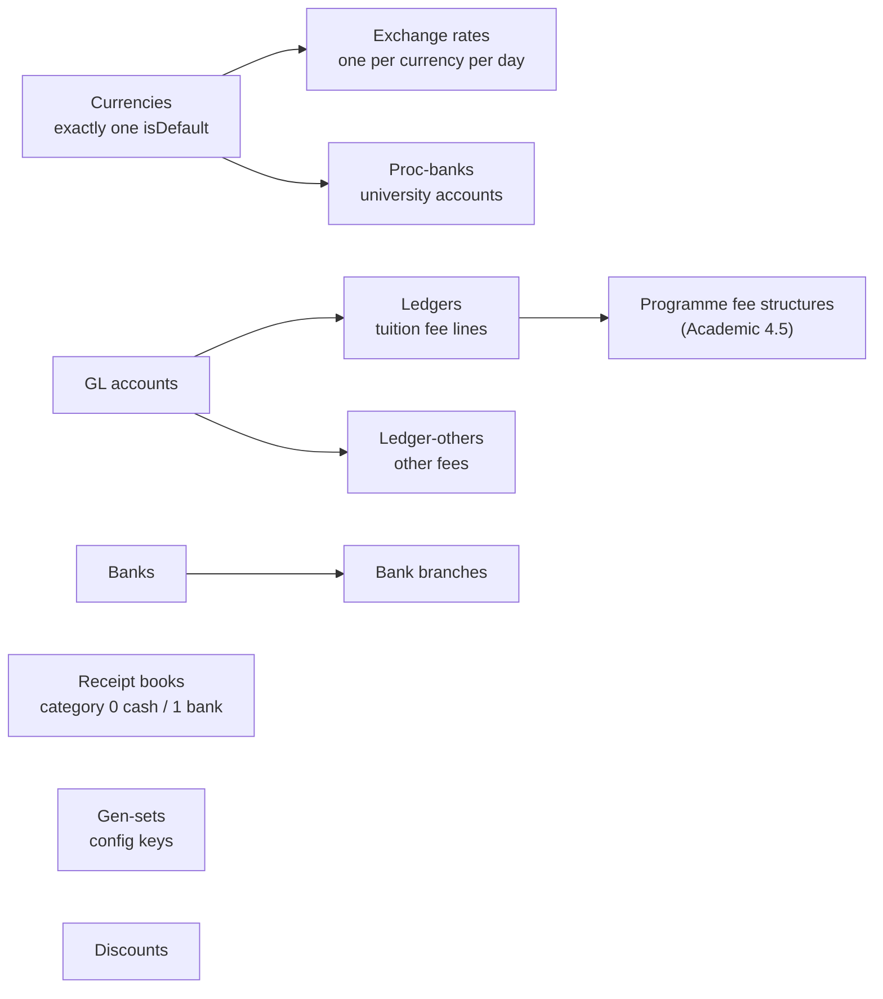
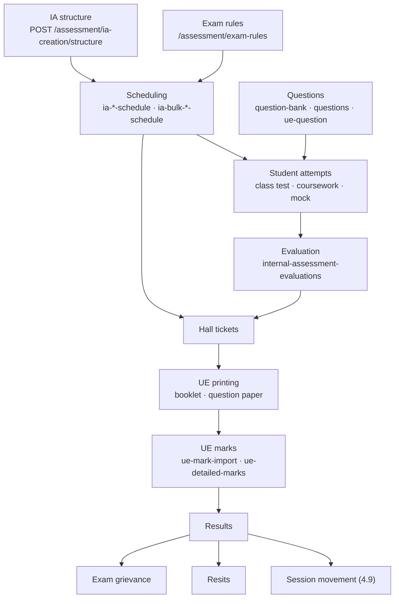
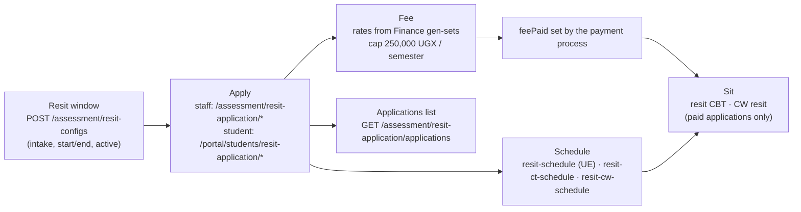

# ISBAT ERP — API Flows and How They Connect

A walkthrough of the ERP backend as documented in [`erp-docs/`](../erp-docs/): what each group of APIs is for, the order they are called in, and which IDs pass from one call to the next. The full list of all 842 endpoints is in the [Appendix](#appendix--every-endpoint).

**Source:** `erp-docs/api` (endpoint docs) and `erp-docs/pages` (screen flows), read on 2026-09-28. When this file and those docs disagree, the docs win.

**Path convention:** every path below starts with `/api/v1`, which is left out to keep lines short. `POST /academic/batches` means `POST /api/v1/academic/batches`. The two exceptions are written in full: `/hubs/notifications` (a SignalR hub) and `/api/academic/session-batches/eligible` (no `v1`).

---

## Contents

1. [The big picture](#1-the-big-picture)
2. [Rules that apply to every API](#2-rules-that-apply-to-every-api)
3. [Login, staff and permissions](#3-login-staff-and-permissions-userrole-service)
4. [Academic setup: building a programme](#4-academic-setup-building-a-programme)
5. [Admissions: from enquiry to student](#5-admissions-from-enquiry-to-student)
6. [Students: changes after registration](#6-students-changes-after-registration)
7. [Finance: taking and returning money](#7-finance-taking-and-returning-money)
8. [Assessment: exams, marks and resits](#8-assessment-exams-marks-and-resits)
9. [Student portal: what the student calls](#9-student-portal-what-the-student-calls)
10. [Shared: audit log and notifications](#10-shared-audit-log-and-notifications)
11. [Cross-service call map](#11-cross-service-call-map)
12. [Gaps and inconsistencies in the docs](#12-gaps-and-inconsistencies-in-the-docs)
13. [Appendix — every endpoint](#appendix--every-endpoint)

---

## 1. The big picture

The browser talks only to the **API gateway**. The gateway checks the login cookie and forwards each call to one of four services:

| Service | Path prefixes | Owns |
|---|---|---|
| `erp-userrole-service` | `/users/*`, `/notifications/*` | Login, employees, permission groups, menus, notifications, countries/departments |
| `erp-academic-service` | `/academic/*`, `/admissions/*`, `/students/*`, `/portal/*` | Programmes, intakes, batches, timetables; enquiries and applications; student records; the student portal |
| `erp-finance-service` | `/finance/*` | Currencies, ledgers, receipt books, all payments, refunds, fee status |
| `erp-assessment-attendance-service` | `/assessment/*`, `/attendance/*` | Exam rules, questions, IA structure, scheduling, CBT/coursework attempts, marks, hall tickets, resits |

The services call each other to resolve names and check rules. For example, Academic asks Userrole for a dean's name, and Assessment asks Finance whether a student has paid before issuing a hall ticket. Those calls are listed in [section 11](#11-cross-service-call-map).



### The life of one student, end to end

This is the main chain the whole system is built around. Every later section is one part of it.



Two IDs carry a person through that chain, and it matters which one an API asks for:

| ID | Created by | Used by |
|---|---|---|
| `applicationGuid` | Application payment / application form | Admissions, **and all Finance payment APIs**. Finance keys money to the application, not the student. |
| `studentGuid` | Registrar desk registration | Students, Assessment and the portal. Finance also accepts it as an optional extra. |

`appRefNo` is the human-readable application number that unlocks the application form. `intApplication` is an internal integer that a few application-form endpoints still use in their path.

### "Current intake" is two different things

Many APIs never ask which intake to use. The server looks it up from two flags on the intake record:

| Flag | Meaning | Used by |
|---|---|---|
| `currentIntake = true` | The academic cycle being taught now | Session movement, electives, resits, CBT dashboards, timetables |
| `currentAdmissionIntake = true` | The cycle currently admitting students | Batch summary, bulk calendar update, current-intake applicants |

Both flags are set on the Intake screen (`PUT /academic/intakes/{guid}`). The API does not stop two intakes from both being marked current, so the screen has to warn about it.

---

## 2. Rules that apply to every API

- **Response wrapper.** Every response is `{ success, data, message, code, errors }`. The docs only describe `data`. On failure, `errors` is a flat list of human-readable strings and `code` is one of `validation_error`, `not_found`, `conflict`, `unauthorized`, `bad_request`, `server_error`.
- **Auth is a cookie.** Login sets HttpOnly `erp_access` and `erp_refresh` cookies. Send requests with credentials included and no `Authorization` header. A `401` means the cookie is missing or expired, so call `POST /users/auth/refresh` and retry.
- **IDs are GUIDs.** Almost every record is addressed by a GUID. The exceptions are departments, designations, countries (on PUT/DELETE), skill catalog, academic skills and a few application-form paths, which use integers.
- **The six-endpoint pattern.** Most master tables have: `GET` list (paged, with `search`), `GET /{guid}`, `GET /dropdown` (unpaged, `{guid, name}`), `POST`, `PUT /{guid}`, `DELETE /{guid}`. When a flow below says "pick X", it means X's `/dropdown` endpoint.
- **Deletes are soft.** Rows get `isDeleted = true` and vanish from lists. Only a few deletes check whether the row is still in use (program levels, course units, course-unit repetition tags, batches, discounts). **Receipt books are the one hard delete.**
- **Bulk lookups.** `POST .../by-guids`, `.../names-by-guids` and `.../names` endpoints exist so one call can label a whole grid instead of one call per row. Most of them are used between services, but the frontend can use them too.
- **`/internal/*` endpoints** are service-to-service. The browser should not call them.
- **Audit.** Every write is recorded automatically. See [section 10](#10-shared-audit-log-and-notifications).

---

## 3. Login, staff and permissions (userrole-service)

### 3.1 Logging in

```
POST /users/auth/login                 → sets cookies, returns UserDto
   └─ error password_expired → POST /users/auth/change-expired-password (logs in on success)
GET  /users/me/menu                    → sidebar tree (Module → Sub-module → Page) the user may see
...every request: gateway calls GET /users/internal/permissions/{userId} to load permission keys
POST /users/auth/refresh               → on 401, rotates both cookies (no body)
POST /users/auth/logout                → always succeeds, clears cookies
```

- Tokens are never in the JSON. Only the cookies carry them.
- The menu and the permission keys are both computed from the user's **permission groups** (3.3), so changing a group changes both on the next request.

### 3.2 Forgot password

1. `POST /users/auth/forgot-password`: always returns success, with a masked email (or an empty string if no account matched). An OTP is emailed and expires after 10 minutes.
2. `POST /users/auth/reset-password`: sends the OTP and a new password. It allows 3 attempts, then the OTP locks. On success **every existing session for that user is revoked**.

### 3.3 Onboarding a staff member



- A **Pending** employee has no login and **does not appear** in `GET /users/employees/dropdown` (which defaults to `isApproved=true`). That dropdown is used across the ERP for Dean, HOD, batch in-charge, lecturer and "taught by" pickers, so a new lecturer can't be selected anywhere until approved.
- `PUT /users/employees/{guid}`, `PUT .../block` and `DELETE` only work on **Active** employees (Pending or Blocked returns 404). `GET /users/employees/{guid}` can see all of them.
- Permission groups are assigned per employee but stored on their login account, so an employee must be approved before they can get groups.

### 3.4 Permission groups

1. `GET /users/admin/permission-groups/permissions` returns the full catalogue as a Module → Sub-module → Page → permission tree, for the checkbox editor.
2. `POST /users/admin/permission-groups` / `PUT /users/admin/permission-groups/{guid}` save the group. PUT **replaces** the whole permission set.
3. `PUT /users/admin/users/{employeeGuid}/permission-groups` **replaces** the employee's group list. `GET` on the same path reads it.
4. Deleting a group does **not** remove it from employees who have it.

Permission keys look like `assessment.resitschedule.save`. Several page docs list which key each button needs.

### 3.5 Lecturer skills

`GET /users/skill-catalog` (master list of skill names) → `POST /users/skills` (employee claims skills, status Pending) → `GET /users/skills/pending` (dean's queue) → `PUT /users/skills/{guid}/approve` with `isApproved: true|false` (one endpoint for approve and reject). `PUT /users/skills` replaces one employee's whole set.

The academic service has its own separate skill list (`/academic/skills`), which is used for tagging course units.

### 3.6 Reference lists

- **Departments → Designations**: both use integer IDs. A designation belongs to one department.
- **Countries**: `GET /users/countries/dropdown` is the picker used by Admissions. `POST /users/countries/by-guids` labels enquiry grids.
- **Districts → Counties**: read-only, and not linked to countries.

### 3.7 Bulk email

`POST /notifications/bulk-email` queues a send to students and/or employees, and a background worker sends it. Follow it with `GET /notifications/bulk-email` (list) → `GET /notifications/bulk-email/{jobGuid}` (detail) → `GET .../{jobGuid}/recipients` (per-person status and errors).

---

## 4. Academic setup: building a programme

### 4.1 What depends on what

Create things in this order. Each arrow means the thing on the right needs a GUID from the thing on the left.



### 4.2 Simple masters (six-endpoint pattern)

| Resource | Path | Needs | Notes |
|---|---|---|---|
| Campus | `/academic/campus` | — | `POST /academic/campus/by-guids` for bulk labels |
| Faculty | `/academic/faculties` | `campusGuid`, `deanEmployeeGuid` | Dean from `GET /users/employees/dropdown`. Duplicate code returns 409. PUT returns only `true`, so update the row locally. |
| Program level | `/academic/program-levels` | `currencyGuid` (checked with Finance) | Holds `yearCount` (so `semCount`), `appFee`, `lateFee`. Delete is blocked while in use. |
| Program group | `/academic/program-groups` | `programLevelGuid` | Delete does not check programmes |
| Specialization (stream) | `/academic/specializations` | — | Can filter by programme/semester |
| Unit type | `/academic/unit-types` | — | How it is taught (Lecture, Practical…) |
| Unit category | `/academic/unit-categories` | — | Its role (Core, Elective…). "Elective" drives the electives screen. |
| Repetition tag | `/academic/course-unit-repetitions` | `programLevelGuid` | Delete returns `tag_in_use` if a course unit uses it |
| Skills | `/academic/skills` | — | Integer id |
| Batch time | `/academic/batchtimes` | — | Morning/Evening/Weekend… |
| Time slot | `/academic/timeslots` | `batchTimeGuid` | Dropdown filters by batch time |
| Weekday | `/academic/weekdays` | — | 7 rows |
| Room | `/academic/rooms` | — | PUT clears `location`/`capacity` if omitted |

### 4.3 Intake (academic calendar)

`GET /academic/intakes` (filters: `currentIntake`, `currentAdmissionIntake`, `search`) → `GET /academic/intakes/{guid}` (with calendar) → `POST` / `PUT /academic/intakes/{guid}` → `DELETE`.

An intake carries a list of semester calendars (`semCode`, semester/term/exam/resit/grievance dates). `durationInWeeks` limits each `semesterEndDate`.

**Bulk calendar edit:** `GET /academic/intakes/calendar-batch` returns up to 8 semester rows for the current admission intake. `PATCH /academic/intakes/calendar-batch` applies the same dates to the ticked rows, and if any GUID is stale the whole request fails with 404.

### 4.4 Course units

1. `GET /academic/courseunits` for the list.
2. While typing code/name: `GET /academic/courseunits/check-availability` (pass `excludeGuid` when editing). A duplicate code blocks saving; a duplicate name is only a warning.
3. `POST /academic/courseunits` / `PUT /academic/courseunits/{guid}` as **multipart** (optional syllabus file). Weightages must add up to 100. `Mid` is set by the server.
4. Then the outline: `GET` and `PUT /academic/courseunit-outlines/by-courseunit/{courseUnitGuid}`. The PUT sends the whole chapter/topic tree and the server works out the differences: rows with a GUID are updated, rows without one are created, and missing rows are deleted. "Taught by" comes from `GET /users/employees/dropdown`.
5. `GET /academic/courseunits/{guid}/details` returns unit and outline in one call.
6. `DELETE` is blocked while the unit is assigned to an active programme.

### 4.5 Programme (the central record)

**Create, step by step:**

1. `GET /academic/program-master/fee-lookup/{programLevelGuid}` pre-fills `appFee`/`lateFee` when a level is picked.
2. `POST /academic/program-master` with `programLevelGuid`, `programGroupGuid`, `facultyGuid`, `currencyGuid`, `streamGuid`, `intakeGuid` and more. The response contains **auto-generated `semesters[]` with their `semesterGuid`s. Keep these**, because steps 3 and 4 need them.
3. `POST /academic/program-course-units`: attach course units per `semesterGuid` (plus stream, unit type, unit category).
4. `POST /academic/Programfee-structure/hd/save-complete`: fee header plus lines, each with `ledgerGuid` and `currencyGuid` (from Finance) and a `semesterGuid`. Or copy an existing one with `POST .../hd/copy`.

**Or all at once:** `POST /academic/program-master/save-complete` (and `PUT .../{programGuid}/update-complete` to edit).

**Approval** (a programme stays hidden until approved):

1. `GET /academic/program-master/not-approved` lists the queue.
2. `GET /academic/program-master/{programGuid}/full-details` returns header, units by semester, and fees with ledger/currency names resolved by Finance.
3. `PUT /academic/program-approval` with `isApproved: true|false`. Rejecting sends the programme back to the queue; there is no separate "rejected" state.

After approval the programme appears in `GET /academic/program-master` and in all programme dropdowns: `GET /academic/program-master/dropdown` (optionally filtered by faculty) and `GET /academic/program-master/by-campus/{campusGuid}`.

**Editing parts separately:**

| Change | Call |
|---|---|
| Header only | `PUT /academic/program-master/{programGuid}` |
| All course units | `PUT /academic/program-course-units/{programGuid}` (replaces the set) |
| One course unit link | `PUT /academic/program-course-units` · remove: `DELETE /academic/program-course-units` |
| Fee header plus lines | `GET .../hd/{feeHdGuid}/complete` → `PUT .../hd/{feeHdGuid}/update-complete` |
| Delete fee structure | `DELETE .../hd/{feeHdGuid}/delete-complete` |
| Delete programme | `DELETE /academic/program-master/{programGuid}/delete-complete`. The plain `DELETE .../{programGuid}` hides only the header and leaves its units and fees active. |

**Semester lookups** used everywhere afterwards: `GET /academic/semesters/dropdownforprogram?programGuid=` and `GET /academic/semesters/first-for-program/{programGuid}`.

**Electives:** pick programme → semester → `GET /academic/program-unit-electives/dropdown` (only units whose category is "Elective") → `POST /academic/program-unit-electives` with `{ programUnitGuid, intakeGuid }`, where the intake is the current intake and the user doesn't choose it. List with `GET /academic/program-unit-electives/{programGuid}`.

### 4.6 Batches

`POST /academic/batches` needs `programGuid`, `semesterGuid`, `batchTimeGuid`, `intakeGuid`, `streamGuid`, dates, and two employees (`bInCharge`, `pHead`). The server generates `BatchCode` from programme + intake + batch time and **links the batch into the current session automatically**. Programme, semester, batch time and intake can't be changed afterwards. `DELETE` is blocked while students are in the batch.

Batch dropdowns: `GET /academic/batches/dropdown` (filter by programme, semester, intake, search). **Batch summary** screen: campus dropdown → `GET /academic/batch-summary?campusGuid=` (current admission intake, live head counts).

### 4.7 Who teaches what (programme planning)

`POST /academic/program-plannings` with `lecturerGuid`, `unitGuid`, `schoolGuid` (a faculty), `intakeGuid`, `load`, `term`.

Other screens depend on this data:
- Question Bank Import: the course unit list is the lecturer's planned units.
- Faculty Student List: a lecturer sees their units and students.

### 4.8 Timetable

Every step is keyed by `intakeGuid` and `term`:

1. `GET /academic/timetables/intakes`: which intakes may be viewed or edited. **Call this first.**
2. `GET /academic/timetables/course-units`: units running that term.
3. `GET /academic/timetables/eligible-batches`: batches for that unit, with **live student counts** from the Students service.
4. `GET /academic/rooms/available`: rooms free for `batchTimeGuid` + `timeSlotGuid` + `weekDayGuid` + intake + term (pass `excludeTimetableGuid` when editing).
5. `GET /academic/timetables/lecturer-load`: current load before assigning more.
6. `POST /academic/timetables`: one lecturer, room, slot and weekday, with a `batches[]` array so one entry can cover several batches.
7. Grid: `GET /academic/timetables/slots` (optional lecturer filter from `GET /academic/timetables/lecturers`). Edit: `GET /academic/timetables/{guid}` → `PUT` (**replaces the `batches[]` array**). `DELETE` frees the room and slot.

Students see the result through `GET /portal/students/{studentGuid}/timetable`.

### 4.9 Session movement (promoting a cohort to the next semester)

A "session" is one programme + semester + intake, and it links to batches.

1. Intake dropdown `GET /academic/intakes?currentIntake=true` and campus dropdown.
2. `GET /academic/session-management/?intakeGuid=&campusGuid=`: rows show `sessionMoved` and the scheduling flags CW1 / MID / MOK / CW2 / UE, which come from the Assessment scheduling in [8.3](#83-building-and-scheduling-assessments).
3. Per row: `GET /academic/session-management/{sessionGuid}/movement-status`. The result is `MovementAllowed`, `AlreadyMoved`, `NotPossible`, `FinalSemester`, `NoStudents` or `ResultsNotPublished`.
4. `POST /academic/session-management/{sessionGuid}/move` (once only), or `POST /academic/session-management/move-all?intakeGuid=`, which runs synchronously and returns `bulkMovementGuid` → `GET .../move-all/{bulkMovementGuid}/status`.

Movement requires **results to be published in Assessment** and the intake to be the current one. Student history is then updated through a message queue.

---

## 5. Admissions: from enquiry to student

### 5.1 Masters used by admissions

All follow the six-endpoint pattern under `/admissions/`: `enquiry-sources`, `isbat-enquiry-sources` (a separate list, not a filtered view), `enquiry-statuses`, `follow-up-statuses` (has a "closes the enquiry" flag), `followup-modes` (Phone, Email, Walk-in…), `interest-levels`. Also `GET /admissions/registration-types` (Regular, Lateral Entry, Credit Exemption, Existing Student).

### 5.2 Enquiry and follow-up

1. `POST /admissions/enquiries` with `intakeGuid`, `campusGuid`, `programGuid`, `countryGuid` (from `/users/countries/dropdown`), sources and contact details. The server sets `enquiryCode = EQ{intakeCode}/{n}` and status 1 (pending follow-up). **Everyone with the follow-up permission gets a notification** (see 10.2).
2. Optional email check: `POST /admissions/enquiries/{guid}/email-otp/request` → `POST .../email-otp/verify` sets `emailVerified = true`.
3. Follow-up worklists:
   - `GET /admissions/enquiry-followups`: all pending enquiries, one row each.
   - `GET /admissions/enquiry-followups/getbyadvisor`: pending enquiries assigned to me.
   - `GET /admissions/enquiry-followups/all`: every follow-up entry, including closed ones.
4. `POST /admissions/enquiry-followups` records a call or visit. **It overwrites the enquiry's status, next follow-up date and advisor**, and this is the only way an advisor gets assigned.
5. `GET /admissions/enquiry-followups/history/{enquiryGuid}` shows the timeline. `PUT /admissions/enquiries/{guid}` changes only status, programme and campus.
6. Dashboard: `GET /admissions/enquiries/counts?intakeGuid=`.

### 5.3 Application fee payment (creates the `appRefNo`)

The screen fills its pickers in this order:

```
on load (parallel): /academic/intakes · .../dropdowns/exemption-types · .../dropdowns/payment-types
                    /academic/batchtimes/dropdown · /users/countries/dropdown (pre-select isDefault)
pick intake   → GET /admissions/application-payments/unconverted-enquiries?intakeGuid=
pick enquiry  → GET /admissions/enquiries/{guid}               (autofill name, mobile, email, country, programme)
pick campus   → GET /academic/program-master/by-campus/{campusGuid}
pick program  → GET /academic/semesters/dropdownforprogram?programGuid=  and  .../dropdowns/fees?programGuid=
program + semester + batch time → GET /admissions/application-payments/dropdowns/batches
pay type 1 (cash) → GET /finance/receipt-books/dropdown?category=0
pay type >1       → GET /finance/receipt-books/dropdown?category=1  and  GET /finance/proc-banks/dropdown
submit        → POST /admissions/application-payments   → appRefNo, paymentCode, receiptNo
```

- Picking an **exemption type** makes the amount, currency, pay type and receipt book fields optional.
- The receipt number is taken from the **same Finance receipt books** that tuition uses, so the numbering is shared.
- The date format is `dd/MMM/yyyy`, and the mobile number must not start with `0`.
- `GET /admissions/application-payments/current-intake` lists who has paid this admission cycle. Chain it with `GET /admissions/application-filling/by-payment/{paymentGuid}`.

### 5.4 Application form (wizard)

1. `GET /admissions/application-filling/lookup?appRefNo=` confirms the number exists and is still editable. **Every later step is keyed by `appRefNo`.**
2. `POST /admissions/application-filling/general`: personal details, documents, visa and placement.
3. `POST /admissions/application-filling/photo`: replaces any earlier photo.
4. `POST /admissions/application-filling/qualifications`, once per qualification (at least one is required). There is no edit; `DELETE .../qualifications/{intApplicationQual}` and add again.
5. To resume half-way: `GET /admissions/application-filling/{intApplication}/detail` and `.../{intApplication}/qualifications`.
6. `POST /admissions/application-filling/{intApplication}/submit`. After this, `lookup` refuses the number and the application appears in the vetting queue.

### 5.5 Vetting

1. `GET /admissions/vetting/applications`: the queue of submitted applications.
2. `GET /admissions/vetting/applications/{applicationGuid}`: details plus qualifications in one call. Documents come from `GET /admissions/application-filling/{applicationGuid}/documents` (raw bytes) and the photo from `.../photo`.
3. Decide:
   - Approve or reject: `POST /admissions/application-filling/{applicationGuid}/vet`. Rejecting needs a reason.
   - Park it: `POST /admissions/vetting/applications/{applicationGuid}/wait` with an optional remark.

### 5.6 Registrar desk (application becomes a student)

1. `GET /admissions/registrar-desk/applications/counts`: paid / not paid / registered.
2. `GET /admissions/registrar-desk/applications`: approved applications not yet registered.
3. `GET /admissions/registrar-desk/applications/{applicationGuid}/registration-detail` shows campus, intake, programme, semester and batch **by name** for checking.
4. `POST /admissions/registrar-desk/applications/{applicationGuid}/register` with `registrationTypeId`. **This creates the student** (Students' `POST /students/register`). It cannot be repeated or undone. Choosing Lateral Entry or Credit Exemption makes Finance charge the lateral/credit fee (`GET /finance/payment-console/lateral-credit-balance/...`).

### 5.7 Other admission endpoints

- `GET /admissions/application-filling/export/csv`: every application with optional intake, programme and date filters. It downloads a file.
- Searches: `payment-search` and `payment-console/search` (used by the Finance cashier screen), `vetted-registered-search`, and `filter` (by gender or country).
- `GET /admissions/refund-search/rejected-applications`: rejected applicants, for Finance to refund.
- Bulk labels: `POST /admissions/application-filling/contacts` and `.../summaries-by-guids`.

---

## 6. Students: changes after registration

### 6.1 Finding a student

| Endpoint | Use |
|---|---|
| `GET /students?searchTerm=` | Simple search; the student picker used by many screens |
| `GET /students/filter` | By programme / semester / batch plus search |
| `POST /students/search/search` | Full search with 14 filters |
| `POST /studentsearch/search` | Older full search (filters on country and gender call Admissions) |
| `GET /students/{guid}` | Student detail page, the hub for the sub-pages below |

Several screens have their own narrow search: ID cards, hall tickets, statements, NCHE and learning mode.

### 6.2 Moving a student

All three follow the same pattern: load a snapshot and history, pick the target, submit, then refresh the history.

| Change | Load | Pick target from | Submit | Also triggers |
|---|---|---|---|---|
| **Batch** (same programme) | `GET /students/{guid}/batch-transfer/detail`, `.../history` | `GET .../batch-transfer/eligible-batches` | `POST /students/{guid}/batch-transfer` → code `BT/...` | Finance recalculation. If that fails the transfer is still saved and a warning is shown; do not resubmit. |
| **Programme** | `GET .../program-transfer/detail`, `.../history` | programme dropdown → `GET /students/program-transfer/fee-structures?programGuid=` + semesters → `GET /students/program-transfer/batches?programGuid=&semesterGuid=` | `POST /students/{id}/program-transfer` | May issue a **new reg no / student no** (`regNoRegenerated`). Finance ledger rebuilt. |
| **Fee structure** | `GET .../fee-transfer/student-context`, `.../history` | active fee structures of the same programme | `POST /students/{id}/fee-transfer` (`changeAllSemesters` defaults to false) | Finance rebuild runs in the background with retries |

The Finance side is `POST /finance/payment-ledgers/rebuild`. If the fee-transfer rebuild keeps failing (after 10 tries), an admin uses `GET /students/fee-transfer-sync/failed` → `POST /students/fee-transfer-sync/{syncGuid}/retry`.

### 6.3 Other per-student records

| Record | Flow | Linked to |
|---|---|---|
| Discount | `GET /students/{guid}/discount` → `POST` assign / `PUT` update / `POST .../discount/cancel` | Discount definitions come from `GET /finance/discounts/dropdown`. The payment console reads the result via `GET /finance/payment-console/discount/...`. Finance won't delete a discount a student still holds. |
| Sponsor | Categories `/students/sponsor-categories` → `POST /students/sponsor-assignment/{guid}/sponsor-assignment` | Falls back to the category on the application |
| Refugee | `GET /students/refugee/eligible` → `POST /students/refugee/{guid}` (with document) → `DELETE` to remove | — |
| ID card | `GET /students/id-cards/search` → `GET /students/id-cards/{guid}` → `POST /students/id-cards` (issue or renew via `isRenewal`) → `PUT .../{cardIssueGuid}` (dates only) | QR: `.../qr-image`, and scanning resolves with `GET /students/id-cards/qr/{guid}` |
| Learning mode | `GET /students/learning-mode/options` → `GET/PUT /students/learning-mode/{guid}`; roster `GET /students/learning-mode/report?campusGuid=` | Affects attendance, fee routing and exam eligibility rules |
| Specialization | intake → `GET /students/specialization/batches?intakeGuid=` → `.../batches/{batchGuid}/context` (valid streams) → `.../students` → `POST /students/specialization/assign` | Streams come from programme ↔ stream links in Academic |

### 6.4 Status changes

| Situation | Flow | Finance involvement |
|---|---|---|
| **Dropout returns** | `GET /students/dropout-rejoin` (shows `canRejoin`) → `GET .../{guid}/candidate` (current or next semester only) → `GET .../{guid}/batches` → `POST .../{guid}/rejoin` | `POST /finance/student-fee-status/batch` sets `canRejoin`. The registration fee check decides Registered vs Yet-to-register. |
| **Resume any student** | `GET /students/resume/{guid}/candidate` → `POST /students/resume/{guid}/resume` | `GET /finance/student-fee-status/{guid}/semester`: blocked if the old semester isn't paid when changing semester |
| **Terminate** | reasons `GET /students/termination-reasons/dropdown` → `POST /students/{guid}/terminate` | "Fake Certificate" terminations appear in `GET /students/refund-search/fake-certificate-terminations` |
| **Passout (PCSE/PCIM only)** | `GET /students/passout-confirmation/candidates` → `GET .../{guid}` → `POST .../{guid}/confirm` | Passout students appear in the library-deposit refund search (7.7) |

### 6.5 Communication

| Admin side | Student side |
|---|---|
| `/students/announcements` CRUD (multipart attachment; global or per programme) | `GET /portal/students/{guid}/announcements` → `POST .../{announcementGuid}/mark-read` |
| `/students/events` CRUD | `GET /portal/students/events/grouped` |
| `/students/service-categories` CRUD | `GET /portal/students/service-tickets/categories` → raise / edit / delete tickets |
| `/assessment/question-faqs` CRUD (Assessment service) | `GET /portal/students/service-tickets/faqs` reads the **same FAQ table** |

### 6.6 Statements and lists

- **Statement:** `GET /students/studentstatement/search` → `GET /students/studentstatement/{guid}` (three calls to Finance behind it) → `.../fee-summary` → `.../pdf`.
- **Faculty student list:** `GET /students/faculty-student-list/course-units` (from programme planning) → `GET /students/faculty-student-list/students`.

---

## 7. Finance: taking and returning money

### 7.1 Setup order



- **Default currency:** if none is flagged, payment screens fail with "Base currency is not configured."
- **Exchange rates:** `GET /finance/exchange-rates/exists` → `POST` (only one per currency per day) → `PUT` works **only on today's** rate. **A missing rate for the payment date blocks every payment.** Daily board: `GET /finance/exchange-rates?date=`. History: `.../history`.
- **Gen-sets** are live config keys (NCHE ledger, guild rate, `RESIT_UE_RATE`, `RESIT_IA_RATE`, lateral fee). Editing or deleting one takes effect on the very next payment. `GET /finance/gen-sets/{type}/ledger-guid` turns a setting into a ledger GUID.
- **Receipt books:** `POST /finance/receipt-books` (start number and count). Each payment takes one number permanently. `POST /finance/receipt-books/{guid}/claim` exists but payments claim numbers themselves.
- **Enums:** `GET /finance/enums/{enum-name}` returns labels for status and type dropdowns.

### 7.2 Tuition payment (cashier)

```
1. GET /admissions/application-filling/payment-console/search?term=      → applicationGuid (+ studentGuid)
2. GET /finance/payment-console/student-profile/{applicationGuid}          → header strip
3. GET /finance/payment-console/outstanding-ledgers/{applicationGuid}?studentGuid=   → what is owed
   GET /finance/payment-console/payment-history/{applicationGuid}          → all categories, one list
4. form pickers: GET /finance/currencies · receipt-books/dropdown?category= · proc-banks/dropdown
5. on amount / currency / date change:
   GET /finance/payment-console/payable-ledgers?applicationGuid&studentGuid&amount&currencyGuid&payDate
      → exact lines this money would settle (discount and rounding lines flagged) + leftover balance
6. POST /finance/payment-console/payments   (same amount / currency / date as the preview)
      201 → receipt, paymentCode, maybe advanceMessage (overpayment became an advance)
      409 reregistration_required → confirm → resend with confirmOverride: true
7. refetch 3 and history
```

- **Never retry the POST automatically.** Each call uses up a receipt number.
- An amount of `0` is allowed (a discount-only settlement).
- "No outstanding ledgers found" (404) means fully paid, not an error.
- Receipt detail: `GET /finance/payment-console/paid-ledgers/{paymentGuid}`. Correct a payment with `PUT /finance/payment-console/payments/{paymentGuid}`, which re-runs the allocation.
- Useful extras: `current-semester-payable/{applicationGuid}`, `discount/{applicationGuid}/{studentGuid}`, `lateral-credit-balance/{applicationGuid}/{studentGuid}`.

### 7.3 Everything in one transaction

`GET /finance/payment-console/outstanding-all/{applicationGuid}` lists tuition, other, NCHE and guild together. `POST /finance/payment-console/unified-payment` settles tuition plus any number of other-fee lines under one payment group.

### 7.4 Other fees

Catalogue: `GET /finance/payment-console/ledger-others` (or `/finance/ledger-others/dropdown`). Note that `ledgerOthersGuid` is **not** a `ledgerGuid`.

`POST /finance/other-payment` takes `lines[]` (one receipt covers all of them). It can be paid **from an advance** by passing `paymentAdvanceGuid`, in which case no new receipt is issued. `PUT /finance/other-payment/{guid}` replaces all the lines.

### 7.5 Advance deposits

`POST /finance/advance-payment` (issues a receipt) → `GET /finance/advance-payment/balance/{applicationGuid}` (per currency) and `.../deposits/{applicationGuid}` (the picker for 7.4).

To apply an advance to tuition: `POST /finance/advance-payment/{paymentAdvanceGuid}/adjustments` → view with `.../adjustments` and `/adjustments/{adjustmentGuid}/ledgers`.

### 7.6 NCHE and guild (per-semester levies)

For each: `GET .../semester-status/{applicationGuid}` (which semester is due) → `POST` payment (must be a multiple of the configured rate and no more than what's owed) → `PUT` / `DELETE` → `GET .../payment-history/{studentGuid}`.

Paths: `/finance/nche/*` and `/finance/guild/*`. The hall-ticket check has its own versions (`/finance/hall-ticket-issue/nche-status`, `guild-status`).

### 7.7 Refunds

| Who is refunded | Find them | Refund |
|---|---|---|
| Any applicant, one ledger | `GET /finance/refund/ledger-options/{applicationGuid}` → `GET /finance/refund/total-paid` | `POST /finance/refund/applications/{applicationGuid}` |
| Rejected applicants | `GET /admissions/refund-search/rejected-applications` | same |
| Fake-certificate terminations | `GET /students/refund-search/fake-certificate-terminations` | same |
| Passout library deposit | `GET /students/refund-search/passout-library-deposit` (or `/{studentGuid}`) | `POST /finance/refund/passout-library-deposit/bulk` (send the exact lines confirmed) |

Batch lookups: `POST /finance/refund/ledger-details-batch` and `other-ledger-details-batch`. Lists: `GET /finance/refund/payments` and `.../by-application/{applicationGuid}`.

### 7.8 Fee status checks other services rely on

| Endpoint | Called by |
|---|---|
| `GET /finance/student-fee-status/{studentGuid}/registration` | Dropout rejoin, resume (registered vs yet-to-register) |
| `GET /finance/student-fee-status/{studentGuid}/semester` | Resume (fee gate) |
| `POST /finance/student-fee-status/batch` | Dropout list (`canRejoin`) |
| `GET /finance/hall-ticket-issue/fee-status` · `guild-status` · `nche-status` | Hall ticket eligibility |
| `POST /finance/payment-ledgers/rebuild` | Batch, programme and fee transfers |
| `GET /finance/payment-console/payment-history` | Receipt register (all students) |

---

## 8. Assessment: exams, marks and resits

### 8.1 The pipeline



### 8.2 Setting up exam content

- **Assessment types:** `/assessment/assessment-types`. Only `PUT .../{guid}/fee-clearance` is used by the legacy screen.
- **Exam rules** (a paper blueprint with up to three sections A/B/C): `/assessment/exam-rules`. The code `R{n}` is generated by the server. Rules are linked to every schedule.
- **Question bank import** (lecturer, from Excel):
  1. `GET /assessment/question-bank/categories` (CBT, Course Work, University Exam).
  2. `GET /assessment/question-bank/course-units?intakeGuid&lecturerGuid`, which lists the lecturer's planned units (4.7).
  3. `POST /assessment/question-bank/sheets` (list sheets) → `POST .../preview` (validate) → `POST .../import` (save). **Send the same file each time**, because nothing is stored between steps.
  4. `GET .../template` downloads the blank sheet. `DELETE /assessment/question-bank` clears a bank.
- **Questions one by one:** `GET /assessment/questions/categories` (a **different** list: Class Test, Course Work, Class Activity) → `.../course-units` (`lecturerGuid` optional) → `GET /assessment/questions` → POST / PUT / DELETE. Delete has no role check, so the UI must hide it for the wrong roles.
- **University exam questions and vetting:** `GET /assessment/ue-question/course-units` → `.../summary` (counts per section) → `.../questions` (one section at a time) → POST / PUT → `POST /assessment/ue-question/verify` (committee sign-off).

### 8.3 Building and scheduling assessments

1. **Structure:** `GET /assessment/ia-creation/init` (programmes and intakes) → `GET .../semesters?programGuid=` → `GET /assessment/ia-creation/structure` (404 means no session exists for that combination) → `POST .../structure`. This creates one coursework, one class test and one theory UE row per unit, worth 15 / 15 / 70 marks.
2. **Schedule one item** (the GUID comes from the structure grid):
   - class test: `GET/PUT /assessment/ia-test-schedule/{testGuid}`
   - coursework: `GET/PUT /assessment/ia-cw-schedule/{courseworkGuid}`
   - university exam: `GET/PUT /assessment/ia-ue-schedule/{universityExamGuid}`
   Each sets dates, mark, Online/Offline, publish status and exam rule (the rule must be active).
3. **Schedule many at once** for all units in scope: `/assessment/ia-bulk-cw-schedule` (CW1/CW2), `ia-bulk-test-schedule` (mid-semester), `ia-bulk-mock-schedule`, `ia-bulk-ue-schedule`. Each has `init` (CW only), `preview` (dry run), `status` (`isFullyScheduled`) and `PUT /`.

The `status` results are the CW1 / MID / MOK / CW2 / UE flags shown on the Session Management grid.

### 8.4 Students sit the assessment

The browser calls the portal endpoints ([section 9](#9-student-portal-what-the-student-calls)), and Academic forwards them to Assessment.

- **Class test / mock / resit CBT:** dashboard → `start` (draws questions; safe to repeat) → get attempt → save each answer (`answers/{answerGuid}`) → checkpoint the timer about every 30 s → `submit` (marked automatically).
- **Coursework:** list → open (questions created on first open) → save text or upload a file per question → `submit`. The late penalty applies here. The response may say `requiresFeedback: true`, and the student must then fill the course feedback form (9) first.

### 8.5 Marking coursework and tests

`GET /assessment/internal-assessment-evaluations/pending` (or `/evaluated`) → `GET .../{category}/{guid}/students` → `GET .../students/{studentGuid}/questions` → `PUT .../questions/{questionGuid}/mark` (Save & Next) → `POST .../students/{studentGuid}/finalize`. The server works out the total and returns the next student.

**Fixing coursework problems** (CW rectification): the filters `GET /assessment/cw-rectification/intakes` → `.../course-units` → `.../courseworks` → `.../students` lead to `GET /assessment/cw-rectification/{courseworkGuid}/students/{studentGuid}` (current state plus the actions allowed). The actions are:
- `POST .../reopen`: submitted work goes back to saved.
- `POST .../reevaluate`: cancels the marking.
- `DELETE .../submission`: clears saved answers.
- `GET .../recheck`: read-only view of the marked work.

### 8.6 Hall tickets

1. `GET /students/hall-ticket-search?intakeGuid&search`: registered students in the intake.
2. `GET /assessment/hall-ticket-issue/eligibility?studentGuid&intakeGuid&term` runs every check:
   - already issued?
   - fee exception or exemption?
   - **fees paid** (Finance): at least 50% for term 1, 100% for term 2
   - coursework and class test done
   - **guild and NCHE paid** (term 2 only)
3. `POST /assessment/hall-ticket-issue` (re-checks eligibility itself), or `POST .../bulk` for a whole programme/semester or the whole intake (students from `GET /students/hall-ticket-bulk-candidates`).
4. Print: `GET .../{studentGuid}/pdf` or `GET .../bulk/pdf` (and `GET .../bulk` to see who got one) → `POST .../print` records who printed.
5. At the exam door: the QR from `.../{studentGuid}/qr-image` is checked with `GET .../{studentGuid}/qr-scan`.

### 8.7 University exam printing

Pickers: `GET /academic/program-master/dropdown` → semesters → `GET /academic/program-course-units/{programGuid}`, filtered by semester. The intake is always the current one and is sent without asking. The student list comes from `GET /students/ue-eligible-for-course-unit`.

| Material | Create | Download |
|---|---|---|
| Answer booklet roster | `POST /assessment/ue-booklet` (reprint adds only new students) | `GET .../ue-booklet/pdf`, `.../attendance/pdf`, `.../cover/pdf` |
| Theory question paper | `POST /assessment/ue-question-print/theory` | `.../theory/pdf`, `.../theory/word`, `.../theory/answer-key` |
| Practical question paper | `POST /assessment/ue-question-print/practical` (a different draw per student) | `.../practical/word` |
| Mark sheet | (needs the booklet) | `GET /assessment/consolidated-mark-sheet/pdf` |

The print calls return 200 even when they can't print, so check `data.outcome`: `ExamRuleNotSet` or `QuestionsNotAvailable` mean stop. To start over, use `DELETE .../theory` or `.../practical`.

### 8.8 University exam marks

- **Import from Excel:** `GET /assessment/ue-mark-import/units` → `.../exam` (resolves which exam) → `.../template` → `POST .../sheets` → `.../preview` → `.../import`.
- **Per-question entry:** `GET /assessment/ue-detailed-marks/{universityExamGuid}` → `PUT .../students/{studentGuid}` → `POST .../verify`. Verifying **locks the marks and can't be undone.**

### 8.9 Who reads the results

| Consumer | Endpoint |
|---|---|
| Portal academic record | `GET /assessment/internal/student-program-units/results`, `POST .../credit-summary`, `POST .../resit-eligibility` |
| Pass percentage across semesters | `GET /assessment/pass-percentage/{studentGuid}` |
| Session movement gate | "results published" check (4.9) |
| Exam grievance | `GET /assessment/exam-grievance/eligible-units` (units from the **previous** exam intake) |
| Resit eligibility | a fail means IA or UE below 50%; the **latest** result counts |

### 8.10 Resits



**Staff applying for a student:**
1. `GET /assessment/resit-application/students`: students with failed units.
2. `GET .../students/{guid}/dropdown` (units) and `.../applied-units`.
3. On picking a unit: `GET .../checkbox-state?courseUnitGuid=`, which says whether IA and/or UE may be ticked and whether to show the theory/practical choice.
4. `POST .../students/{guid}/submit` (the same call creates and updates) → `GET .../{resitApplicationGuid}/edit` to edit → `POST .../{resitApplicationGuid}/delete` (blocked once paid).

The server does not re-check the IA/UE rules, so the screen has to enforce them.

**Scheduling** (all for the active resit, with no selector): `GET/POST/PUT /assessment/resit-schedule` (one per unit and part) and `GET .../course-units`, `GET/PUT /assessment/resit-ct-schedule` (one per resit), `GET/PUT /assessment/resit-cw-schedule` (one per resit, Section A only). Some fields lock once a student has started or marks exist.

---

## 9. Student portal: what the student calls

Portal endpoints get the student from the login session. Some also take `studentGuid` in the path. Most of them forward to another service.

| Portal screen | Portal endpoints | Forwards to |
|---|---|---|
| Header strip | `GET /portal/students/summary` | Students |
| Profile | `GET /portal/students/{guid}/profile`, `.../qualifications` | Students + Admissions |
| University email | `GET /portal/students/{guid}/university-email` | Admissions application record |
| Timetable | `GET /portal/students/{guid}/timetable` | Academic timetables |
| Academic record | `GET /portal/students/{guid}/program-units`, `.../credit-accumulation`, `.../resit-eligibility` | Assessment `internal/student-program-units/*` |
| Fees | `GET /portal/fees/active-fee-lines`, `.../fee-clearance?targetPercentage=`, `.../payment-history` | Finance |
| Class test CBT | `/portal/class-test-cbt/*` — docs list both `/portal/class-test-cbt/…` and `/portal/class-test/…` (dashboard, start, attempt, answers, timer, submit) | Assessment `student/class-test/*` |
| Mock exam | `/portal/mock-exam/*` (same six steps) | Assessment `student/mock-exam/*` |
| Coursework | `GET /portal/students/cw` → `GET .../cw/{courseworkGuid}` → `PUT .../cw/answers/{answerGuid}` → `POST .../cw/{courseworkGuid}/submit` | Assessment `internal/student-cw/*` |
| Course feedback | `GET /portal/students/{guid}/feedback` → `GET .../feedback/{feedbackGuid}/units/{courseUnitGuid}` → `POST` same path | Students (required after CW submit if `requiresFeedback`) |
| Resit apply | `/portal/students/resit-application/*` (applied-units, fee, dropdown, checkbox-state, submit, edit, delete) | Assessment `internal/resit-application/*` |
| Resit CBT | `/portal/resit-cbt/*` | Assessment `student/resit-cbt/*` |
| CW resit | `/portal/students/cw-resit/*` | Assessment `internal/student-cw-resit/*` |
| Exam grievance | `GET .../exam-grievance/eligible-units`, `.../history`, `.../unit/{courseUnitGuid}` → POST / PUT / DELETE | Assessment (units) + Finance (receipt number) |
| Service tickets | `GET .../service-tickets/categories`, `.../faqs`, `GET /portal/students/{guid}/service-tickets` → POST / PUT / DELETE | Students + Assessment FAQs |
| Announcements / events | see 6.5 | Students |
| Exit survey | `GET/POST /portal/students/{guid}/exit-survey` | Students (current intake from Academic) |

---

## 10. Shared: audit log and notifications

### 10.1 Audit log

1. `GET /users/admin/audit/sources` builds the Entity dropdown. Each module reports its `auditPath` and entity types.
2. **Entity chosen, no employee filter:** call that module's own endpoint:
   - `/academic/audit`
   - `/admissions/audit`
   - `/students/audit`
   - `/finance/audit`
   - `/assessment/audit`
   - `/attendance/audit`
   - `/users/admin/audit`
3. **Employee chosen:** `GET /users/admin/audit/all?userGuid&from&to` searches every module (at most 90 days). `to` is **exclusive**.
4. Paging uses `nextCursor` and `hasMore`. There is no total count.

Each module also has `GET /{module}/audit/entity-types`.

### 10.2 Notification bell

```
on login:     GET /notifications/unread-count  →  then connect SignalR /hubs/notifications
on push:      add to list, badge + 1 (no API call)
bell opened:  GET /notifications?page=1&size=20[&search=][&unreadOnly=]
item clicked: POST /notifications/{notificationGuid}/read  → response is the new badge count → go to pageUrl + entityGuid
mark all:     POST /notifications/read-all
reconnected:  GET /notifications/unread-count again
logout:       stop the SignalR connection
```

Today the only notification is "new enquiry" (from `POST /admissions/enquiries`). It goes to everyone with the `admission.enquiryfollowup.get` permission, except the person who created the enquiry.

---

## 11. Cross-service call map

Calls one service makes to another behind the scenes. The frontend doesn't make these calls, but they explain slow responses and "name is null" fields.

| Caller | Calls | Why |
|---|---|---|
| Gateway | `GET /users/internal/permissions/{userId}` | Permission keys on every request |
| Academic (faculties, batches, programme planning) | `POST /users/employees/names` | Dean, in-charge and lecturer names |
| Admissions (enquiries) | `POST /users/countries/by-guids` | Country names |
| Academic (program levels, full-details, fee structures) | Finance currencies and ledgers | Validate `currencyGuid`; resolve ledger/currency names |
| Admissions (application payment) | `GET /finance/receipt-books/dropdown`, receipt claim | Shared receipt numbering |
| Finance (payment console) | `/admissions/application-filling/payment-search`, `.../finance/{applicationGuid}` | Finance keeps no student data of its own |
| Admissions (payment-console student profile) | `GET /students/{guid}/finance-profile` | Programme, semester, batch and campus names for the cashier header |
| Finance (delete discount) | `GET /students/discounts/{discountGuid}/active-assignment-count` | Block deleting a discount that's in use |
| Students (transfers) | `POST /finance/payment-ledgers/rebuild` | Rebuild ledgers after a transfer |
| Students (rejoin, resume) | `/finance/student-fee-status/*` | Fee gates |
| Students (statement) | Finance profile, history and outstanding | Statement view and PDF |
| Batch summary · timetable eligible batches | Students service (`POST /students/counts-by-batch` is the documented batch count) | Live batch sizes |
| Assessment (dropdowns, structure) | Academic intakes, programmes, semesters, `internal/course-units/*` | Assessment stores no academic master data |
| Assessment (hall tickets) | `/students/{guid}/hall-ticket-profile`, `hall-ticket-bulk-candidates`, `/finance/hall-ticket-issue/*` | Eligibility |
| Assessment (UE printing) | `GET /students/ue-eligible-for-course-unit` | Exam roster |
| Assessment (resits) | `POST /students/resit-candidates`, `internal/resit-list-students`, Finance gen-sets | Student rows, fee rates |
| Academic portal endpoints | Assessment `student/*` and `internal/*` | CBT, CW and results for the portal |
| Session movement | Assessment results; message queue to Students | Gate check; history update |

---

## 12. Gaps and inconsistencies in the docs

These are worth confirming with the backend team before building against them.

**Duplicate or overlapping docs**
- Programme approval is documented twice: `academic/program-approval/program-approval.md` and `academic/programs/program-approval.md`. The files differ slightly.
- Several student features have two sets of docs with slightly different paths. They look like old and new versions:
  - Discount: `/students/{guid}/discount` and `/students/{guid}/discount/` (`student-discounts/` vs `students/`)
  - ID cards: `id-cards/` vs `student-id-cards/`
  - Refugee: `refugee/` vs `student-refugee/`
  - Sponsor: `/students/sponsor-assignment/...` vs `/studentsponsorassignment/...`
  - Full search: `POST /students/search/search` vs `POST /studentsearch/search`
- Batch dropdown `GET /academic/batches/dropdown` has two docs (`get-batch-dropdown.md`, `get-batches-dropdown.md`) with different filters.
- The class test portal path appears as both `/portal/class-test-cbt/...` (page doc) and `/portal/class-test/...` (API docs).

**Paths that don't match**
- The Application Payment page doc calls `/api/v1/identity/countries/dropdown`, but the country API is `/api/v1/users/countries/dropdown`.
- `GET /api/academic/session-batches/eligible` has no `v1`.
- Folder `time-slots/` documents the route `/academic/timeslots`, and `batch-times/` documents `/academic/batchtimes`.
- Docs routes differ from this frontend's routes, e.g. docs `/academic/faculties` vs app `/academic/faculty-master`.

**Missing information**
- The six session-management endpoint docs have an empty Description. The flow is only in `pages/academic/session-management-page.md`.
- `PUT` / `DELETE /users/countries/{id}` need the integer country code, but no read endpoint returns it.
- Only 280 of 842 endpoints are linked to a screen doc.
- The two University Exam print pages are marked "proposed — not yet built". Booklet printing for practical, combined and project units isn't built.

**Behaviour to design around**
- Many deletes don't check whether the row is in use (banks, currencies, ledgers, rooms, unit types/categories, program groups, specializations, permission groups). Receipt book delete is a hard delete.
- Question category lists differ between Question Bank Import (CBT / Course Work / University Exam) and Question View & Edit (Class Test / Course Work / Class Activity).
- Some rules are enforced only by the screen, not the API: resit IA/UE checkboxes, question delete permissions, one current intake at a time, and dean uniqueness.

---

## Appendix — every endpoint

Generated from the `# METHOD /path` title and the first sentence of the Description in each file under `erp-docs/api`. Each row links to its source doc. Paths drop the `/api/v1` prefix.

### Users & Access (userrole-service) — 66

#### Audit

| Method | Path | What it does |
|---|---|---|
| GET | [`/users/admin/audit`](../erp-docs/api/userrole-service/audit/get-audit-log.md) | The Identity module's own audit trail — employees, permission groups, lecturer skills, master |
| GET | [`/users/admin/audit/all`](../erp-docs/api/userrole-service/audit/get-consolidated-audit.md) | Answers "what did this user do across the whole system" by fanning out to every configured audit |
| GET | [`/users/admin/audit/sources`](../erp-docs/api/userrole-service/audit/get-audit-sources.md) | The audit source registry — the catalog the audit screen's module dropdown is built from. |

#### Auth

| Method | Path | What it does |
|---|---|---|
| POST | [`/users/auth/change-expired-password`](../erp-docs/api/userrole-service/auth/post-change-expired-password.md) | The counterpart to Login's `password_expired` case: verifies the current (expired) password and sets a new one in the same call, then logs the user in immediately. |
| POST | [`/users/auth/forgot-password`](../erp-docs/api/userrole-service/auth/post-forgot-password.md) | Starts an OTP-based password reset. |
| POST | [`/users/auth/login`](../erp-docs/api/userrole-service/auth/post-login.md) | Authenticates a username/password pair and starts a session. |
| POST | [`/users/auth/logout`](../erp-docs/api/userrole-service/auth/post-logout.md) | Revokes the current session's refresh token and clears both auth cookies. |
| POST | [`/users/auth/refresh`](../erp-docs/api/userrole-service/auth/post-refresh.md) | Rotates the session using the `erp_refresh` HttpOnly cookie — no request body, the refresh token is read directly from the cookie, not passed in JSON. |
| POST | [`/users/auth/reset-password`](../erp-docs/api/userrole-service/auth/post-reset-password.md) | Completes the OTP flow started by POST /forgot-password — verifies the 6-digit OTP and sets a new password. |
| POST | [`/users/auth/set-password`](../erp-docs/api/userrole-service/auth/post-set-password.md) | Consumes a password-setup token (from the employee-approval flow — see POST /employees/{employeeGuid}/approve) and sets the account's initial password. |
| GET | [`/users/auth/validate-setup-token`](../erp-docs/api/userrole-service/auth/get-validate-setup-token.md) | Checks whether a password-setup token (issued when an employee is approved — see `erp-userrole-service`'s employee-approval flow, which creates a `PasswordSetupTokenEntity`) is still valid, without consuming it. |

#### Bulk Email

| Method | Path | What it does |
|---|---|---|
| GET | [`/notifications/bulk-email`](../erp-docs/api/userrole-service/bulk-email/get-bulk-emails.md) | The bulk-email list — one row per send, newest first. |
| POST | [`/notifications/bulk-email`](../erp-docs/api/userrole-service/bulk-email/post-bulk-email.md) | Queues one bulk email send to a set of students and/or employees. |
| GET | [`/notifications/bulk-email/{jobGuid}`](../erp-docs/api/userrole-service/bulk-email/get-bulk-email-by-guid.md) | One bulk job in full: the same summary as the list row, plus the rendered `bodyHtml`, the attachment metadata, `lastError`, and a `pendingCount`. |
| GET | [`/notifications/bulk-email/{jobGuid}/recipients`](../erp-docs/api/userrole-service/bulk-email/get-bulk-email-recipients.md) | The per-person breakdown for one bulk job: one row per recipient, with the address, the send status, the attempt count, and the last error if any. |

#### Counties

| Method | Path | What it does |
|---|---|---|
| GET | [`/users/counties`](../erp-docs/api/userrole-service/counties/get-counties.md) | Returns a paginated list of counties. |

#### Countries

| Method | Path | What it does |
|---|---|---|
| GET | [`/users/countries`](../erp-docs/api/userrole-service/countries/get-countries.md) | Returns a paginated list of countries. |
| POST | [`/users/countries`](../erp-docs/api/userrole-service/countries/post-country.md) | Creates a new country. |
| PUT | [`/users/countries/{id}`](../erp-docs/api/userrole-service/countries/put-country.md) | Replaces all fields of an existing country. |
| DELETE | [`/users/countries/{id}`](../erp-docs/api/userrole-service/countries/delete-country.md) | Soft-deletes a country. |
| POST | [`/users/countries/by-guids`](../erp-docs/api/userrole-service/countries/get-countries-by-guids.md) | Bulk-resolves a set of country GUIDs to their full `CountryByGuidDto` records in a single call — for callers in other services that hold a list of country GUIDs (e.g. |
| GET | [`/users/countries/dropdown`](../erp-docs/api/userrole-service/countries/get-countries-dropdown.md) | Returns every non-deleted country as a minimal picker-friendly shape. |

#### Departments

| Method | Path | What it does |
|---|---|---|
| GET | [`/users/departments`](../erp-docs/api/userrole-service/departments/get-departments.md) | Returns a paginated list of departments. |
| POST | [`/users/departments`](../erp-docs/api/userrole-service/departments/post-department.md) | Creates a new department. |
| PUT | [`/users/departments/{id}`](../erp-docs/api/userrole-service/departments/put-department.md) | Replaces all fields of an existing department. |
| DELETE | [`/users/departments/{id}`](../erp-docs/api/userrole-service/departments/delete-department.md) | Soft-deletes a department. |

#### Designations

| Method | Path | What it does |
|---|---|---|
| GET | [`/users/designations`](../erp-docs/api/userrole-service/designations/get-designations.md) | Returns a paginated list of designations (job titles). |
| POST | [`/users/designations`](../erp-docs/api/userrole-service/designations/post-designation.md) | Creates a new designation under a department. |
| PUT | [`/users/designations/{id}`](../erp-docs/api/userrole-service/designations/put-designation.md) | Replaces all fields of an existing designation. |
| DELETE | [`/users/designations/{id}`](../erp-docs/api/userrole-service/designations/delete-designation.md) | Soft-deletes a designation. |

#### Districts

| Method | Path | What it does |
|---|---|---|
| GET | [`/users/districts`](../erp-docs/api/userrole-service/districts/get-districts.md) | Returns a paginated list of districts — the top of the District→County hierarchy in this codebase. |

#### Employee Permission Groups

| Method | Path | What it does |
|---|---|---|
| GET | [`/users/admin/users/{employeeGuid}/permission-groups`](../erp-docs/api/userrole-service/employee-permission-groups/get-employee-permission-groups.md) | Returns the permission groups currently assigned to an employee. |
| PUT | [`/users/admin/users/{employeeGuid}/permission-groups`](../erp-docs/api/userrole-service/employee-permission-groups/put-employee-permission-groups.md) | Full replace of an employee's assigned permission groups — not incremental add/remove. |

#### Employees

| Method | Path | What it does |
|---|---|---|
| GET | [`/users/employees`](../erp-docs/api/userrole-service/employees/get-employees.md) | Returns a paginated list of employees with full summary fields (name parts, sex, approval status). |
| POST | [`/users/employees`](../erp-docs/api/userrole-service/employees/post-employee.md) | Creates a new employee record with `Status = Pending`. |
| GET | [`/users/employees/{employeeGuid}`](../erp-docs/api/userrole-service/employees/get-employee-by-guid.md) | Returns full employee detail by GUID. |
| PUT | [`/users/employees/{employeeGuid}`](../erp-docs/api/userrole-service/employees/put-employee.md) | Replaces an employee's editable fields. |
| DELETE | [`/users/employees/{employeeGuid}`](../erp-docs/api/userrole-service/employees/delete-employee.md) | Soft-deletes an employee (`Status = Deleted`). |
| POST | [`/users/employees/{employeeGuid}/approve`](../erp-docs/api/userrole-service/employees/post-employee-approve.md) | Approves a Pending employee: transitions `Status` to `Active`, and creates that employee's login account (a `UserEntity` row) in the same DB transaction — this is not just a status flag flip. |
| PUT | [`/users/employees/{employeeGuid}/block`](../erp-docs/api/userrole-service/employees/put-employee-block.md) | Transitions an employee's `Status` from `Active` to `Blocked`. |
| GET | [`/users/employees/dropdown`](../erp-docs/api/userrole-service/employees/get-employees-dropdown.md) | Returns a minimal `{guid, displayName}` list of employees, for populating an employee picker (e.g. |
| POST | [`/users/employees/names`](../erp-docs/api/userrole-service/employees/post-employee-names.md) | Batch-resolves a list of employee GUIDs to their display names. |

#### Internal Permissions

| Method | Path | What it does |
|---|---|---|
| GET | [`/users/internal/permissions/{userId}`](../erp-docs/api/userrole-service/internal-permissions/get-internal-permissions-by-user-id.md) | Resolves a user's effective permission keys (a flat, deduplicated list of permission strings, e.g. |

#### Internal Users

| Method | Path | What it does |
|---|---|---|
| POST | [`/users/internal/users/names`](../erp-docs/api/userrole-service/internal-users/post-user-names.md) | Resolves internal user ids to display names in one batch. |

#### Navigation

| Method | Path | What it does |
|---|---|---|
| GET | [`/users/me/menu`](../erp-docs/api/userrole-service/navigation/get-navigation-menu.md) | Builds the frontend's navigation tree (Main Module → Sub-Module → Page) scoped to what the current user can actually see and do, derived from their effective permissions (the union across their assigned permission groups, via the same lookup GET /internal/permissions/{userId} uses). |

#### Notifications

| Method | Path | What it does |
|---|---|---|
| GET | [`/notifications`](../erp-docs/api/userrole-service/notifications/get-notifications.md) | Returns the caller's notifications, newest first — the contents of the notification-bell dropdown. |
| POST | [`/notifications/{notificationGuid}/read`](../erp-docs/api/userrole-service/notifications/post-notification-read.md) | Marks a single notification as read. |
| POST | [`/notifications/read-all`](../erp-docs/api/userrole-service/notifications/post-notifications-read-all.md) | Marks every unread notification for the caller as read — the "Mark all as read" action in the bell dropdown. |
| GET | [`/notifications/unread-count`](../erp-docs/api/userrole-service/notifications/get-notifications-unread-count.md) | Returns the number on the bell badge — the caller's unread notification count. |
| WS | [`/hubs/notifications`](../erp-docs/api/userrole-service/notifications/ws-notifications-hub.md) | SignalR hub that pushes new notifications to the browser so the bell badge updates without polling. |

#### Permission Groups

| Method | Path | What it does |
|---|---|---|
| GET | [`/users/admin/permission-groups`](../erp-docs/api/userrole-service/permission-groups/get-permission-groups.md) | Returns permission groups (the "role-less permission-group model" — groups of permissions assignable to employees, see PUT /admin/users/{employeeGuid}/permission-groups). |
| POST | [`/users/admin/permission-groups`](../erp-docs/api/userrole-service/permission-groups/post-permission-group.md) | Creates a new permission group with a fixed set of permissions attached. |
| PUT | [`/users/admin/permission-groups/{guid}`](../erp-docs/api/userrole-service/permission-groups/put-permission-group.md) | Replaces a permission group's name, description, and full permission set (`ReplacePermissionsAsync` — a full replace, not a diff/merge). |
| DELETE | [`/users/admin/permission-groups/{guid}`](../erp-docs/api/userrole-service/permission-groups/delete-permission-group.md) | Soft-deletes a permission group. |
| GET | [`/users/admin/permission-groups/permissions`](../erp-docs/api/userrole-service/permission-groups/get-permission-groups-permissions.md) | Returns the full assignable-permission catalog (`M_PERMISSION`), grouped by the menu hierarchy the permissions act on — Module → SubModule → Page → Permissions. |

#### Skill Catalog

| Method | Path | What it does |
|---|---|---|
| GET | [`/users/skill-catalog`](../erp-docs/api/userrole-service/skill-catalog/get-skill-catalog.md) | Returns a paginated list of the master skill-name catalog (e.g. |
| POST | [`/users/skill-catalog`](../erp-docs/api/userrole-service/skill-catalog/post-skill-catalog.md) | Adds a new skill name to the master catalog. |
| PUT | [`/users/skill-catalog/{id}`](../erp-docs/api/userrole-service/skill-catalog/put-skill-catalog.md) | Renames an existing catalog skill. |
| DELETE | [`/users/skill-catalog/{id}`](../erp-docs/api/userrole-service/skill-catalog/delete-skill-catalog.md) | Soft-deletes a catalog skill. |

#### Skills

| Method | Path | What it does |
|---|---|---|
| GET | [`/users/skills`](../erp-docs/api/userrole-service/skills/get-skills.md) | Returns employee-assigned skills across every approval status (Pending/Approved/Rejected). |
| POST | [`/users/skills`](../erp-docs/api/userrole-service/skills/post-skill.md) | Assigns one or more catalog skills to an employee, each with its own proficiency. |
| PUT | [`/users/skills`](../erp-docs/api/userrole-service/skills/put-skill.md) | Replaces an employee's skill set with the list supplied. |
| GET | [`/users/skills/{guid}`](../erp-docs/api/userrole-service/skills/get-skill-by-guid.md) | Returns a single skill claim by GUID. |
| DELETE | [`/users/skills/{guid}`](../erp-docs/api/userrole-service/skills/delete-skill.md) | Soft-deletes a skill claim, regardless of its current `approvalStatus` — a Pending, Approved, or Rejected claim can all be deleted the same way. |
| PUT | [`/users/skills/{guid}/approve`](../erp-docs/api/userrole-service/skills/put-skill-approve.md) | Single endpoint for both approving and rejecting a Pending skill claim — there is no separate `/reject` route. |
| GET | [`/users/skills/pending`](../erp-docs/api/userrole-service/skills/get-skills-pending.md) | Returns every skill claim with `approvalStatus == Pending` (0), across all employees — the queue a dean reviews before calling PUT /skills/{guid}/approve. |

### Academic Setup (academic-service · academic) — 178

#### Audit

| Method | Path | What it does |
|---|---|---|
| GET | [`/academic/audit`](../erp-docs/api/academic-service/academic/audit/get-audit.md) | The Academic module's audit trail — who changed what, and when. |
| GET | [`/academic/audit/entity-types`](../erp-docs/api/academic-service/academic/audit/get-audit-entity-types.md) | The distinct `EntityType` values actually present in the Academic module's audit data — a live |

#### Batch Summary

| Method | Path | What it does |
|---|---|---|
| GET | [`/academic/batch-summary`](../erp-docs/api/academic-service/academic/batch-summary/get-batch-summary.md) | Returns a summary list of all active batches for the current admission intake (the intake flagged `ADMISSIONINTAKE = true`), one row per batch. |

#### Batch Times

| Method | Path | What it does |
|---|---|---|
| GET | [`/academic/batchtimes`](../erp-docs/api/academic-service/academic/batch-times/get-batch-times.md) | Returns the full list of batch time slots, optionally filtered by a free-text search term. |
| POST | [`/academic/batchtimes`](../erp-docs/api/academic-service/academic/batch-times/post-batch-time.md) | Creates a new batch time slot. |
| GET | [`/academic/batchtimes/{guid}`](../erp-docs/api/academic-service/academic/batch-times/get-batch-time-by-guid.md) | Returns a single batch time slot by its GUID. |
| PUT | [`/academic/batchtimes/{guid}`](../erp-docs/api/academic-service/academic/batch-times/put-batch-time.md) | Updates an existing batch time slot's name and code. |
| DELETE | [`/academic/batchtimes/{guid}`](../erp-docs/api/academic-service/academic/batch-times/delete-batch-time.md) | Soft-deletes a batch time slot (`IsDeleted = true`). |
| GET | [`/academic/batchtimes/dropdown`](../erp-docs/api/academic-service/academic/batch-times/get-batch-time-dropdown.md) | Returns the list of batch time slots for use in dropdowns, optionally filtered by a free-text search term. |

#### Batches

| Method | Path | What it does |
|---|---|---|
| GET | [`/academic/batches`](../erp-docs/api/academic-service/academic/batches/get-batches.md) | Returns a paginated list of batches, optionally filtered by program/semester/batch time and/or a free-text search term. |
| POST | [`/academic/batches`](../erp-docs/api/academic-service/academic/batches/post-batch.md) | Creates a new batch. |
| GET | [`/academic/batches/{batchGuid}/specialization-context`](../erp-docs/api/academic-service/academic/batches/get-batch-specialization-context.md) | Returns the batch's program, semester, and the list of streams linked to the batch's program via `M_PROGRAM_STREAM`. |
| GET | [`/academic/batches/{guid}`](../erp-docs/api/academic-service/academic/batches/get-batch-by-guid.md) | Returns full detail for a single batch by its GUID, including the display names of every related entity (Program, Semester, Stream, Batch Time, Intake, and the in-charge/head employees) so the frontend does not need separate lookups to render a detail view. |
| PUT | [`/academic/batches/{guid}`](../erp-docs/api/academic-service/academic/batches/put-batch.md) | Updates a batch's Stream, dates, and in-charge/head employees. |
| DELETE | [`/academic/batches/{guid}`](../erp-docs/api/academic-service/academic/batches/delete-batch.md) | Soft-deletes a batch (`IsDeleted = true`, `Active = 0`). |
| GET | [`/academic/batches/dropdown`](../erp-docs/api/academic-service/academic/batches/get-batch-dropdown.md) | Returns a lightweight list of batches (GUID + code only) for populating a dropdown/autocomplete, optionally filtered by Program, Semester, and/or a free-text search term. |
| GET | [`/academic/batches/dropdown`](../erp-docs/api/academic-service/academic/batches/get-batches-dropdown.md) | Returns a flat dropdown list of batches. |
| GET | [`/academic/batches/guid-lookup`](../erp-docs/api/academic-service/academic/batches/get-batch-guid-lookup.md) | Bulk-resolves internal integer batch IDs (`IntBatch`) to their public `BatchGuid`s. |

#### Campus

| Method | Path | What it does |
|---|---|---|
| GET | [`/academic/campus`](../erp-docs/api/academic-service/academic/campus/get-campuses.md) | Returns a paginated list of active (non-deleted) campuses. |
| POST | [`/academic/campus`](../erp-docs/api/academic-service/academic/campus/post-campus.md) | Creates a new campus. |
| GET | [`/academic/campus/{guid}`](../erp-docs/api/academic-service/academic/campus/get-campus-by-guid.md) | Returns a single campus by GUID. |
| PUT | [`/academic/campus/{guid}`](../erp-docs/api/academic-service/academic/campus/put-campus.md) | Replaces all fields of an existing campus. |
| DELETE | [`/academic/campus/{guid}`](../erp-docs/api/academic-service/academic/campus/delete-campus.md) | Soft-deletes a campus (`IsDeleted = true`). |
| POST | [`/academic/campus/by-guids`](../erp-docs/api/academic-service/academic/campus/get-campuses-by-guids.md) | Bulk-resolves a set of campus GUIDs to their full `CampusListItemDto` records in a single call — for callers that hold a list of campus GUIDs (e.g. |
| GET | [`/academic/campus/dropdown`](../erp-docs/api/academic-service/academic/campus/get-campus-dropdown.md) | Returns every non-deleted campus as a minimal `{guid, name}` pair, for populating a Campus picker. |

#### Course Unit Repetitions

| Method | Path | What it does |
|---|---|---|
| GET | [`/academic/course-unit-repetitions`](../erp-docs/api/academic-service/academic/course-unit-repetitions/get-course-unit-repetitions.md) | Returns a paginated list of course unit repetition tags, optionally filtered by a free-text search term and/or a specific program level. |
| POST | [`/academic/course-unit-repetitions`](../erp-docs/api/academic-service/academic/course-unit-repetitions/post-course-unit-repetition.md) | Creates a new course unit repetition tag — a lookup row (`TagCode`/`TagName`) linked to a `ProgramLevel`, used to mark a Course Unit as a "repeat unit" for that level via its `CourseUnitRepetitionGuid`. |
| GET | [`/academic/course-unit-repetitions/{guid}`](../erp-docs/api/academic-service/academic/course-unit-repetitions/get-course-unit-repetition-by-guid.md) | Returns a single course unit repetition tag by its GUID. |
| PUT | [`/academic/course-unit-repetitions/{guid}`](../erp-docs/api/academic-service/academic/course-unit-repetitions/put-course-unit-repetition.md) | Updates an existing course unit repetition tag's code, name, and linked program level. |
| DELETE | [`/academic/course-unit-repetitions/{guid}`](../erp-docs/api/academic-service/academic/course-unit-repetitions/delete-course-unit-repetition.md) | Soft-deletes a course unit repetition tag. |
| GET | [`/academic/course-unit-repetitions/dropdown`](../erp-docs/api/academic-service/academic/course-unit-repetitions/get-course-unit-repetition-dropdown.md) | Returns a lightweight list of course unit repetition tags for populating a dropdown/autocomplete, optionally filtered by a free-text search term. |

#### Courseunit Outlines

| Method | Path | What it does |
|---|---|---|
| GET | [`/academic/courseunit-outlines/by-courseunit/{courseUnitGuid}`](../erp-docs/api/academic-service/academic/courseunit-outlines/get-courseunit-outlines-by-courseunit.md) | Returns all chapters (outlines) and their topics for a given course unit. |
| PUT | [`/academic/courseunit-outlines/by-courseunit/{courseUnitGuid}`](../erp-docs/api/academic-service/academic/courseunit-outlines/put-courseunit-outlines-by-courseunit.md) | Replaces the full outline (chapters + topics) of a course unit in one call, using diff-based upsert — not a delete-all-then-insert. |

#### Courseunits

| Method | Path | What it does |
|---|---|---|
| GET | [`/academic/courseunits`](../erp-docs/api/academic-service/academic/courseunits/get-courseunits.md) | Returns a paginated list of course units, optionally filtered by a free-text search term. |
| POST | [`/academic/courseunits`](../erp-docs/api/academic-service/academic/courseunits/post-courseunit.md) | Creates a new course unit, optionally with a syllabus file attachment. |
| GET | [`/academic/courseunits/{guid}`](../erp-docs/api/academic-service/academic/courseunits/get-courseunit-by-guid.md) | Returns a single course unit by its GUID. |
| PUT | [`/academic/courseunits/{guid}`](../erp-docs/api/academic-service/academic/courseunits/put-courseunit.md) | Replaces the editable fields of an existing course unit, optionally replacing its syllabus file. |
| DELETE | [`/academic/courseunits/{guid}`](../erp-docs/api/academic-service/academic/courseunits/delete-courseunit.md) | Soft-deletes a course unit (sets `IsDeleted = true`), cascading the soft-delete to its outlines and topics, and removes its file attachments. |
| GET | [`/academic/courseunits/{guid}/details`](../erp-docs/api/academic-service/academic/courseunits/get-courseunit-details-by-guid.md) | Returns a single course unit together with its full outline (chapters and topics) in one call. |
| GET | [`/academic/courseunits/check-availability`](../erp-docs/api/academic-service/academic/courseunits/get-courseunit-check-availability.md) | Checks whether a given course unit code and/or name are already in use, for real-time validation while filling out the create/edit form — before submitting. |
| GET | [`/academic/courseunits/dropdown`](../erp-docs/api/academic-service/academic/courseunits/get-courseunit-dropdown.md) | Returns a lightweight, unpaginated list of course units for populating dropdown/autocomplete UI, optionally filtered by a free-text search term. |

#### Enrollment Counts

| Method | Path | What it does |
|---|---|---|
| POST | [`/academic/enrollment-counts`](../erp-docs/api/academic-service/academic/enrollment-counts/post-enrollment-counts.md) | Given an intake and a list of (course unit, semester) pairs, returns how many students are |

#### Exam Eligibility

| Method | Path | What it does |
|---|---|---|
| GET | [`/academic/exam-eligibility/{programGuid}/units`](../erp-docs/api/academic-service/academic/exam-eligibility/get-exam-eligible-units.md) | Returns the set of `(courseUnitGuid, semesterGuid)` pairs a student was eligible to sit for exams within a semester range, based on the program's course unit structure. |

#### Faculties

| Method | Path | What it does |
|---|---|---|
| GET | [`/academic/faculties`](../erp-docs/api/academic-service/academic/faculties/get-faculties.md) | Returns a paginated list of faculties, each resolved with its campus name and dean name. |
| POST | [`/academic/faculties`](../erp-docs/api/academic-service/academic/faculties/post-faculty.md) | Creates a new faculty. |
| GET | [`/academic/faculties/{guid}`](../erp-docs/api/academic-service/academic/faculties/get-faculty-by-guid.md) | Returns a single faculty by GUID, resolved with its campus name and dean name. |
| PUT | [`/academic/faculties/{guid}`](../erp-docs/api/academic-service/academic/faculties/put-faculty.md) | Replaces all fields of an existing faculty. |
| DELETE | [`/academic/faculties/{guid}`](../erp-docs/api/academic-service/academic/faculties/delete-faculty.md) | Soft-deletes a faculty (`IsDeleted = true`). |
| GET | [`/academic/faculties/dropdown`](../erp-docs/api/academic-service/academic/faculties/get-faculty-dropdown.md) | Faculty list for dropdowns, optionally scoped to the faculties present at one campus. |

#### Intakes

| Method | Path | What it does |
|---|---|---|
| GET | [`/academic/intakes`](../erp-docs/api/academic-service/academic/intakes/get-intakes.md) | Returns a paginated list of intakes, optionally filtered by whether they're the current academic intake, the current admission intake, and/or a free-text search term. |
| POST | [`/academic/intakes`](../erp-docs/api/academic-service/academic/intakes/post-intake.md) | Creates a new intake, optionally with its academic calendar entries. |
| GET | [`/academic/intakes/{guid}`](../erp-docs/api/academic-service/academic/intakes/get-intake-by-guid.md) | Returns the full detail of a single intake, including its academic calendar entries. |
| PUT | [`/academic/intakes/{guid}`](../erp-docs/api/academic-service/academic/intakes/put-intake.md) | Replaces all fields of an existing intake, including its academic calendar entries. |
| DELETE | [`/academic/intakes/{guid}`](../erp-docs/api/academic-service/academic/intakes/delete-intake.md) | Soft-deletes an intake (sets `Status = Deleted` and `IsDeleted = true`). |
| GET | [`/academic/intakes/calendar-batch`](../erp-docs/api/academic-service/academic/intakes/get-calendar-batch.md) | Returns the semester back-fill batch anchored to the current admission intake (the intake with `currentAdmissionIntake = true`) — no GUID is passed in; the server resolves which intake to use. |
| PATCH | [`/academic/intakes/calendar-batch`](../erp-docs/api/academic-service/academic/intakes/patch-calendar-batch-bulk.md) | Bulk-updates the calendar date fields of one or more entries in the current admission intake's back-fill batch (see GET /intakes/calendar-batch for what that batch is). |

#### Program Approval

| Method | Path | What it does |
|---|---|---|
| PUT | [`/academic/program-approval`](../erp-docs/api/academic-service/academic/program-approval/program-approval.md) | Approves or rejects a program by setting its `isApproved` flag. |
| GET | [`/academic/program-master/{programGuid}/full-details`](../erp-docs/api/academic-service/academic/program-approval/program-approval.md) | Returns complete details of a single program including all course units and fee structures. |
| GET | [`/academic/program-master/not-approved`](../erp-docs/api/academic-service/academic/program-approval/program-approval.md) | Returns a paginated list of programs with minimum data where `isApproved = 0` (pending approval). |

#### Program Groups

| Method | Path | What it does |
|---|---|---|
| GET | [`/academic/program-groups`](../erp-docs/api/academic-service/academic/program-groups/get-program-groups.md) | Returns a paged list of program groups — the grouping layer that sits under a program level and above individual programs. |
| POST | [`/academic/program-groups`](../erp-docs/api/academic-service/academic/program-groups/post-program-group.md) | Creates a program group under an existing program level. |
| GET | [`/academic/program-groups/{guid}`](../erp-docs/api/academic-service/academic/program-groups/get-program-group-by-guid.md) | Returns a single program group by its GUID, with its parent program level loaded. |
| PUT | [`/academic/program-groups/{guid}`](../erp-docs/api/academic-service/academic/program-groups/put-program-group.md) | Updates a program group, including re-parenting it to a different program level. |
| DELETE | [`/academic/program-groups/{guid}`](../erp-docs/api/academic-service/academic/program-groups/delete-program-group.md) | Soft-deletes a program group (`isDeleted = true`). |
| GET | [`/academic/program-groups/dropdown`](../erp-docs/api/academic-service/academic/program-groups/get-program-group-dropdown.md) | Searchable program-group list for dropdowns. |

#### Program Levels

| Method | Path | What it does |
|---|---|---|
| GET | [`/academic/program-levels`](../erp-docs/api/academic-service/academic/program-levels/get-program-levels.md) | Returns every program level (Certificate, Diploma, Bachelors, Masters, …) with its duration, credit-load minimum and application/late fees. |
| POST | [`/academic/program-levels`](../erp-docs/api/academic-service/academic/program-levels/post-program-level.md) | Creates a program level. |
| GET | [`/academic/program-levels/{guid}`](../erp-docs/api/academic-service/academic/program-levels/get-program-level-by-guid.md) | Returns a single program level by its GUID, with currency details resolved from the Finance service. |
| PUT | [`/academic/program-levels/{guid}`](../erp-docs/api/academic-service/academic/program-levels/put-program-level.md) | Updates a program level. |
| DELETE | [`/academic/program-levels/{guid}`](../erp-docs/api/academic-service/academic/program-levels/delete-program-level.md) | Soft-deletes a program level (`isDeleted = true`) — but only if nothing references it. |
| GET | [`/academic/program-levels/dropdown`](../erp-docs/api/academic-service/academic/program-levels/get-program-levels-dropdown.md) | Returns a lightweight list of program levels for populating a dropdown/autocomplete, optionally filtered by a free-text search term. |

#### Program Master

| Method | Path | What it does |
|---|---|---|
| POST | [`/academic/program-course-units`](../erp-docs/api/academic-service/academic/program-master/post-program-course-units.md) | Adds one or more course units to an existing program in bulk. |
| PUT | [`/academic/program-course-units`](../erp-docs/api/academic-service/academic/program-master/put-program-course-unit.md) | Updates one course-unit assignment on a program — its stream, unit type, unit category or flag. |
| DELETE | [`/academic/program-course-units`](../erp-docs/api/academic-service/academic/program-master/delete-program-course-unit.md) | Removes one course-unit assignment from a program — it detaches the unit from that program/semester, it does not delete the course unit itself. |
| GET | [`/academic/program-course-units/{programGuid}`](../erp-docs/api/academic-service/academic/program-master/get-program-course-units.md) | Returns all active (non-deleted) course units assigned to a program, with their semester, stream, unit type, and unit category details. |
| PUT | [`/academic/program-course-units/{programGuid}`](../erp-docs/api/academic-service/academic/program-master/put-program-course-units-bulk.md) | Replaces the full set of course units assigned to a program in one call — the editing counterpart of POST /program-course-units. |
| GET | [`/academic/program-master`](../erp-docs/api/academic-service/academic/program-master/get-programs.md) | Returns a paginated list of approved programs (`isApproved = true`). |
| POST | [`/academic/program-master`](../erp-docs/api/academic-service/academic/program-master/post-program-master.md) | Creates a new program. |
| GET | [`/academic/program-master/{programGuid}`](../erp-docs/api/academic-service/academic/program-master/get-program-by-guid.md) | Returns a single program by its GUID. |
| PUT | [`/academic/program-master/{programGuid}`](../erp-docs/api/academic-service/academic/program-master/put-program-master.md) | Updates a program's header fields only — code, name, status, level, group, faculty, currency, streams, intake and fees. |
| DELETE | [`/academic/program-master/{programGuid}`](../erp-docs/api/academic-service/academic/program-master/delete-program-master.md) | Soft-deletes the program header only (`isDeleted = true`). |
| DELETE | [`/academic/program-master/{programGuid}/delete-complete`](../erp-docs/api/academic-service/academic/program-master/delete-program-delete-complete.md) | Soft-deletes a program and everything hanging off it — its course units, its fee structures, and every fee line under those fee structures — in one transaction. |
| GET | [`/academic/program-master/{programGuid}/full-details`](../erp-docs/api/academic-service/academic/program-master/get-program-full-details.md) | Returns the complete picture of a program — header fields, all assigned course units, and all fee structure headers with their fee lines. |
| PUT | [`/academic/program-master/{programGuid}/update-complete`](../erp-docs/api/academic-service/academic/program-master/put-program-update-complete.md) | Updates a program together with its course units and fee structures in one transaction — the editing counterpart of POST /program-master/save-complete, and the full-fat alternative to header-only PUT /program-master/{programGuid}. |
| GET | [`/academic/program-master/by-campus/{campusGuid}`](../erp-docs/api/academic-service/academic/program-master/get-programs-by-campus.md) | Returns the list of programmes offered at a given campus. |
| POST | [`/academic/program-master/by-guids`](../erp-docs/api/academic-service/academic/program-master/post-programs-by-guids.md) | Bulk program lookup: resolves a list of program GUIDs to their code and name in one round trip, for labelling grids whose rows carry only `programGuid`. |
| GET | [`/academic/program-master/dropdown`](../erp-docs/api/academic-service/academic/program-master/get-program-dropdown.md) | Program list for dropdowns, optionally scoped to one faculty. |
| GET | [`/academic/program-master/fee-lookup/{programLevelGuid}`](../erp-docs/api/academic-service/academic/program-master/get-fee-lookup-by-program-level.md) | Returns the default application and late fees carried by a program level, so the program-creation form can pre-fill `appFee` / `lateFee` when the user picks a level. |
| POST | [`/academic/program-master/internal/by-group-codes`](../erp-docs/api/academic-service/academic/program-master/post-by-group-codes.md) | Resolves program group codes (e.g. |
| GET | [`/academic/program-master/not-approved`](../erp-docs/api/academic-service/academic/program-master/get-programs-not-approved.md) | Returns the programs still awaiting approval — the queue behind the program-approval screen. |
| POST | [`/academic/program-master/save-complete`](../erp-docs/api/academic-service/academic/program-master/post-program-save-complete.md) | Creates a program together with its course units and fee structures in one transaction — the "save everything" path behind the full program-master wizard. |
| GET | [`/academic/Programfee-structure`](../erp-docs/api/academic-service/academic/program-master/get-fees-by-program.md) | Returns a paged list of fee headers (fee HDs), optionally filtered to one program. |
| POST | [`/academic/Programfee-structure/fee`](../erp-docs/api/academic-service/academic/program-master/post-fee.md) | Adds (or edits) a single fee line under an existing fee header — one ledger, one semester, one amount. |
| GET | [`/academic/Programfee-structure/fee-lines/{feeHdGuid}`](../erp-docs/api/academic-service/academic/program-master/get-fee-lines-by-fee-hd.md) | Returns all fee lines under a fee header — one row per ledger per semester, with ledger and currency names resolved. |
| GET | [`/academic/Programfee-structure/fee-lines/{feeHdGuid}/semester/{semesterGuid}`](../erp-docs/api/academic-service/academic/program-master/get-fee-lines-by-fee-hd-and-semester.md) | Returns the fee lines under a fee header for one semester only — the narrow variant of GET /Programfee-structure/fee-lines/{feeHdGuid}, for screens that price a single semester rather than the whole program. |
| POST | [`/academic/Programfee-structure/hd`](../erp-docs/api/academic-service/academic/program-master/post-fee-hd.md) | Creates a fee header on its own, with no fee lines. |
| PUT | [`/academic/Programfee-structure/hd`](../erp-docs/api/academic-service/academic/program-master/put-fee-hd.md) | Updates a fee header's own fields. |
| GET | [`/academic/Programfee-structure/hd/{feeHdGuid}`](../erp-docs/api/academic-service/academic/program-master/get-fee-hd-by-guid.md) | Returns a single fee header by its GUID — the header fields only, without its fee lines. |
| GET | [`/academic/Programfee-structure/hd/{feeHdGuid}/complete`](../erp-docs/api/academic-service/academic/program-master/get-fee-hd-complete.md) | Returns a fee structure header together with all its fee lines, including the `feeLineGuid` and `semesterGuid` for each line. |
| DELETE | [`/academic/Programfee-structure/hd/{feeHdGuid}/delete-complete`](../erp-docs/api/academic-service/academic/program-master/delete-fee-hd-delete-complete.md) | Soft-deletes a fee header and all its fee lines in one transaction. |
| PUT | [`/academic/Programfee-structure/hd/{feeHdGuid}/update-complete`](../erp-docs/api/academic-service/academic/program-master/put-fee-hd-update-complete.md) | Updates a fee header and its complete set of fee lines in one transaction — the editing counterpart of POST /Programfee-structure/hd/save-complete. |
| POST | [`/academic/Programfee-structure/hd/copy`](../erp-docs/api/academic-service/academic/program-master/post-fee-hd-copy.md) | Copies an existing fee structure header and all its fee lines to a different (or the same) program. |
| POST | [`/academic/Programfee-structure/hd/save-complete`](../erp-docs/api/academic-service/academic/program-master/post-fee-hd-save-complete.md) | Creates a fee structure header together with all its fee lines in a single request. |

#### Program Plannings

| Method | Path | What it does |
|---|---|---|
| GET | [`/academic/program-plannings`](../erp-docs/api/academic-service/academic/program-plannings/get-program-plannings.md) | Returns the full list of program planning rows (which lecturer teaches which course unit, for which school and intake, in which term). |
| POST | [`/academic/program-plannings`](../erp-docs/api/academic-service/academic/program-plannings/post-program-planning.md) | Creates a new program planning row, assigning a lecturer to a course unit for a given school and intake, optionally with a teaching load and term. |
| GET | [`/academic/program-plannings/{guid}`](../erp-docs/api/academic-service/academic/program-plannings/get-program-planning-by-guid.md) | Returns a single program planning row by its GUID, with the same enriched GUID + human-readable detail shape as GET /program-plannings. |
| PUT | [`/academic/program-plannings/{guid}`](../erp-docs/api/academic-service/academic/program-plannings/put-program-planning.md) | Updates an existing program planning row's lecturer, unit, load, school, intake, and term. |
| DELETE | [`/academic/program-plannings/{guid}`](../erp-docs/api/academic-service/academic/program-plannings/delete-program-planning.md) | Soft-deletes a program planning row (`IsDeleted = true`). |

#### Program Unit Electives

| Method | Path | What it does |
|---|---|---|
| GET | [`/academic/program-unit-electives`](../erp-docs/api/academic-service/academic/program-unit-electives/get-all-program-unit-electives.md) | Returns a paginated list of all program unit electives across all programmes, with programme name, semester, course unit, and intake details. |
| POST | [`/academic/program-unit-electives`](../erp-docs/api/academic-service/academic/program-unit-electives/post-program-unit-elective.md) | Adds a course unit as an elective for a programme and intake. |
| GET | [`/academic/program-unit-electives/{programGuid}`](../erp-docs/api/academic-service/academic/program-unit-electives/get-program-unit-electives-by-program.md) | Returns a paginated list of electives for a specific programme, identified by its `programGuid`. |
| GET | [`/academic/program-unit-electives/dropdown`](../erp-docs/api/academic-service/academic/program-unit-electives/get-elective-program-unit-dropdown.md) | Returns the list of programme course units eligible to be added as electives for a given programme and semester. |

#### Programs

| Method | Path | What it does |
|---|---|---|
| PUT | [`/academic/program-approval`](../erp-docs/api/academic-service/academic/programs/program-approval.md) | Approves or rejects a program by setting its `isApproved` flag. |
| GET | [`/academic/program-master/{programGuid}/full-details`](../erp-docs/api/academic-service/academic/programs/program-approval.md) | Returns complete details of a single program including all course units and fee structures. |
| GET | [`/academic/program-master/not-approved`](../erp-docs/api/academic-service/academic/programs/program-approval.md) | Returns a paginated list of programs with minimum data where `isApproved = 0` (pending approval). |

#### Rooms

| Method | Path | What it does |
|---|---|---|
| GET | [`/academic/rooms`](../erp-docs/api/academic-service/academic/rooms/get-rooms.md) | Returns every teaching room with its location and capacity. |
| POST | [`/academic/rooms`](../erp-docs/api/academic-service/academic/rooms/post-room.md) | Creates a teaching room. |
| GET | [`/academic/rooms/{guid}`](../erp-docs/api/academic-service/academic/rooms/get-room-by-guid.md) | Returns a single room by its GUID. |
| PUT | [`/academic/rooms/{guid}`](../erp-docs/api/academic-service/academic/rooms/put-room.md) | Updates a room's code, location and capacity. |
| DELETE | [`/academic/rooms/{guid}`](../erp-docs/api/academic-service/academic/rooms/delete-room.md) | Soft-deletes a room (`isDeleted = true`). |
| GET | [`/academic/rooms/available`](../erp-docs/api/academic-service/academic/rooms/get-available-rooms.md) | Returns only the rooms free for a specific timetable slot — the clash-aware room picker. |
| GET | [`/academic/rooms/dropdown`](../erp-docs/api/academic-service/academic/rooms/get-room-dropdown.md) | Searchable room list for dropdowns. |

#### Semesters

| Method | Path | What it does |
|---|---|---|
| GET | [`/academic/semesters/{semesterGuid}`](../erp-docs/api/academic-service/academic/semesters/get-semester-by-guid.md) | Returns a single semester by its GUID, with its parent program's GUID resolved. |
| POST | [`/academic/semesters/by-guids`](../erp-docs/api/academic-service/academic/semesters/post-semesters-by-guids.md) | Bulk semester lookup: resolves a list of semester GUIDs in one round trip, instead of firing one GET /semesters/{semesterGuid} per row. |
| GET | [`/academic/semesters/by-int-sem/{intSem}`](../erp-docs/api/academic-service/academic/semesters/get-semester-by-int-sem.md) | Same lookup as GET /semesters/{semesterGuid}, keyed by the legacy integer `intSem` instead of the GUID. |
| GET | [`/academic/semesters/dropdownforprogram`](../erp-docs/api/academic-service/academic/semesters/get-semester-dropdown-by-program.md) | Returns the list of semesters available for a given programme. |
| GET | [`/academic/semesters/first-for-program/{programGuid}`](../erp-docs/api/academic-service/academic/semesters/get-first-semester-for-program.md) | Returns the GUID of the first semester (lowest `semCode`) defined for a program. |

#### Session Batches

| Method | Path | What it does |
|---|---|---|
| GET | [`/api/academic/session-batches/eligible`](../erp-docs/api/academic-service/academic/session-batches/get-eligible-batch-ids.md) | Returns the distinct batch ids belonging to session-management records whose academic intake is at or after a given intake number — the eligibility filter behind session-based batch selection. |

#### Session Management

| Method | Path | What it does |
|---|---|---|
| GET | [`/academic/session-management/`](../erp-docs/api/academic-service/academic/session-management/get-sessions.md) | Returns a paginated list of sessions for a given academic intake, each with programme details, semester code, admission intake label, session-moved flag, and exam scheduling status (CW1/MID/MOK/CW2/UE) sourced from the Assessment service. |
| POST | [`/academic/session-management/{sessionGuid}/move`](../erp-docs/api/academic-service/academic/session-management/post-execute-session-movement.md) | Executes session movement for a single session — advances the session to the next semester and publishes a `SessionMovementInitiatedEvent` to RabbitMQ. |
| GET | [`/academic/session-management/{sessionGuid}/movement-status`](../erp-docs/api/academic-service/academic/session-management/get-session-movement-status.md) | Returns a pre-flight status check for a single session indicating whether session movement is currently possible and, if not, why. |
| GET | [`/academic/session-management/admission-intake`](../erp-docs/api/academic-service/academic/session-management/get-admission-intake.md) | Resolves the admission intake code for a given programme + semester + academic intake triple. |
| POST | [`/academic/session-management/move-all`](../erp-docs/api/academic-service/academic/session-management/post-move-all-sessions.md) | Executes bulk session movement for all eligible sessions in a given intake. |
| GET | [`/academic/session-management/move-all/{bulkMovementGuid}/status`](../erp-docs/api/academic-service/academic/session-management/get-bulk-movement-status.md) | Returns the current status and audit results of a bulk session movement run. |

#### Skills

| Method | Path | What it does |
|---|---|---|
| GET | [`/academic/skills`](../erp-docs/api/academic-service/academic/skills/get-skills.md) | Returns a paged list of academic skills — the skill catalogue course units can be tagged against. |
| POST | [`/academic/skills`](../erp-docs/api/academic-service/academic/skills/post-skill.md) | Creates a skill in the academic skill catalogue. |
| PUT | [`/academic/skills/{id}`](../erp-docs/api/academic-service/academic/skills/put-skill.md) | Renames a skill. |
| DELETE | [`/academic/skills/{id}`](../erp-docs/api/academic-service/academic/skills/delete-skill.md) | Soft-deletes a skill (`isDeleted = true`). |

#### Specializations

| Method | Path | What it does |
|---|---|---|
| GET | [`/academic/specializations`](../erp-docs/api/academic-service/academic/specializations/get-specializations.md) | Returns a paged list of specializations (streams) — the named tracks a program can branch into. |
| POST | [`/academic/specializations`](../erp-docs/api/academic-service/academic/specializations/post-specialization.md) | Creates a specialization (stream). |
| GET | [`/academic/specializations/{guid}`](../erp-docs/api/academic-service/academic/specializations/get-specialization-by-guid.md) | Returns a single specialization by its GUID. |
| PUT | [`/academic/specializations/{guid}`](../erp-docs/api/academic-service/academic/specializations/put-specialization.md) | Updates a specialization's code and name. |
| DELETE | [`/academic/specializations/{guid}`](../erp-docs/api/academic-service/academic/specializations/delete-specialization.md) | Soft-deletes a specialization (`isDeleted = true`). |
| GET | [`/academic/specializations/dropdown`](../erp-docs/api/academic-service/academic/specializations/get-specialization-dropdown.md) | Searchable specialization list for dropdowns. |

#### Time Slots

| Method | Path | What it does |
|---|---|---|
| GET | [`/academic/timeslots`](../erp-docs/api/academic-service/academic/time-slots/get-time-slots.md) | Returns the full list of time slots, optionally filtered by `batchTimeGuid` and/or a free-text search term. |
| POST | [`/academic/timeslots`](../erp-docs/api/academic-service/academic/time-slots/post-time-slot.md) | Creates a new time slot under a Batch Time. |
| GET | [`/academic/timeslots/{guid}`](../erp-docs/api/academic-service/academic/time-slots/get-time-slot-by-guid.md) | Returns a single time slot by its GUID, enriched with the linked Batch Time's name and code. |
| PUT | [`/academic/timeslots/{guid}`](../erp-docs/api/academic-service/academic/time-slots/put-time-slot.md) | Updates an existing time slot's code, batch time, name, and start/end times. |
| DELETE | [`/academic/timeslots/{guid}`](../erp-docs/api/academic-service/academic/time-slots/delete-time-slot.md) | Soft-deletes a time slot (`IsDeleted = true`). |
| GET | [`/academic/timeslots/dropdown`](../erp-docs/api/academic-service/academic/time-slots/get-time-slot-dropdown.md) | Returns the list of time slots for use in dropdowns, optionally filtered by `batchTimeGuid` and/or a free-text search term. |

#### Timetables

| Method | Path | What it does |
|---|---|---|
| POST | [`/academic/timetables`](../erp-docs/api/academic-service/academic/timetables/post-timetable.md) | Creates a timetable entry: one lecturer, in one room, at one time slot on one weekday, teaching one or more batches. |
| GET | [`/academic/timetables/{guid}`](../erp-docs/api/academic-service/academic/timetables/get-timetable-by-guid.md) | Returns a single timetable entry in edit form — all GUIDs, plus the full `batches` array. |
| PUT | [`/academic/timetables/{guid}`](../erp-docs/api/academic-service/academic/timetables/put-timetable.md) | Updates a timetable entry. |
| DELETE | [`/academic/timetables/{guid}`](../erp-docs/api/academic-service/academic/timetables/delete-timetable.md) | Soft-deletes a timetable entry and its attached batch rows — the repository cascades to the child rows, so the slot and every batch link on it disappear together. |
| GET | [`/academic/timetables/course-units`](../erp-docs/api/academic-service/academic/timetables/get-timetable-course-units.md) | Returns the course units taught in a given intake and term — the unit picker for building a timetable entry. |
| GET | [`/academic/timetables/eligible-batches`](../erp-docs/api/academic-service/academic/timetables/get-timetable-eligible-batches.md) | Returns the batches that may be attached to a given course unit in a given intake and term, each with its live student count fetched from the Students service — so the scheduler can size the room before booking. |
| GET | [`/academic/timetables/intakes`](../erp-docs/api/academic-service/academic/timetables/get-timetable-intakes.md) | Returns which intakes the timetable screen may operate on: the current intake, the next one, and the set the user is allowed to edit. |
| GET | [`/academic/timetables/lecturer-load`](../erp-docs/api/academic-service/academic/timetables/get-lecturer-load.md) | Returns a lecturer's total teaching load for one intake and term — the sum of the `load` values across their timetable entries. |
| GET | [`/academic/timetables/lecturers`](../erp-docs/api/academic-service/academic/timetables/get-timetable-lecturers.md) | Returns the lecturers already timetabled for an intake and term, with names resolved from the Identity service. |
| GET | [`/academic/timetables/slots`](../erp-docs/api/academic-service/academic/timetables/get-timetable-slots.md) | Returns the timetable grid itself: every scheduled slot for an intake and term, fully denormalised — day, time slot, room, batch time, lecturer name and load in one row, ready to render without further lookups. |

#### Unit Categories

| Method | Path | What it does |
|---|---|---|
| GET | [`/academic/unit-categories`](../erp-docs/api/academic-service/academic/unit-categories/get-unit-categories.md) | Returns every unit category — the classification applied to a course unit (Core, Elective, …). |
| POST | [`/academic/unit-categories`](../erp-docs/api/academic-service/academic/unit-categories/post-unit-category.md) | Creates a unit category. |
| GET | [`/academic/unit-categories/{guid}`](../erp-docs/api/academic-service/academic/unit-categories/get-unit-category-by-guid.md) | Returns a single unit category by its GUID. |
| PUT | [`/academic/unit-categories/{guid}`](../erp-docs/api/academic-service/academic/unit-categories/put-unit-category.md) | Renames a unit category. |
| DELETE | [`/academic/unit-categories/{guid}`](../erp-docs/api/academic-service/academic/unit-categories/delete-unit-category.md) | Soft-deletes a unit category (`isDeleted = true`). |
| GET | [`/academic/unit-categories/dropdown`](../erp-docs/api/academic-service/academic/unit-categories/get-unit-category-dropdown.md) | Searchable unit-category list for dropdowns. |

#### Unit Types

| Method | Path | What it does |
|---|---|---|
| GET | [`/academic/unit-types`](../erp-docs/api/academic-service/academic/unit-types/get-unit-types.md) | Returns every unit type — the delivery type of a course unit (Lecture, Practical, …). |
| POST | [`/academic/unit-types`](../erp-docs/api/academic-service/academic/unit-types/post-unit-type.md) | Creates a unit type. |
| GET | [`/academic/unit-types/{guid}`](../erp-docs/api/academic-service/academic/unit-types/get-unit-type-by-guid.md) | Returns a single unit type by its GUID. |
| PUT | [`/academic/unit-types/{guid}`](../erp-docs/api/academic-service/academic/unit-types/put-unit-type.md) | Renames a unit type. |
| DELETE | [`/academic/unit-types/{guid}`](../erp-docs/api/academic-service/academic/unit-types/delete-unit-type.md) | Soft-deletes a unit type (`isDeleted = true`). |
| GET | [`/academic/unit-types/dropdown`](../erp-docs/api/academic-service/academic/unit-types/get-unit-type-dropdown.md) | Searchable unit-type list for dropdowns. |

#### Weekdays

| Method | Path | What it does |
|---|---|---|
| GET | [`/academic/weekdays`](../erp-docs/api/academic-service/academic/weekdays/get-weekdays.md) | Returns the full list of weekdays available for scheduling, optionally filtered by a free-text search term. |
| POST | [`/academic/weekdays`](../erp-docs/api/academic-service/academic/weekdays/post-weekday.md) | Creates a new weekday. |
| GET | [`/academic/weekdays/{guid}`](../erp-docs/api/academic-service/academic/weekdays/get-weekday-by-guid.md) | Returns a single weekday by its GUID. |
| PUT | [`/academic/weekdays/{guid}`](../erp-docs/api/academic-service/academic/weekdays/put-weekday.md) | Updates an existing weekday's name and code. |
| DELETE | [`/academic/weekdays/{guid}`](../erp-docs/api/academic-service/academic/weekdays/delete-weekday.md) | Soft-deletes a weekday (`IsDeleted = true`). |
| GET | [`/academic/weekdays/dropdown`](../erp-docs/api/academic-service/academic/weekdays/get-weekday-dropdown.md) | Returns the list of weekdays for use in dropdowns/selectors, optionally filtered by a free-text search term. |

### Admissions (academic-service · admission) — 97

#### Application Filling

| Method | Path | What it does |
|---|---|---|
| GET | [`/admissions/application-filling`](../erp-docs/api/academic-service/admission/application-filling/get-applications.md) | Returns a paged list of applications — the unfiltered back-office grid. |
| GET | [`/admissions/application-filling/{applicationGuid}`](../erp-docs/api/academic-service/admission/application-filling/get-application-by-guid.md) | Returns a completed application in full by its GUID. |
| GET | [`/admissions/application-filling/{applicationGuid}/documents`](../erp-docs/api/academic-service/admission/application-filling/get-application-documents.md) | Returns the applicant's identity documents — national ID, passport and visa — as raw file bytes in the response body, so the vetting screen can display them without a second round trip to storage. |
| GET | [`/admissions/application-filling/{applicationGuid}/photo`](../erp-docs/api/academic-service/admission/application-filling/get-student-photo.md) | Returns the applicant's photo — the one uploaded via POST /application-filling/photo. |
| GET | [`/admissions/application-filling/{applicationGuid}/summary`](../erp-docs/api/academic-service/admission/application-filling/get-application-summary.md) | Returns a compact contact summary for one application — name and contact details, with the student name already assembled from the first/last name parts. |
| POST | [`/admissions/application-filling/{applicationGuid}/vet`](../erp-docs/api/academic-service/admission/application-filling/post-vet-application.md) | Records the registrar's vetting decision on a submitted application: approve it, or reject it with a justification. |
| GET | [`/admissions/application-filling/{intApplication}/detail`](../erp-docs/api/academic-service/admission/application-filling/get-application-detail.md) | Returns an application's saved detail so the wizard can re-hydrate a part-finished form. |
| GET | [`/admissions/application-filling/{intApplication}/qualifications`](../erp-docs/api/academic-service/admission/application-filling/get-application-qualifications.md) | Returns the educational qualifications recorded on an application — the rows the applicant added via POST /application-filling/qualifications. |
| POST | [`/admissions/application-filling/{intApplication}/submit`](../erp-docs/api/academic-service/admission/application-filling/post-submit-application.md) | Submits a completed application. |
| GET | [`/admissions/application-filling/by-payment/{paymentGuid}`](../erp-docs/api/academic-service/admission/application-filling/get-application-by-payment-guid.md) | Returns the full application detail for an applicant by their payment GUID (`T_APPLICATION_PAYMENT.PaymentGuid`). |
| POST | [`/admissions/application-filling/contacts`](../erp-docs/api/academic-service/admission/application-filling/post-application-contacts.md) | Bulk contact lookup: resolves a list of application GUIDs to their contact details in one round trip. |
| GET | [`/admissions/application-filling/countries`](../erp-docs/api/academic-service/admission/application-filling/get-countries.md) | Country dropdown for the application-filling nationality field. |
| GET | [`/admissions/application-filling/export/csv`](../erp-docs/api/academic-service/admission/application-filling/get-export-csv.md) | Exports all applications across every status (Submitted, Vetted, Rejected, Registered) as a downloadable CSV file. |
| GET | [`/admissions/application-filling/filter`](../erp-docs/api/academic-service/admission/application-filling/get-filter.md) | Finds applications by demographic filters — gender and country of origin. |
| GET | [`/admissions/application-filling/finance/{applicationGuid}`](../erp-docs/api/academic-service/admission/application-filling/get-application-detail-for-finance.md) | Returns the full application detail record for a given application, in the shape the Finance service consumes internally (`ApplicationDetailDto`). |
| POST | [`/admissions/application-filling/general`](../erp-docs/api/academic-service/admission/application-filling/post-application-general.md) | Saves the General Details section of the application wizard — personal details, identity documents, visa dates and academic placement — for the application identified by `appRefNo`. |
| GET | [`/admissions/application-filling/lookup`](../erp-docs/api/academic-service/admission/application-filling/get-lookup.md) | The entry point to the application-filling wizard: the applicant types their reference number and this confirms it exists and is still editable. |
| GET | [`/admissions/application-filling/payment-console/search`](../erp-docs/api/academic-service/admission/application-filling/get-payment-console-search.md) | The payment console's student search entry point — finds applications by name, email, phone or application ref number, enriched with the linked student record where one exists. |
| GET | [`/admissions/application-filling/payment-console/student-profile/{applicationGuid}`](../erp-docs/api/academic-service/admission/application-filling/get-payment-console-student-profile.md) | Returns the Finance-focused profile for an application — the student header shown at the top of the payment console. |
| GET | [`/admissions/application-filling/payment-search`](../erp-docs/api/academic-service/admission/application-filling/get-payment-search.md) | Searches applications for the Finance payment console. |
| POST | [`/admissions/application-filling/photo`](../erp-docs/api/academic-service/admission/application-filling/post-application-photo.md) | Uploads the applicant's photo. |
| POST | [`/admissions/application-filling/qualifications`](../erp-docs/api/academic-service/admission/application-filling/post-application-qualification.md) | Adds one educational qualification to an application, with its proof document. |
| DELETE | [`/admissions/application-filling/qualifications/{intApplicationQual}`](../erp-docs/api/academic-service/admission/application-filling/delete-application-qualification.md) | Removes one educational qualification from an application. |
| POST | [`/admissions/application-filling/summaries-by-guids`](../erp-docs/api/academic-service/admission/application-filling/post-summaries-by-guids.md) | Bulk application-summary lookup: resolves a list of application GUIDs to their full summaries in one round trip, for labelling grids whose rows carry only `applicationGuid`. |
| GET | [`/admissions/application-filling/vetted-registered-search`](../erp-docs/api/academic-service/admission/application-filling/get-vetted-registered-search.md) | Searches applications that have already been vetted or registered — the pool the registrar desk and downstream student-creation flows work from. |

#### Application Payment

| Method | Path | What it does |
|---|---|---|
| GET | [`/admissions/application-payments`](../erp-docs/api/academic-service/admission/application-payment/get-application-payments.md) | Returns a paged list of application payments — the fees collected at application time, before an applicant becomes a student. |
| POST | [`/admissions/application-payments`](../erp-docs/api/academic-service/admission/application-payment/post-application-payment.md) | Creates an application payment record for a student. |
| GET | [`/admissions/application-payments/current-intake`](../erp-docs/api/academic-service/admission/application-payment/get-current-intake-applicants.md) | Returns a paged list of applicants who paid their application fee under the current admission intake, without requiring the caller to know or pass an intake code. |
| GET | [`/admissions/application-payments/dropdowns/banks`](../erp-docs/api/academic-service/admission/application-payment/get-dropdown-banks.md) | Bank-account picker for the application-payment form — required whenever the payment type is anything other than cash. |
| GET | [`/admissions/application-payments/dropdowns/batches`](../erp-docs/api/academic-service/admission/application-payment/get-dropdown-batches.md) | Returns the list of batches available for a given programme, semester, and batch time slot. |
| GET | [`/admissions/application-payments/dropdowns/exemption-types`](../erp-docs/api/academic-service/admission/application-payment/get-dropdown-exemption-types.md) | Returns all available exemption types. |
| GET | [`/admissions/application-payments/dropdowns/fees`](../erp-docs/api/academic-service/admission/application-payment/get-dropdown-fees.md) | Returns the fee heads configured for a programme. |
| GET | [`/admissions/application-payments/dropdowns/payment-types`](../erp-docs/api/academic-service/admission/application-payment/get-dropdown-payment-types.md) | Returns all available payment types. |
| GET | [`/admissions/application-payments/dropdowns/receipt-books`](../erp-docs/api/academic-service/admission/application-payment/get-dropdown-receipt-books.md) | Receipt-book picker for the application-payment form. |
| GET | [`/admissions/application-payments/proof/{intApplication}`](../erp-docs/api/academic-service/admission/application-payment/get-payment-proof.md) | Returns the payment-proof file attached to an application payment — the deposit slip or transfer confirmation uploaded when the payment was recorded via POST /application-payments. |
| GET | [`/admissions/application-payments/unconverted-enquiries`](../erp-docs/api/academic-service/admission/application-payment/get-unconverted-enquiries.md) | Returns a paginated list of enquiries that have not yet been converted to an application payment, filtered by intake. |

#### Audit

| Method | Path | What it does |
|---|---|---|
| GET | [`/admissions/audit`](../erp-docs/api/academic-service/admission/audit/get-audit.md) | The Admissions module's audit trail — who changed what, and when. |
| GET | [`/admissions/audit/entity-types`](../erp-docs/api/academic-service/admission/audit/get-audit-entity-types.md) | The distinct `EntityType` values actually present in the Admissions module's audit data — a live |

#### Enquiries

| Method | Path | What it does |
|---|---|---|
| GET | [`/admissions/enquiries`](../erp-docs/api/academic-service/admission/enquiries/get-enquiries.md) | Returns a paginated list of admission enquiries, enriched with names resolved from the Academic module (campus, program) and the Identity service (advisor, country, sponsor country). |
| POST | [`/admissions/enquiries`](../erp-docs/api/academic-service/admission/enquiries/post-enquiry.md) | Creates a new admission enquiry. |
| GET | [`/admissions/enquiries/{guid}`](../erp-docs/api/academic-service/admission/enquiries/get-enquiry-by-guid.md) | Returns a single enquiry by GUID, enriched with names resolved from the Academic module (campus, program) and the Identity service (advisor, country) — same enrichment as GET /enquiries, just for one record. |
| PUT | [`/admissions/enquiries/{guid}`](../erp-docs/api/academic-service/admission/enquiries/put-enquiry.md) | Updates an existing enquiry's status, program, and campus. |
| POST | [`/admissions/enquiries/{guid}/email-otp/request`](../erp-docs/api/academic-service/admission/enquiries/post-enquiry-email-otp-request.md) | Generates a 6-digit OTP to verify ownership of an enquiry's `email`, and stages an event that emails it to the enquiry's address. |
| POST | [`/admissions/enquiries/{guid}/email-otp/verify`](../erp-docs/api/academic-service/admission/enquiries/post-enquiry-email-otp-verify.md) | Verifies the OTP previously issued by POST .../email-otp/request. |
| GET | [`/admissions/enquiries/counts`](../erp-docs/api/academic-service/admission/enquiries/get-enquiry-counts.md) | Returns summary counts of enquiries, optionally scoped to a single intake. |
| GET | [`/admissions/enquiries/dropdown`](../erp-docs/api/academic-service/admission/enquiries/get-enquiry-dropdown.md) | Returns a minimal `{guid, code, studentName}` list of enquiries, for populating an enquiry picker. |

#### Enquiry Followups

| Method | Path | What it does |
|---|---|---|
| GET | [`/admissions/enquiry-followups`](../erp-docs/api/academic-service/admission/enquiry-followups/get-enquiry-followups.md) | Returns a paginated list of enquiries pending follow-up (`enquiryStatus = 1`), one row per enquiry (not per follow-up entry). |
| POST | [`/admissions/enquiry-followups`](../erp-docs/api/academic-service/admission/enquiry-followups/post-enquiry-followup.md) | Records a follow-up activity against an enquiry. |
| GET | [`/admissions/enquiry-followups/all`](../erp-docs/api/academic-service/admission/enquiry-followups/get-enquiry-followups-all.md) | Returns a paginated list of follow-up entries (one row per follow-up record, not per enquiry) across all enquiries regardless of status. |
| GET | [`/admissions/enquiry-followups/getbyadvisor`](../erp-docs/api/academic-service/admission/enquiry-followups/get-enquiry-followups-by-advisor.md) | Returns a paginated list of pending-follow-up enquiries (`enquiryStatus = 1`) whose latest follow-up was assigned to the currently authenticated user. |
| GET | [`/admissions/enquiry-followups/history/{enquiryGuid}`](../erp-docs/api/academic-service/admission/enquiry-followups/get-enquiry-followup-history.md) | Returns the full follow-up history for a specific enquiry, oldest first. |

#### Enquiry Sources

| Method | Path | What it does |
|---|---|---|
| GET | [`/admissions/enquiry-sources`](../erp-docs/api/academic-service/admission/enquiry-sources/get-enquiry-sources.md) | Returns a paginated list of active (non-deleted) enquiry sources. |
| POST | [`/admissions/enquiry-sources`](../erp-docs/api/academic-service/admission/enquiry-sources/post-enquiry-source.md) | Creates a new enquiry source. |
| GET | [`/admissions/enquiry-sources/{guid}`](../erp-docs/api/academic-service/admission/enquiry-sources/get-enquiry-source-by-guid.md) | Returns a single enquiry source by its GUID. |
| PUT | [`/admissions/enquiry-sources/{guid}`](../erp-docs/api/academic-service/admission/enquiry-sources/put-enquiry-source.md) | Updates an existing enquiry source's name. |
| DELETE | [`/admissions/enquiry-sources/{guid}`](../erp-docs/api/academic-service/admission/enquiry-sources/delete-enquiry-source.md) | Soft-deletes an enquiry source (`IsDeleted = true`). |
| GET | [`/admissions/enquiry-sources/dropdown`](../erp-docs/api/academic-service/admission/enquiry-sources/get-enquiry-source-dropdown.md) | Returns the full list of active enquiry sources for use in dropdowns/selectors, optionally filtered by a free-text search term. |

#### Enquiry Statuses

| Method | Path | What it does |
|---|---|---|
| GET | [`/admissions/enquiry-statuses`](../erp-docs/api/academic-service/admission/enquiry-statuses/get-enquiry-statuses.md) | Returns a paginated list of active (non-deleted) enquiry statuses. |
| POST | [`/admissions/enquiry-statuses`](../erp-docs/api/academic-service/admission/enquiry-statuses/post-enquiry-status.md) | Creates a new enquiry status. |
| GET | [`/admissions/enquiry-statuses/{guid}`](../erp-docs/api/academic-service/admission/enquiry-statuses/get-enquiry-status-by-guid.md) | Returns a single enquiry status by its GUID. |
| PUT | [`/admissions/enquiry-statuses/{guid}`](../erp-docs/api/academic-service/admission/enquiry-statuses/put-enquiry-status.md) | Updates an existing enquiry status's name and code. |
| DELETE | [`/admissions/enquiry-statuses/{guid}`](../erp-docs/api/academic-service/admission/enquiry-statuses/delete-enquiry-status.md) | Soft-deletes an enquiry status (`IsDeleted = true`). |
| GET | [`/admissions/enquiry-statuses/dropdown`](../erp-docs/api/academic-service/admission/enquiry-statuses/get-enquiry-status-dropdown.md) | Returns the full list of active enquiry statuses for use in dropdowns/selectors, optionally filtered by a free-text search term. |

#### Follow Up Statuses

| Method | Path | What it does |
|---|---|---|
| GET | [`/admissions/follow-up-statuses`](../erp-docs/api/academic-service/admission/follow-up-statuses/get-follow-up-statuses.md) | Returns a paginated list of active (non-deleted) follow-up statuses. |
| POST | [`/admissions/follow-up-statuses`](../erp-docs/api/academic-service/admission/follow-up-statuses/post-follow-up-status.md) | Creates a new follow-up status. |
| GET | [`/admissions/follow-up-statuses/{guid}`](../erp-docs/api/academic-service/admission/follow-up-statuses/get-follow-up-status-by-guid.md) | Returns a single follow-up status by its GUID. |
| PUT | [`/admissions/follow-up-statuses/{guid}`](../erp-docs/api/academic-service/admission/follow-up-statuses/put-follow-up-status.md) | Updates an existing follow-up status's name, code, and close flag. |
| DELETE | [`/admissions/follow-up-statuses/{guid}`](../erp-docs/api/academic-service/admission/follow-up-statuses/delete-follow-up-status.md) | Soft-deletes a follow-up status (`IsDeleted = true`). |
| GET | [`/admissions/follow-up-statuses/dropdown`](../erp-docs/api/academic-service/admission/follow-up-statuses/get-follow-up-status-dropdown.md) | Returns the full list of active follow-up statuses for use in dropdowns/selectors, optionally filtered by a free-text search term. |

#### Followup Modes

| Method | Path | What it does |
|---|---|---|
| GET | [`/admissions/followup-modes`](../erp-docs/api/academic-service/admission/followup-modes/get-followup-modes.md) | Returns a paginated list of active (non-deleted) follow-up modes (e.g. |
| POST | [`/admissions/followup-modes`](../erp-docs/api/academic-service/admission/followup-modes/post-followup-mode.md) | Creates a new follow-up mode. |
| GET | [`/admissions/followup-modes/{guid}`](../erp-docs/api/academic-service/admission/followup-modes/get-followup-mode-by-guid.md) | Returns a single follow-up mode by its GUID. |
| PUT | [`/admissions/followup-modes/{guid}`](../erp-docs/api/academic-service/admission/followup-modes/put-followup-mode.md) | Updates an existing follow-up mode's name. |
| DELETE | [`/admissions/followup-modes/{guid}`](../erp-docs/api/academic-service/admission/followup-modes/delete-followup-mode.md) | Soft-deletes a follow-up mode (`IsDeleted = true`). |
| GET | [`/admissions/followup-modes/dropdown`](../erp-docs/api/academic-service/admission/followup-modes/get-followup-mode-dropdown.md) | Returns the full list of active follow-up modes for use in dropdowns/selectors, optionally filtered by a free-text search term. |

#### General

| Method | Path | What it does |
|---|---|---|
| GET | [`/admissions/portal/applications/{applicationGuid}/qualifications`](../erp-docs/api/academic-service/admission/get-portal-qualifications.md) | Internal service endpoint. |

#### Interest Levels

| Method | Path | What it does |
|---|---|---|
| GET | [`/admissions/interest-levels`](../erp-docs/api/academic-service/admission/interest-levels/get-interest-levels.md) | Returns a paginated list of active (non-deleted) interest levels. |
| POST | [`/admissions/interest-levels`](../erp-docs/api/academic-service/admission/interest-levels/post-interest-level.md) | Creates a new interest level. |
| GET | [`/admissions/interest-levels/{guid}`](../erp-docs/api/academic-service/admission/interest-levels/get-interest-level-by-guid.md) | Returns a single interest level by its GUID. |
| PUT | [`/admissions/interest-levels/{guid}`](../erp-docs/api/academic-service/admission/interest-levels/put-interest-level.md) | Updates an existing interest level's name. |
| DELETE | [`/admissions/interest-levels/{guid}`](../erp-docs/api/academic-service/admission/interest-levels/delete-interest-level.md) | Soft-deletes an interest level (`IsDeleted = true`). |
| GET | [`/admissions/interest-levels/dropdown`](../erp-docs/api/academic-service/admission/interest-levels/get-interest-level-dropdown.md) | Returns the full list of active interest levels for use in dropdowns/selectors, optionally filtered by a free-text search term. |

#### ISBAT Enquiry Sources

| Method | Path | What it does |
|---|---|---|
| GET | [`/admissions/isbat-enquiry-sources`](../erp-docs/api/academic-service/admission/isbat-enquiry-sources/get-isbat-enquiry-sources.md) | Returns a paginated list of active (non-deleted) ISBAT-specific enquiry sources. |
| POST | [`/admissions/isbat-enquiry-sources`](../erp-docs/api/academic-service/admission/isbat-enquiry-sources/post-isbat-enquiry-source.md) | Creates a new ISBAT-specific enquiry source. |
| GET | [`/admissions/isbat-enquiry-sources/{guid}`](../erp-docs/api/academic-service/admission/isbat-enquiry-sources/get-isbat-enquiry-source-by-guid.md) | Returns a single ISBAT-specific enquiry source by its GUID. |
| PUT | [`/admissions/isbat-enquiry-sources/{guid}`](../erp-docs/api/academic-service/admission/isbat-enquiry-sources/put-isbat-enquiry-source.md) | Updates an existing ISBAT-specific enquiry source's name. |
| DELETE | [`/admissions/isbat-enquiry-sources/{guid}`](../erp-docs/api/academic-service/admission/isbat-enquiry-sources/delete-isbat-enquiry-source.md) | Soft-deletes an ISBAT-specific enquiry source (`IsDeleted = true`). |
| GET | [`/admissions/isbat-enquiry-sources/dropdown`](../erp-docs/api/academic-service/admission/isbat-enquiry-sources/get-isbat-enquiry-source-dropdown.md) | Returns the full list of active ISBAT-specific enquiry sources for use in dropdowns/selectors, optionally filtered by a free-text search term. |

#### Refund Search

| Method | Path | What it does |
|---|---|---|
| GET | [`/admissions/refund-search/rejected-applications`](../erp-docs/api/academic-service/admission/refund-search/get-rejected-applications.md) | Searches applications rejected by the registrar (`Action = RejectedByRegistrar`) so Finance staff can find and refund whatever the applicant paid before rejection. |

#### Registrar Desk

| Method | Path | What it does |
|---|---|---|
| GET | [`/admissions/registrar-desk/applications`](../erp-docs/api/academic-service/admission/registrar-desk/get-registrar-desk-applications.md) | The registrar desk work list: applications ready to be turned into students. |
| POST | [`/admissions/registrar-desk/applications/{applicationGuid}/register`](../erp-docs/api/academic-service/admission/registrar-desk/post-register-student.md) | Turns a vetted application into a student. This is the hand-off point between Admissions and the Students module: the applicant stops being an application and becomes a student record that Finance can bill and Academic can timetable. |
| GET | [`/admissions/registrar-desk/applications/{applicationGuid}/registration-detail`](../erp-docs/api/academic-service/admission/registrar-desk/get-registration-detail.md) | Returns the registration review screen for one application — personal details plus the resolved names of the campus, intake, program, semester and batch the applicant will be registered into. |
| GET | [`/admissions/registrar-desk/applications/counts`](../erp-docs/api/academic-service/admission/registrar-desk/get-registrar-desk-counts.md) | Returns the three headline counters for the registrar-desk dashboard: how many vetted applicants have paid their registration fee, how many have not, and how many are already registered. |

#### Registration Types

| Method | Path | What it does |
|---|---|---|
| GET | [`/admissions/registration-types`](../erp-docs/api/academic-service/admission/registration-types/get-registration-types.md) | Returns the registration types a student can be registered under — Regular, Lateral Entry, Credit Exemption, Existing Student. |

#### Vetting

| Method | Path | What it does |
|---|---|---|
| GET | [`/admissions/vetting/applications`](../erp-docs/api/academic-service/admission/vetting/get-vetting-queue.md) | The vetting queue: submitted applications awaiting a registrar's decision. |
| GET | [`/admissions/vetting/applications/{applicationGuid}`](../erp-docs/api/academic-service/admission/vetting/get-vetting-application-detail.md) | Returns everything a vetting officer needs to make a decision on one application: the applicant's details plus their educational qualifications, assembled in a single call so the review screen opens without a second round trip. |
| POST | [`/admissions/vetting/applications/{applicationGuid}/wait`](../erp-docs/api/academic-service/admission/vetting/post-mark-application-waiting.md) | Parks an application as waiting — the third option at the vetting desk, alongside approve and reject. |

### Students & Portal (academic-service · students) — 188

#### Announcements

| Method | Path | What it does |
|---|---|---|
| GET | [`/portal/students/{studentGuid}/announcements`](../erp-docs/api/academic-service/students/announcements/get-student-announcements.md) | Returns all active announcements visible to the logged-in student, ordered most-recent first. |
| POST | [`/portal/students/{studentGuid}/announcements/{announcementGuid}/mark-read`](../erp-docs/api/academic-service/students/announcements/post-mark-announcement-read.md) | Marks a specific announcement as read for the student. |
| GET | [`/students/announcements`](../erp-docs/api/academic-service/students/announcements/get-admin-announcements.md) | Returns all announcements (admin view), ordered most-recent first. |
| POST | [`/students/announcements`](../erp-docs/api/academic-service/students/announcements/post-create-announcement.md) | Creates a new announcement. |
| GET | [`/students/announcements/{announcementGuid}`](../erp-docs/api/academic-service/students/announcements/get-admin-announcement-by-guid.md) | Returns a single announcement by its GUID. |
| PUT | [`/students/announcements/{announcementGuid}`](../erp-docs/api/academic-service/students/announcements/put-update-announcement.md) | Updates an existing announcement's body, date, scope (`isGlobal`/`programGuid`), and optionally replaces its attachment. |
| DELETE | [`/students/announcements/{announcementGuid}`](../erp-docs/api/academic-service/students/announcements/delete-announcement.md) | Permanently deletes an announcement. |

#### Audit

| Method | Path | What it does |
|---|---|---|
| GET | [`/students/audit`](../erp-docs/api/academic-service/students/audit/get-audit.md) | The Students module's audit trail — who changed what, and when. |
| GET | [`/students/audit/entity-types`](../erp-docs/api/academic-service/students/audit/get-audit-entity-types.md) | The distinct `EntityType` values actually present in the Students module's audit data — a live |

#### Batch Transfer

| Method | Path | What it does |
|---|---|---|
| POST | [`/students/{studentGuid}/batch-transfer`](../erp-docs/api/academic-service/students/batch-transfer/post-batch-transfer.md) | Transfers a student from their current batch to a new one within the same program. |
| GET | [`/students/{studentGuid}/batch-transfer/detail`](../erp-docs/api/academic-service/students/batch-transfer/get-batch-transfer-detail.md) | Returns a snapshot of the student's current academic registration for display on the batch transfer page. |
| GET | [`/students/{studentGuid}/batch-transfer/eligible-batches`](../erp-docs/api/academic-service/students/batch-transfer/get-eligible-batches.md) | Returns all active batches the student is eligible to be transferred into. |
| GET | [`/students/{studentGuid}/batch-transfer/history`](../erp-docs/api/academic-service/students/batch-transfer/get-batch-transfer-history.md) | Returns all batch transfer records for a student, newest first. |

#### Class Test CBT

| Method | Path | What it does |
|---|---|---|
| GET | [`/portal/class-test/{testGuid}`](../erp-docs/api/academic-service/students/class-test-cbt/get-attempt.md) | Returns the full in-progress attempt for the authenticated student on a specific class test. |
| PUT | [`/portal/class-test/{testGuid}/answers/{answerGuid}`](../erp-docs/api/academic-service/students/class-test-cbt/put-save-answer.md) | Saves the authenticated student's answer for a single question and checkpoints the countdown timer. |
| POST | [`/portal/class-test/{testGuid}/start`](../erp-docs/api/academic-service/students/class-test-cbt/post-start.md) | Starts (or idempotently re-starts) the authenticated student's class test. |
| POST | [`/portal/class-test/{testGuid}/submit`](../erp-docs/api/academic-service/students/class-test-cbt/post-submit.md) | Submits the authenticated student's class test. |
| PUT | [`/portal/class-test/{testGuid}/timer`](../erp-docs/api/academic-service/students/class-test-cbt/put-checkpoint-timer.md) | Checkpoints the remaining countdown time for the authenticated student's class test. |
| GET | [`/portal/class-test/dashboard`](../erp-docs/api/academic-service/students/class-test-cbt/get-dashboard.md) | Returns the class-test CBT dashboard for the currently authenticated student. |

#### Course Feedback

| Method | Path | What it does |
|---|---|---|
| GET | [`/portal/students/{studentGuid}/feedback`](../erp-docs/api/academic-service/students/course-feedback/get-feedback-list.md) | Returns the list of course units for the student's current program and semester, each indicating whether the student has already submitted feedback for that unit in the active intake. |
| GET | [`/portal/students/{studentGuid}/feedback/{feedbackGuid}/units/{courseUnitGuid}`](../erp-docs/api/academic-service/students/course-feedback/get-feedback-form.md) | Returns the full feedback form for a student for a specific course unit — including all questions grouped by type, available rating options, and any previously submitted answers. |
| POST | [`/portal/students/{studentGuid}/feedback/{feedbackGuid}/units/{courseUnitGuid}`](../erp-docs/api/academic-service/students/course-feedback/post-submit-feedback.md) | Submits a student's feedback answers for a specific course unit. |

#### CW

| Method | Path | What it does |
|---|---|---|
| GET | [`/portal/students/cw`](../erp-docs/api/academic-service/students/cw/get-list.md) | Returns the list of coursework assignments for the authenticated student, each with its schedule status and whether it can be launched. |
| GET | [`/portal/students/cw/{courseworkGuid}`](../erp-docs/api/academic-service/students/cw/get-attempt.md) | Returns the full attempt for a coursework: the list of questions, their existing answers (if any), and schedule info. |
| POST | [`/portal/students/cw/{courseworkGuid}/submit`](../erp-docs/api/academic-service/students/cw/post-submit.md) | Submits the student's completed coursework. |
| PUT | [`/portal/students/cw/answers/{answerGuid}`](../erp-docs/api/academic-service/students/cw/put-save-answer.md) | Saves or clears one answer for a coursework question. |

#### CW Resit

| Method | Path | What it does |
|---|---|---|
| GET | [`/portal/students/cw-resit`](../erp-docs/api/academic-service/students/cw-resit/get-list.md) | Returns the list of CW resit applications for the authenticated student, each with its schedule status and whether it can be launched. |
| GET | [`/portal/students/cw-resit/{resitApplicationGuid}`](../erp-docs/api/academic-service/students/cw-resit/get-attempt.md) | Returns the full CW resit attempt for the authenticated student, including the question set and any previously saved answers. |
| POST | [`/portal/students/cw-resit/{resitApplicationGuid}/submit`](../erp-docs/api/academic-service/students/cw-resit/post-submit.md) | Final submission of a CW resit. |
| PUT | [`/portal/students/cw-resit/answers/{answerGuid}`](../erp-docs/api/academic-service/students/cw-resit/put-save-answer.md) | Saves or clears the student's answer for a single CW resit question. |

#### Dropout Rejoin

| Method | Path | What it does |
|---|---|---|
| GET | [`/students/dropout-rejoin`](../erp-docs/api/academic-service/students/dropout-rejoin/get-dropout-students.md) | Returns the full list of active students whose registration history is in `REGSTATUS = 3 (DropOut)`. |
| GET | [`/students/dropout-rejoin/{studentGuid}/batches`](../erp-docs/api/academic-service/students/dropout-rejoin/get-rejoin-batches.md) | Returns the batch dropdown for the rejoin form, filtered by the student's current program, the selected semester, and the selected batch time. |
| GET | [`/students/dropout-rejoin/{studentGuid}/candidate`](../erp-docs/api/academic-service/students/dropout-rejoin/get-rejoin-candidate.md) | Returns the candidate profile and dropdown options needed to populate the Rejoin form for a specific dropout student. |
| POST | [`/students/dropout-rejoin/{studentGuid}/rejoin`](../erp-docs/api/academic-service/students/dropout-rejoin/post-rejoin-student.md) | Moves a dropout student into a new semester/batch/fee. |

#### Enums

| Method | Path | What it does |
|---|---|---|
| GET | [`/students/enums/{enum-name}`](../erp-docs/api/academic-service/students/enums/get-enum-values.md) | Reflects over a Students domain enum and returns its numeric values with their C# member names. |

#### Events

| Method | Path | What it does |
|---|---|---|
| GET | [`/portal/students/events/grouped`](../erp-docs/api/academic-service/students/events/get-grouped-events.md) | Returns all campus events grouped by date, ordered most-recent date first. |
| GET | [`/students/events`](../erp-docs/api/academic-service/students/events/get-events.md) | Returns all active events ordered by event date descending (newest first). |
| POST | [`/students/events`](../erp-docs/api/academic-service/students/events/post-create-event.md) | Creates a new event. |
| GET | [`/students/events/{eventGuid}`](../erp-docs/api/academic-service/students/events/get-event-by-guid.md) | Returns the full detail of a single event by its GUID, including the event body. |
| PUT | [`/students/events/{eventGuid}`](../erp-docs/api/academic-service/students/events/put-update-event.md) | Updates all three editable fields of an existing event — `subject`, `eventBody`, and `eventDate`. |
| DELETE | [`/students/events/{eventGuid}`](../erp-docs/api/academic-service/students/events/delete-event.md) | Soft-deletes an event by setting `IS_DELETED = true` in `T_EVENTS`. |

#### Exam Grievance

| Method | Path | What it does |
|---|---|---|
| POST | [`/portal/students/{studentGuid}/exam-grievance`](../erp-docs/api/academic-service/students/exam-grievance/post-create-grievance.md) | Submits a new exam grievance for a student against a specific course unit in a given academic intake. |
| PUT | [`/portal/students/{studentGuid}/exam-grievance/{grievanceGuid}`](../erp-docs/api/academic-service/students/exam-grievance/put-update-grievance.md) | Updates an existing exam grievance. |
| DELETE | [`/portal/students/{studentGuid}/exam-grievance/{grievanceGuid}`](../erp-docs/api/academic-service/students/exam-grievance/delete-grievance.md) | Soft-deletes an exam grievance. |
| GET | [`/portal/students/{studentGuid}/exam-grievance/eligible-units`](../erp-docs/api/academic-service/students/exam-grievance/get-eligible-units.md) | Returns the list of course units the student is eligible to raise an exam grievance for in the current intake. |
| GET | [`/portal/students/{studentGuid}/exam-grievance/history`](../erp-docs/api/academic-service/students/exam-grievance/get-grievance-history.md) | Returns all exam grievances the student has submitted in the current academic intake, ordered newest-first. |
| GET | [`/portal/students/{studentGuid}/exam-grievance/unit/{courseUnitGuid}`](../erp-docs/api/academic-service/students/exam-grievance/get-grievance-for-unit.md) | Returns the grievance record the student has submitted for a specific course unit in the current intake, if one exists. |

#### Faculty Student List

| Method | Path | What it does |
|---|---|---|
| GET | [`/students/faculty-student-list/course-units`](../erp-docs/api/academic-service/students/faculty-student-list/get-course-units.md) | Returns a paginated list of course units assigned to a specific lecturer in the current intake. |
| GET | [`/students/faculty-student-list/students`](../erp-docs/api/academic-service/students/faculty-student-list/get-students.md) | Returns a paginated list of active students enrolled in batches where the given lecturer teaches the given course unit in the current intake. |

#### Fee Transfer

| Method | Path | What it does |
|---|---|---|
| POST | [`/students/{studentId}/fee-transfer`](../erp-docs/api/academic-service/students/fee-transfer/post-fee-transfer.md) | Transfers a student from their current fee structure to a different one within the same program. |
| GET | [`/students/{studentId}/fee-transfer/history`](../erp-docs/api/academic-service/students/fee-transfer/get-fee-transfer-history.md) | Returns all fee structure transfer records for a student, newest first. |
| GET | [`/students/{studentId}/fee-transfer/student-context`](../erp-docs/api/academic-service/students/fee-transfer/get-fee-transfer-student-context.md) | Returns a snapshot of the student's current academic context for display on the Fee Transfer page. |

#### Fee Transfer Sync

| Method | Path | What it does |
|---|---|---|
| POST | [`/students/fee-transfer-sync/{syncGuid}/retry`](../erp-docs/api/academic-service/students/fee-transfer-sync/post-retry-fee-transfer-sync.md) | Resets a failed or pending fee-transfer outbox record so the background worker will retry the payment-ledger rebuild on its next poll cycle (within 30 seconds). |
| GET | [`/students/fee-transfer-sync/failed`](../erp-docs/api/academic-service/students/fee-transfer-sync/get-failed-fee-transfer-syncs.md) | Returns all fee transfer outbox records whose automatic retry has been permanently exhausted (`SyncStatus = Failed`). |

#### Financial Ledger

| Method | Path | What it does |
|---|---|---|
| GET | [`/portal/fees/active-fee-lines`](../erp-docs/api/academic-service/students/financial-ledger/get-active-fee-lines.md) | Returns the authenticated student's current-semester fee lines — one row per payable ledger — showing the fee type, currency, invoice amount, amount paid, outstanding balance, and payment status. |
| GET | [`/portal/fees/fee-clearance`](../erp-docs/api/academic-service/students/financial-ledger/get-fee-clearance.md) | Checks whether the authenticated student has cleared a given percentage of their total program fee and returns the clearance result together with a human-readable status message. |
| GET | [`/portal/fees/payment-history`](../erp-docs/api/academic-service/students/financial-ledger/get-payment-history.md) | Returns the authenticated student's complete payment history — a chronological list of all payments made against their fee ledgers. |

#### Hall Ticket Issue

| Method | Path | What it does |
|---|---|---|
| GET | [`/students/{studentGuid}/hall-ticket-profile`](../erp-docs/api/academic-service/students/hall-ticket-issue/get-hall-ticket-profile.md) | Returns the student fields the Hall Ticket Issue eligibility check needs (application/program/semester/batch identity, registration semester, stream, CE semester, category, entry type) in one call. |
| GET | [`/students/hall-ticket-bulk-candidates`](../erp-docs/api/academic-service/students/hall-ticket-issue/get-hall-ticket-bulk-candidates.md) | Returns registered students (`RegStatus = Registered`, active history) for a program+semester under an intake, or every program/semester under the intake when both filters are omitted — the "bulk issue for the whole intake" scope. |
| GET | [`/students/hall-ticket-search`](../erp-docs/api/academic-service/students/hall-ticket-issue/get-hall-ticket-search.md) | Minimal student search for the Hall Ticket Issue console's search grid. |

#### ID Cards

| Method | Path | What it does |
|---|---|---|
| POST | [`/students/id-cards`](../erp-docs/api/academic-service/students/id-cards/post-issue-or-renew-id-card.md) | Issues a student ID card, or renews an existing one — one endpoint for both, switched by the `isRenewal` flag rather than by separate routes. |
| PUT | [`/students/id-cards/{cardIssueGuid}`](../erp-docs/api/academic-service/students/id-cards/put-id-card-dates.md) | Corrects the joining and expiry dates on an issued ID card. |
| GET | [`/students/id-cards/{studentGuid}`](../erp-docs/api/academic-service/students/id-cards/get-id-card-details.md) | Returns a student's ID-card record — the card currently issued, its joining and expiry dates, and the issue history that renewals build up. |
| GET | [`/students/id-cards/{studentGuid}/qr-image`](../erp-docs/api/academic-service/students/id-cards/get-id-card-qr-image.md) | Generates the QR code printed on a student's ID card, as a PNG. |
| GET | [`/students/id-cards/qr/{studentGuid}`](../erp-docs/api/academic-service/students/id-cards/get-id-card-qr-scan-result.md) | Resolves a scanned ID-card QR code to the student it identifies — the verification endpoint behind scanning a card at a gate or desk. |
| GET | [`/students/id-cards/search`](../erp-docs/api/academic-service/students/id-cards/get-id-card-search.md) | Finds a student to issue or renew an ID card for. |

#### Learning Mode

| Method | Path | What it does |
|---|---|---|
| GET | [`/students/learning-mode/{studentGuid}`](../erp-docs/api/academic-service/students/learning-mode/get-student-learning-mode-detail.md) | Returns a single student's current learning mode plus the academic context shown alongside it on the edit form — programme and semester. |
| PUT | [`/students/learning-mode/{studentGuid}`](../erp-docs/api/academic-service/students/learning-mode/put-student-learning-mode.md) | Sets a single student's learning mode on `T_STUDENT.LEARNINGMODE`. |
| GET | [`/students/learning-mode/options`](../erp-docs/api/academic-service/students/learning-mode/get-learning-mode-options.md) | Returns the fixed list of learning-mode options used to populate the mode dropdown on the Student Learning Mode page (both the edit form and the report filter). |
| GET | [`/students/learning-mode/report`](../erp-docs/api/academic-service/students/learning-mode/get-learning-mode-report.md) | Returns the learning-mode roster for one campus — currently active, registered students in that campus, optionally narrowed to a single learning mode, a single admission intake, and/or a name/number search term. |

#### Maintenance

| Method | Path | What it does |
|---|---|---|
| POST | [`/students/maintenance/backfill-batch-guids`](../erp-docs/api/academic-service/students/maintenance/post-backfill-batch-guids.md) | A one-off data-migration job, not a feature: it walks student records that carry only the legacy integer `intBatch` and fills in the corresponding `batchGuid`, resolving each through the Academic module's batch guid-lookup. |

#### Mock Exam CBT

| Method | Path | What it does |
|---|---|---|
| GET | [`/portal/mock-exam/{mockExamGuid}`](../erp-docs/api/academic-service/students/mock-exam-cbt/get-attempt.md) | Returns the current attempt for the authenticated student on a given mock exam — question list with saved answers, section configuration, timer, and submission state. |
| PUT | [`/portal/mock-exam/{mockExamGuid}/answers/{answerGuid}`](../erp-docs/api/academic-service/students/mock-exam-cbt/put-save-answer.md) | Saves (or clears) the authenticated student's answer for a single question and checkpoints the timer. |
| POST | [`/portal/mock-exam/{mockExamGuid}/start`](../erp-docs/api/academic-service/students/mock-exam-cbt/post-start.md) | Starts (or resumes) the mock exam for the authenticated student. |
| POST | [`/portal/mock-exam/{mockExamGuid}/submit`](../erp-docs/api/academic-service/students/mock-exam-cbt/post-submit.md) | Submits the authenticated student's mock exam attempt. |
| PUT | [`/portal/mock-exam/{mockExamGuid}/timer`](../erp-docs/api/academic-service/students/mock-exam-cbt/put-checkpoint-timer.md) | Checkpoints the authenticated student's remaining mock exam time. |
| GET | [`/portal/mock-exam/dashboard`](../erp-docs/api/academic-service/students/mock-exam-cbt/get-dashboard.md) | Returns the mock exam CBT dashboard for the currently authenticated student. |

#### Passout Confirmation

| Method | Path | What it does |
|---|---|---|
| GET | [`/students/passout-confirmation/{studentGuid}`](../erp-docs/api/academic-service/students/passout-confirmation/get-candidate-detail.md) | Returns full detail for one Passout confirmation candidate — the confirmation screen shown after selecting a student from GET /candidates. |
| POST | [`/students/passout-confirmation/{studentGuid}/confirm`](../erp-docs/api/academic-service/students/passout-confirmation/post-confirm.md) | Manually marks a PCSE/PCIM student as Passout (`REGSTATUS = 5`). |
| GET | [`/students/passout-confirmation/candidates`](../erp-docs/api/academic-service/students/passout-confirmation/get-candidates.md) | Lists currently Registered (`REGSTATUS = 1`) students belonging to the PCSE or PCIM program groups, paged and searchable. |

#### Program Transfer

| Method | Path | What it does |
|---|---|---|
| GET | [`/students/{studentGuid}/program-transfer/detail`](../erp-docs/api/academic-service/students/program-transfer/get-program-transfer-detail.md) | Returns a snapshot of the student's current academic registration for display on the program transfer page. |
| GET | [`/students/{studentGuid}/program-transfer/history`](../erp-docs/api/academic-service/students/program-transfer/get-transfer-history.md) | Returns all program transfer records for a student, newest first. |
| POST | [`/students/{studentId}/program-transfer`](../erp-docs/api/academic-service/students/program-transfer/post-program-transfer.md) | Transfers a student from their current program to a new one. |
| GET | [`/students/program-transfer/batches`](../erp-docs/api/academic-service/students/program-transfer/get-batches.md) | Returns all active batches for the given programme and semester combination. |
| GET | [`/students/program-transfer/fee-structures`](../erp-docs/api/academic-service/students/program-transfer/get-fee-structures.md) | Returns all active fee structures for the given programme. |

#### Program Units

| Method | Path | What it does |
|---|---|---|
| GET | [`/portal/students/{studentGuid}/program-units`](../erp-docs/api/academic-service/students/program-units/get-program-units.md) | Returns the student's full curriculum grouped by semester, with IA/UE marks and pass status per unit. |
| GET | [`/portal/students/{studentGuid}/program-units/credit-accumulation`](../erp-docs/api/academic-service/students/program-units/get-credit-accumulation.md) | Returns the student's total program credits and how many they have earned so far, used to render the credit accumulation doughnut chart. |
| GET | [`/portal/students/{studentGuid}/program-units/resit-eligibility`](../erp-docs/api/academic-service/students/program-units/get-resit-eligibility.md) | Returns whether the student is eligible to apply for a resit. |

#### Refugee

| Method | Path | What it does |
|---|---|---|
| GET | [`/students/refugee`](../erp-docs/api/academic-service/students/refugee/get-refugee-students.md) | Returns the students who currently hold refugee status. |
| GET | [`/students/refugee/{studentGuid}`](../erp-docs/api/academic-service/students/refugee/get-student-refugee-details.md) | Returns one student's refugee-status record — their refugee id, country code and the supporting document uploaded at assignment. |
| POST | [`/students/refugee/{studentGuid}`](../erp-docs/api/academic-service/students/refugee/post-assign-refugee-status.md) | Grants a student refugee status, with the supporting document. |
| DELETE | [`/students/refugee/{studentGuid}`](../erp-docs/api/academic-service/students/refugee/delete-refugee-status.md) | Removes a student's refugee status. |
| GET | [`/students/refugee/eligible`](../erp-docs/api/academic-service/students/refugee/get-eligible-students.md) | Returns the students who may be given refugee status but do not currently hold it — the candidate list for POST /students/refugee/{studentGuid}. |

#### Refund Search

| Method | Path | What it does |
|---|---|---|
| GET | [`/students/refund-search/fake-certificate-terminations`](../erp-docs/api/academic-service/students/refund-search/get-fake-certificate-terminations.md) | Searches students terminated mid-program via POST /students/{studentGuid}/terminate whose termination reason is "Fake Certificate" (looked up by name against `M_TERMINATION_REASON`, not hardcoded by ID). |
| GET | [`/students/refund-search/passout-library-deposit`](../erp-docs/api/academic-service/students/refund-search/get-passout-library-deposit.md) | Searches students whose active registration history has `RegStatus = Passout (5)` — students eligible for a Library Deposit refund. |
| GET | [`/students/refund-search/passout-library-deposit/{studentGuid}`](../erp-docs/api/academic-service/students/refund-search/get-passout-library-deposit-detail.md) | Single-student version of GET /students/refund-search/passout-library-deposit — for a "click one student" detail view rather than the bulk search-and-select flow. |

#### Resit Application

| Method | Path | What it does |
|---|---|---|
| POST | [`/portal/students/resit-application/{resitApplicationGuid}/delete`](../erp-docs/api/academic-service/students/resit-application/post-delete.md) | Soft-deletes a resit application. |
| GET | [`/portal/students/resit-application/{resitApplicationGuid}/edit`](../erp-docs/api/academic-service/students/resit-application/get-edit.md) | Fetches the current saved values of a resit application to pre-populate the edit form. |
| GET | [`/portal/students/resit-application/applied-units`](../erp-docs/api/academic-service/students/resit-application/get-applied-units.md) | Returns all resit applications the student has submitted in the current resit window. |
| GET | [`/portal/students/resit-application/checkbox-state`](../erp-docs/api/academic-service/students/resit-application/get-checkbox-state.md) | Returns which components (CW, UE) a student can apply for on a given unit, based on their published exam result. |
| GET | [`/portal/students/resit-application/dropdown`](../erp-docs/api/academic-service/students/resit-application/get-dropdown.md) | Returns the list of course units available for a student to add as a new resit application. |
| GET | [`/portal/students/resit-application/fee`](../erp-docs/api/academic-service/students/resit-application/get-fee.md) | Returns the calculated resit fee for the student's current applications. |
| POST | [`/portal/students/resit-application/submit`](../erp-docs/api/academic-service/students/resit-application/post-submit.md) | Creates or updates a resit application for the authenticated student. |

#### Resit CBT

| Method | Path | What it does |
|---|---|---|
| GET | [`/portal/resit-cbt/{resitApplicationGuid}`](../erp-docs/api/academic-service/students/resit-cbt/get-attempt.md) | Returns the full in-progress resit CBT attempt for the authenticated student. |
| PUT | [`/portal/resit-cbt/{resitApplicationGuid}/answers/{answerGuid}`](../erp-docs/api/academic-service/students/resit-cbt/put-save-answer.md) | Saves the authenticated student's answer for a single resit CBT question and checkpoints the countdown timer. |
| POST | [`/portal/resit-cbt/{resitApplicationGuid}/start`](../erp-docs/api/academic-service/students/resit-cbt/post-start.md) | Starts (or idempotently re-starts) the authenticated student's resit CBT. |
| POST | [`/portal/resit-cbt/{resitApplicationGuid}/submit`](../erp-docs/api/academic-service/students/resit-cbt/post-submit.md) | Submits the authenticated student's resit CBT. |
| PUT | [`/portal/resit-cbt/{resitApplicationGuid}/timer`](../erp-docs/api/academic-service/students/resit-cbt/put-checkpoint-timer.md) | Checkpoints the remaining countdown time for the authenticated student's resit CBT session. |
| GET | [`/portal/resit-cbt/dashboard`](../erp-docs/api/academic-service/students/resit-cbt/get-dashboard.md) | Returns the resit CBT dashboard for the authenticated student. |

#### Service Categories

| Method | Path | What it does |
|---|---|---|
| GET | [`/students/service-categories`](../erp-docs/api/academic-service/students/service-categories/get-service-categories.md) | Returns a paginated list of service categories. |
| POST | [`/students/service-categories`](../erp-docs/api/academic-service/students/service-categories/post-service-category.md) | Creates a new service category. |
| GET | [`/students/service-categories/{guid}`](../erp-docs/api/academic-service/students/service-categories/get-service-category-by-guid.md) | Returns a single service category by its GUID. |
| PUT | [`/students/service-categories/{guid}`](../erp-docs/api/academic-service/students/service-categories/put-service-category.md) | Updates an existing service category. |
| DELETE | [`/students/service-categories/{guid}`](../erp-docs/api/academic-service/students/service-categories/delete-service-category.md) | Soft-deletes a service category by setting `IsDeleted = true`. |

#### Service Tickets

| Method | Path | What it does |
|---|---|---|
| GET | [`/portal/students/{studentGuid}/service-tickets`](../erp-docs/api/academic-service/students/service-tickets/get-ticket-history.md) | Returns all service tickets the student has ever raised, across all statuses, ordered newest-first. |
| POST | [`/portal/students/{studentGuid}/service-tickets`](../erp-docs/api/academic-service/students/service-tickets/post-create-ticket.md) | Raises a new service ticket for the student against a selected department category. |
| PUT | [`/portal/students/{studentGuid}/service-tickets/{ticketGuid}`](../erp-docs/api/academic-service/students/service-tickets/put-update-ticket.md) | Updates the service text and/or category of an existing `Open` ticket. |
| DELETE | [`/portal/students/{studentGuid}/service-tickets/{ticketGuid}`](../erp-docs/api/academic-service/students/service-tickets/delete-ticket.md) | Soft-deletes a service ticket by setting `IS_DELETED = 1`. |
| GET | [`/portal/students/service-tickets/categories`](../erp-docs/api/academic-service/students/service-tickets/get-service-categories.md) | Returns all active service categories from `M_STUDENT_SERVICE_CATEGORY`, ordered alphabetically by name. |
| GET | [`/portal/students/service-tickets/faqs`](../erp-docs/api/academic-service/students/service-tickets/get-faqs.md) | Returns all active FAQ entries from `T_QUESTIONS_FAQ`, ordered by their internal sequence. |

#### Sponsor Assignment

| Method | Path | What it does |
|---|---|---|
| POST | [`/students/sponsor-assignment/{studentGuid}/sponsor-assignment`](../erp-docs/api/academic-service/students/sponsor-assignment/post-assign-sponsor-category.md) | Places a student into a sponsor category — recording who funds their studies. |
| GET | [`/students/sponsor-assignment/{studentGuid}/sponsor-details`](../erp-docs/api/academic-service/students/sponsor-assignment/get-sponsor-details.md) | Returns the sponsor category a student is assigned to, with its details resolved. |

#### Sponsor Categories

| Method | Path | What it does |
|---|---|---|
| GET | [`/students/sponsor-categories`](../erp-docs/api/academic-service/students/sponsor-categories/get-sponsor-categories.md) | Returns a paged list of sponsor categories — the classifications a student's funding source falls under (self-paid, HEC, corporate sponsorship, …). |
| POST | [`/students/sponsor-categories`](../erp-docs/api/academic-service/students/sponsor-categories/post-sponsor-category.md) | Creates a sponsor category. |
| GET | [`/students/sponsor-categories/{guid}`](../erp-docs/api/academic-service/students/sponsor-categories/get-sponsor-category-by-guid.md) | Returns a single sponsor category by its GUID. |
| PUT | [`/students/sponsor-categories/{guid}`](../erp-docs/api/academic-service/students/sponsor-categories/put-sponsor-category.md) | Updates a sponsor category. |
| DELETE | [`/students/sponsor-categories/{guid}`](../erp-docs/api/academic-service/students/sponsor-categories/delete-sponsor-category.md) | Deletes a sponsor category. |

#### Student Discounts

| Method | Path | What it does |
|---|---|---|
| GET | [`/students/{studentGuid}/discount`](../erp-docs/api/academic-service/students/student-discounts/get-student-discount.md) | Returns a student's discount assignment — which discount they hold, on what terms, and from/until which semester. |
| POST | [`/students/{studentGuid}/discount`](../erp-docs/api/academic-service/students/student-discounts/post-assign-student-discount.md) | Assigns a discount to a student. |
| PUT | [`/students/{studentGuid}/discount`](../erp-docs/api/academic-service/students/student-discounts/put-student-discount.md) | Updates the terms of a student's existing discount assignment — its `calcType`, `amtPer`, `cop` and remarks. |
| POST | [`/students/{studentGuid}/discount/`](../erp-docs/api/academic-service/students/student-discounts/post-assign-discount.md) | Assigns a discount to a student. |
| PUT | [`/students/{studentGuid}/discount/`](../erp-docs/api/academic-service/students/student-discounts/put-update-discount.md) | Updates the discount assignment for a student. |
| POST | [`/students/{studentGuid}/discount/cancel`](../erp-docs/api/academic-service/students/student-discounts/post-cancel-discount.md) | Cancels the active discount assignment for a student. |
| POST | [`/students/{studentGuid}/discount/cancel`](../erp-docs/api/academic-service/students/student-discounts/post-cancel-student-discount.md) | Ends a student's discount assignment. |
| GET | [`/students/discounts/{discountGuid}/active-assignment-count`](../erp-docs/api/academic-service/students/student-discounts/get-active-assignment-count.md) | Returns how many students currently hold an active assignment of a given discount. |

#### Student ID Cards

| Method | Path | What it does |
|---|---|---|
| POST | [`/students/id-cards/`](../erp-docs/api/academic-service/students/student-id-cards/post-issue-id-card.md) | Issues a new ID card for a student. |
| PUT | [`/students/id-cards/{cardIssueGuid}`](../erp-docs/api/academic-service/students/student-id-cards/put-update-id-card-dates.md) | Updates the `joiningDate` and/or `expiryDate` of an existing ID card record. |
| GET | [`/students/id-cards/{studentGuid}`](../erp-docs/api/academic-service/students/student-id-cards/get-id-card-details.md) | Returns full ID card details for a student including company/branch branding info and the complete card issuance history. |
| GET | [`/students/id-cards/{studentGuid}/qr-image`](../erp-docs/api/academic-service/students/student-id-cards/get-qr-image.md) | Returns a PNG QR code image encoding the student's `StudentGuid`. |
| GET | [`/students/id-cards/qr/{studentGuid}`](../erp-docs/api/academic-service/students/student-id-cards/get-qr-scan-result.md) | Returns a summary of a student's ID card status when their QR code is scanned. |
| GET | [`/students/id-cards/search`](../erp-docs/api/academic-service/students/student-id-cards/get-id-card-search.md) | Searches students eligible for ID card issuance by registration number or name. |

#### Student Refugee

| Method | Path | What it does |
|---|---|---|
| GET | [`/students/refugee/`](../erp-docs/api/academic-service/students/student-refugee/get-refugee-students.md) | Returns a list of all students who have been assigned refugee status (`Refugee = 1`). |
| GET | [`/students/refugee/{studentGuid}`](../erp-docs/api/academic-service/students/student-refugee/get-refugee-student-details.md) | Returns full refugee details for a specific student, including their current academic assignment and document URL. |
| POST | [`/students/refugee/{studentGuid}`](../erp-docs/api/academic-service/students/student-refugee/post-assign-refugee-status.md) | Assigns refugee status to a student. |
| DELETE | [`/students/refugee/{studentGuid}`](../erp-docs/api/academic-service/students/student-refugee/delete-remove-refugee-status.md) | Removes refugee status from a student. |
| GET | [`/students/refugee/eligible`](../erp-docs/api/academic-service/students/student-refugee/get-eligible-students.md) | Returns a list of students eligible for refugee status assignment — i.e., active students who have not yet been assigned refugee status (`Refugee` flag is `0` or null). |

#### Student Resuming

| Method | Path | What it does |
|---|---|---|
| GET | [`/students/resume/{studentGuid}/candidate`](../erp-docs/api/academic-service/students/student-resuming/get-resume-candidate.md) | Returns the candidate profile and dropdown options needed to populate the Resume form for any student. |
| POST | [`/students/resume/{studentGuid}/resume`](../erp-docs/api/academic-service/students/student-resuming/post-resume-student.md) | Moves any student (any `REGSTATUS`) into a new semester/batch/fee. |

#### Student Search

| Method | Path | What it does |
|---|---|---|
| GET | [`/students/nche-search`](../erp-docs/api/academic-service/students/student-search/get-nche-search.md) | Returns a paged list of students scoped to NCHE payment workflows. |
| POST | [`/students/search/search`](../erp-docs/api/academic-service/students/student-search/post-student-search.md) | The full student search: fourteen optional filters combined with AND, paged and validated. |
| POST | [`/studentsearch/search`](../erp-docs/api/academic-service/students/student-search/post-search.md) | Advanced student search with multiple filter dimensions. |

#### Student Specialization

| Method | Path | What it does |
|---|---|---|
| POST | [`/students/specialization/assign`](../erp-docs/api/academic-service/students/student-specialization/post-assign-specialization.md) | Assigns a specialization stream to one or more students in a batch. |
| GET | [`/students/specialization/batches`](../erp-docs/api/academic-service/students/student-specialization/get-batches-by-intake.md) | Returns a dropdown list of batches scoped to a given intake. |
| GET | [`/students/specialization/batches/{batchGuid}/context`](../erp-docs/api/academic-service/students/student-specialization/get-batch-context.md) | Returns the read-only context for a batch: program name, semester name, and the list of streams valid for that batch's program (via `M_PROGRAM_STREAM`). |
| GET | [`/students/specialization/batches/{batchGuid}/students`](../erp-docs/api/academic-service/students/student-specialization/get-students-in-batch.md) | Returns all students in the given batch with their current stream name (if a specialization has already been assigned). |

#### Student Sponsor Assignment

| Method | Path | What it does |
|---|---|---|
| POST | [`/studentsponsorassignment/{studentGuid}/sponsor-assignment`](../erp-docs/api/academic-service/students/student-sponsor-assignment/post-assign-sponsor.md) | Assigns a sponsor category to a student. |
| GET | [`/studentsponsorassignment/{studentGuid}/sponsor-details`](../erp-docs/api/academic-service/students/student-sponsor-assignment/get-sponsor-details.md) | Returns the current sponsor category assignment details for a student, enriched with program, batch, and semester info from the academic service. |

#### Student Statement

| Method | Path | What it does |
|---|---|---|
| GET | [`/students/studentstatement/{studentGuid}`](../erp-docs/api/academic-service/students/student-statement/get-student-statement.md) | Returns the full financial statement for a student. |
| GET | [`/students/studentstatement/{studentGuid}/fee-summary`](../erp-docs/api/academic-service/students/student-statement/get-student-fee-summary.md) | Returns a concise fee summary for a student: total amount to pay, amount already paid, and the pending (outstanding) balance. |
| GET | [`/students/studentstatement/{studentGuid}/pdf`](../erp-docs/api/academic-service/students/student-statement/get-student-statement-pdf.md) | Generates and streams a PDF file of the student's full financial statement. |
| GET | [`/students/studentstatement/search`](../erp-docs/api/academic-service/students/student-statement/search-student-statement.md) | Returns a paginated list of students for the statement search screen. |

#### Student Termination

| Method | Path | What it does |
|---|---|---|
| POST | [`/students/{studentGuid}/terminate`](../erp-docs/api/academic-service/students/student-termination/post-terminate-student.md) | Terminates a student mid-program (e.g. |

#### Students

| Method | Path | What it does |
|---|---|---|
| GET | [`/portal/students/{studentGuid}/exit-survey`](../erp-docs/api/academic-service/students/students/get-exit-survey.md) | Returns the active exit survey for the student portal. |
| POST | [`/portal/students/{studentGuid}/exit-survey`](../erp-docs/api/academic-service/students/students/post-submit-exit-survey.md) | Submits or re-submits the student's exit survey answers. |
| GET | [`/portal/students/{studentGuid}/profile`](../erp-docs/api/academic-service/students/students/get-student-profile.md) | Returns the full student profile for the student portal. |
| GET | [`/portal/students/{studentGuid}/qualifications`](../erp-docs/api/academic-service/students/students/get-student-qualifications.md) | Returns the list of academic qualifications for a student, sourced from `T_APPLICATION_QUAL` in the Admissions database. |
| GET | [`/portal/students/{studentGuid}/timetable`](../erp-docs/api/academic-service/students/students/get-student-portal-timetable.md) | Returns the student's timetable for the current term as a flat list of scheduled rows — one row per unit/day/timeslot combination. |
| GET | [`/portal/students/{studentGuid}/university-email`](../erp-docs/api/academic-service/students/students/get-student-university-email.md) | Returns the university-assigned email address for a student. |
| GET | [`/portal/students/summary`](../erp-docs/api/academic-service/students/students/get-student-summary.md) | Returns the logged-in student's display name and profile photo URL. |
| GET | [`/students`](../erp-docs/api/academic-service/students/students/get-students.md) | Returns a paged list of students with a single free-text search. |
| GET | [`/students/{guid}`](../erp-docs/api/academic-service/students/students/get-student-by-guid.md) | Returns a single student by their GUID. |
| GET | [`/students/{studentGuid}/finance-profile`](../erp-docs/api/academic-service/students/students/get-finance-profile.md) | Internal, service-to-service endpoint. |
| POST | [`/students/active-counts-by-program-semester`](../erp-docs/api/academic-service/students/students/post-active-counts-by-program-semester.md) | Internal cross-module endpoint. |
| GET | [`/students/application-guids-by-term`](../erp-docs/api/academic-service/students/students/get-application-guids-by-term.md) | Resolves a free-text search term to the application GUIDs of matching students — a narrow lookup that returns identifiers only, no student data. |
| GET | [`/students/applications/{applicationGuid}/documents`](../erp-docs/api/academic-service/students/students/get-application-documents.md) | Returns the identity documents attached to the application a student was registered from, so student-side screens can show them without reaching into the Admissions module. |
| POST | [`/students/counts-by-batch`](../erp-docs/api/academic-service/students/students/post-counts-by-batch.md) | Returns how many students are in each of the given batches. |
| POST | [`/students/display-names`](../erp-docs/api/academic-service/students/students/post-display-names.md) | Batch-resolves a list of student GUIDs to their registration number and display name — for any |
| GET | [`/students/filter`](../erp-docs/api/academic-service/students/students/get-students-filter.md) | Returns a paged list of students filtered by program, semester, and/or batch. |
| GET | [`/students/passout-application-guids`](../erp-docs/api/academic-service/students/students/get-passout-application-guids.md) | Returns the application GUIDs of every student whose current (active) registration history has `RegStatus = Passout` — a narrow lookup, identifiers only, no student data. |
| POST | [`/students/register`](../erp-docs/api/academic-service/students/students/post-register-student.md) | Creates a student record from a vetted application — the Students module's own registration command. |
| POST | [`/students/resit-candidates`](../erp-docs/api/academic-service/students/students/post-resit-candidates.md) | Turns a list of student guids (the students with resit-eligible units, worked out by the Assessment service) into list rows for the staff Resit Apply screen, with optional search. |
| GET | [`/students/ue-eligible-for-course-unit`](../erp-docs/api/academic-service/students/students/get-ue-eligible-students-for-course-unit.md) | Resolves the eligible student roster for a program/semester/course-unit under an intake, backing the University Exam Booklet and Practical Question Print flows (POST /ue-booklet, POST /ue-question-print/practical). |

#### Termination Reasons

| Method | Path | What it does |
|---|---|---|
| GET | [`/students/termination-reasons`](../erp-docs/api/academic-service/students/termination-reasons/get-termination-reasons.md) | Returns a paginated, searchable list of termination reasons (`M_TERMINATION_REASON`) — the master data used by POST /students/{studentGuid}/terminate. |
| POST | [`/students/termination-reasons`](../erp-docs/api/academic-service/students/termination-reasons/post-termination-reason.md) | Creates a new termination reason. |
| GET | [`/students/termination-reasons/{guid}`](../erp-docs/api/academic-service/students/termination-reasons/get-termination-reason-by-guid.md) | Returns a single termination reason by GUID. |
| PUT | [`/students/termination-reasons/{guid}`](../erp-docs/api/academic-service/students/termination-reasons/put-termination-reason.md) | Renames an existing termination reason. |
| DELETE | [`/students/termination-reasons/{guid}`](../erp-docs/api/academic-service/students/termination-reasons/delete-termination-reason.md) | Soft-deletes a termination reason by setting `IsDeleted = true`. |
| GET | [`/students/termination-reasons/dropdown`](../erp-docs/api/academic-service/students/termination-reasons/get-termination-reasons-dropdown.md) | Returns the full, unpaged list of termination reasons (guid + name only) for populating a select box — e.g. |

### Academic internal (service-to-service) — 3

#### Course Units

| Method | Path | What it does |
|---|---|---|
| POST | [`/academic/internal/course-units/names-by-guids`](../erp-docs/api/academic-service/internal/course-units/post-names-by-guids.md) | Batch lookup of course unit name, code, and unit category name by a list of course unit GUIDs. |
| POST | [`/academic/internal/course-units/program-unit-types`](../erp-docs/api/academic-service/internal/course-units/post-program-unit-types.md) | Batch lookup of a course unit's type within a given programme. |

#### Students

| Method | Path | What it does |
|---|---|---|
| POST | [`/students/internal/resit-list-students`](../erp-docs/api/academic-service/internal/students/post-resit-list-students.md) | Batch lookup of active students by GUID for the Resit Applications list. |

### Finance (finance-service) — 131

#### Advance Payment

| Method | Path | What it does |
|---|---|---|
| GET | [`/finance/advance-payment`](../erp-docs/api/finance-service/advance-payment/get-payment-advances.md) | Returns a paged list of advance deposits across all students — money paid in ahead of any specific fee, later drawn down by "other" payments. |
| POST | [`/finance/advance-payment`](../erp-docs/api/finance-service/advance-payment/post-advance-deposit.md) | Takes money from a student ahead of any specific fee and holds it as a credit. |
| PUT | [`/finance/advance-payment/{paymentAdvanceGuid}`](../erp-docs/api/finance-service/advance-payment/put-advance-deposit.md) | Corrects an advance deposit: amount, date, bank or remarks. |
| GET | [`/finance/advance-payment/{paymentAdvanceGuid}/adjustments`](../erp-docs/api/finance-service/advance-payment/get-adjustments-by-advance.md) | Lists every adjustment made against one advance deposit — the history of "advance applied to tuition" events for that deposit, newest-relevant first. |
| POST | [`/finance/advance-payment/{paymentAdvanceGuid}/adjustments`](../erp-docs/api/finance-service/advance-payment/post-adjustment.md) | Applies a chosen amount of an existing advance deposit's remaining balance against the student's outstanding fee ledgers, running the payment-console allocation engine (currency conversion, tuition discount, lump-sum, round-off) exactly as a tuition payment would. |
| GET | [`/finance/advance-payment/adjustments/{adjustmentGuid}/ledgers`](../erp-docs/api/finance-service/advance-payment/get-adjustment-ledger-breakdown.md) | Returns the ledger allocation lines a single advance adjustment produced — what the applied money settled, ledger by ledger and semester by semester, including any discount and rounding lines. |
| GET | [`/finance/advance-payment/balance/{applicationGuid}`](../erp-docs/api/finance-service/advance-payment/get-advance-balance.md) | Returns the student's undrawn advance-deposit balance, broken down by currency — a student who deposited in two currencies gets two rows. |
| GET | [`/finance/advance-payment/deposits/{applicationGuid}`](../erp-docs/api/finance-service/advance-payment/get-advance-deposits.md) | Returns the student's individual advance deposits that still have money left in them, newest first. |

#### Audit

| Method | Path | What it does |
|---|---|---|
| GET | [`/finance/audit`](../erp-docs/api/finance-service/audit/get-audit.md) | The Finance module's audit trail — who changed what, and when. |
| GET | [`/finance/audit/entity-types`](../erp-docs/api/finance-service/audit/get-audit-entity-types.md) | The distinct `EntityType` values actually present in the Finance module's audit data — a live |

#### Bank Branches

| Method | Path | What it does |
|---|---|---|
| GET | [`/finance/bank-branches`](../erp-docs/api/finance-service/bank-branches/get-bank-branches.md) | Returns a paged list of bank branches. |
| POST | [`/finance/bank-branches`](../erp-docs/api/finance-service/bank-branches/post-bank-branch.md) | Creates a bank branch under an existing bank. |
| GET | [`/finance/bank-branches/{guid}`](../erp-docs/api/finance-service/bank-branches/get-bank-branch-by-guid.md) | Returns a single bank branch by its GUID, including the parent `bankGuid`. |
| PUT | [`/finance/bank-branches/{guid}`](../erp-docs/api/finance-service/bank-branches/put-bank-branch.md) | Updates a bank branch, including re-parenting it to a different bank. |
| DELETE | [`/finance/bank-branches/{guid}`](../erp-docs/api/finance-service/bank-branches/delete-bank-branch.md) | Soft-deletes a bank branch (`isDeleted = true`). |

#### Banks

| Method | Path | What it does |
|---|---|---|
| GET | [`/finance/banks`](../erp-docs/api/finance-service/banks/get-banks.md) | Returns a paged list of banks — the *institution-level* bank master (Stanbic, Centenary, …), distinct from proc-banks, which are the university's own collection accounts. |
| POST | [`/finance/banks`](../erp-docs/api/finance-service/banks/post-bank.md) | Creates a bank in the institution-level bank master. |
| GET | [`/finance/banks/{guid}`](../erp-docs/api/finance-service/banks/get-bank-by-guid.md) | Returns a single bank by its GUID. |
| PUT | [`/finance/banks/{guid}`](../erp-docs/api/finance-service/banks/put-bank.md) | Updates a bank. |
| DELETE | [`/finance/banks/{guid}`](../erp-docs/api/finance-service/banks/delete-bank.md) | Soft-deletes a bank (`isDeleted = true`); the row stays in the database and remains resolvable by historical records. |

#### Cooperates

| Method | Path | What it does |
|---|---|---|
| GET | [`/finance/cooperates`](../erp-docs/api/finance-service/cooperates/get-cooperates.md) | Returns a paged list of cooperates — corporate sponsors/partner organisations that fee arrangements can be attached to. |
| POST | [`/finance/cooperates`](../erp-docs/api/finance-service/cooperates/post-cooperate.md) | Creates a cooperate (corporate sponsor). |
| GET | [`/finance/cooperates/{guid}`](../erp-docs/api/finance-service/cooperates/get-cooperate-by-guid.md) | Returns a single cooperate by its GUID. |
| PUT | [`/finance/cooperates/{guid}`](../erp-docs/api/finance-service/cooperates/put-cooperate.md) | Updates a cooperate. |
| DELETE | [`/finance/cooperates/{guid}`](../erp-docs/api/finance-service/cooperates/delete-cooperate.md) | Soft-deletes a cooperate (`isDeleted = true`). |

#### Currencies

| Method | Path | What it does |
|---|---|---|
| GET | [`/finance/currencies`](../erp-docs/api/finance-service/currencies/get-currencies.md) | Returns a paged list of currencies. |
| POST | [`/finance/currencies`](../erp-docs/api/finance-service/currencies/post-currency.md) | Creates a currency. |
| GET | [`/finance/currencies/{guid}`](../erp-docs/api/finance-service/currencies/get-currency-by-guid.md) | Returns a single currency by its GUID. |
| PUT | [`/finance/currencies/{guid}`](../erp-docs/api/finance-service/currencies/put-currency.md) | Updates a currency. |
| DELETE | [`/finance/currencies/{guid}`](../erp-docs/api/finance-service/currencies/delete-currency.md) | Soft-deletes a currency (`isDeleted = true`). |
| POST | [`/finance/currencies/names-by-guids`](../erp-docs/api/finance-service/currencies/post-currency-names-by-guids.md) | Bulk name lookup: resolves a list of currency GUIDs to their names in one round trip. |

#### Discounts

| Method | Path | What it does |
|---|---|---|
| GET | [`/finance/discounts`](../erp-docs/api/finance-service/discounts/get-discounts.md) | Returns a paged list of discount definitions. |
| POST | [`/finance/discounts`](../erp-docs/api/finance-service/discounts/post-discount.md) | Creates a discount definition. |
| GET | [`/finance/discounts/{guid}`](../erp-docs/api/finance-service/discounts/get-discount-by-guid.md) | Returns a single discount definition by its GUID. |
| PUT | [`/finance/discounts/{guid}`](../erp-docs/api/finance-service/discounts/put-discount.md) | Updates a discount definition. |
| DELETE | [`/finance/discounts/{guid}`](../erp-docs/api/finance-service/discounts/delete-discount.md) | Soft-deletes a discount definition — but only if no student is currently assigned to it. |
| GET | [`/finance/discounts/dropdown`](../erp-docs/api/finance-service/discounts/get-discount-dropdown.md) | Returns a searchable, unpaged list of discount definitions for use in dropdowns (e.g. |

#### Enums

| Method | Path | What it does |
|---|---|---|
| GET | [`/finance/enums/{enum-name}`](../erp-docs/api/finance-service/enums/get-enum-values.md) | Reflects over a Finance domain enum and returns its numeric values with their C# member names. |

#### Exchange Rates

| Method | Path | What it does |
|---|---|---|
| GET | [`/finance/exchange-rates`](../erp-docs/api/finance-service/exchange-rates/get-exchange-rates-by-date.md) | Returns all currencies' exchange rates for a single date — the "today's rates" board. |
| POST | [`/finance/exchange-rates`](../erp-docs/api/finance-service/exchange-rates/post-exchange-rate.md) | Records the exchange rate for one currency on one date. |
| GET | [`/finance/exchange-rates/{guid}`](../erp-docs/api/finance-service/exchange-rates/get-exchange-rate-by-guid.md) | Returns a single exchange rate by its GUID, with the currency denormalised onto the response. |
| PUT | [`/finance/exchange-rates/{guid}`](../erp-docs/api/finance-service/exchange-rates/put-exchange-rate.md) | Corrects the rate value on an exchange-rate row — but only today's row. |
| DELETE | [`/finance/exchange-rates/{guid}`](../erp-docs/api/finance-service/exchange-rates/delete-exchange-rate.md) | Soft-deletes an exchange rate (`isDeleted = true`). |
| GET | [`/finance/exchange-rates/exists`](../erp-docs/api/finance-service/exchange-rates/get-exchange-rate-exists.md) | Answers "does a rate already exist for this currency on this date?" — the pre-check the rate-entry form runs before POST /exchange-rates, which rejects duplicates outright. |
| GET | [`/finance/exchange-rates/history`](../erp-docs/api/finance-service/exchange-rates/get-exchange-rate-history.md) | Paged, filterable history of exchange rates across dates and currencies. |

#### Fee Transfer

| Method | Path | What it does |
|---|---|---|
| POST | [`/finance/payment-ledgers/rebuild`](../erp-docs/api/finance-service/fee-transfer/post-rebuild-ledgers.md) | Rebuilds payment-ledger allocations for a student after a fee-structure transfer or a program transfer. |

#### Gen Sets

| Method | Path | What it does |
|---|---|---|
| GET | [`/finance/gen-sets`](../erp-docs/api/finance-service/gen-sets/get-gen-sets.md) | Returns a paged list of GenSets — the Finance module's generic key/value settings table, carried over from the legacy system. |
| POST | [`/finance/gen-sets`](../erp-docs/api/finance-service/gen-sets/post-gen-set.md) | Creates a GenSet setting row. |
| GET | [`/finance/gen-sets/{guid}`](../erp-docs/api/finance-service/gen-sets/get-gen-set-by-guid.md) | Returns a single GenSet setting row by its GUID. |
| PUT | [`/finance/gen-sets/{guid}`](../erp-docs/api/finance-service/gen-sets/put-gen-set.md) | Updates a GenSet setting row. |
| DELETE | [`/finance/gen-sets/{guid}`](../erp-docs/api/finance-service/gen-sets/delete-gen-set.md) | Soft-deletes a GenSet setting row (`isDeleted = true`). |
| GET | [`/finance/gen-sets/{type}/ledger-guid`](../erp-docs/api/finance-service/gen-sets/get-gen-set-ledger-guid.md) | Resolves a GenSet whose `condition` holds a legacy integer ledger ID into that ledger's GUID. |

#### Guild

| Method | Path | What it does |
|---|---|---|
| POST | [`/finance/guild/payment-guild`](../erp-docs/api/finance-service/guild/post-payment-guild.md) | Creates a new Guild payment record for an application. |
| PUT | [`/finance/guild/payment-guild/{paymentGuildGuid}`](../erp-docs/api/finance-service/guild/put-payment-guild.md) | Updates an existing Guild payment record. |
| DELETE | [`/finance/guild/payment-guild/{paymentGuildGuid}`](../erp-docs/api/finance-service/guild/delete-payment-guild.md) | Deletes an existing Guild payment record. |
| GET | [`/finance/guild/payment-guilds`](../erp-docs/api/finance-service/guild/get-payment-guilds.md) | Retrieves a paginated list of all Guild payment records across the system. |
| GET | [`/finance/guild/payment-history/{studentGuid}`](../erp-docs/api/finance-service/guild/get-payment-history.md) | Retrieves the complete payment history for a student's Guild payments, showing all payments made across their application. |
| GET | [`/finance/guild/semester-status/{applicationGuid}`](../erp-docs/api/finance-service/guild/get-semester-status.md) | Retrieves the semester status for an application's Guild payments, showing which semester the student is currently eligible to pay for based on their payment history. |

#### Hall Ticket Issue

| Method | Path | What it does |
|---|---|---|
| GET | [`/finance/hall-ticket-issue/fee-status`](../erp-docs/api/finance-service/hall-ticket-issue/get-fee-status.md) | Dedicated route + dedicated handler for the Hall Ticket Issue feature's fee-clearance percentage check. |
| GET | [`/finance/hall-ticket-issue/guild-status`](../erp-docs/api/finance-service/hall-ticket-issue/get-guild-status.md) | Dedicated route + dedicated handler for the Hall Ticket Issue feature's Guild fee check (Term 2). |
| GET | [`/finance/hall-ticket-issue/nche-status`](../erp-docs/api/finance-service/hall-ticket-issue/get-nche-status.md) | Dedicated route for the Hall Ticket Issue feature's NCHE (Term 2) fee check. |

#### Ledger Others

| Method | Path | What it does |
|---|---|---|
| GET | [`/finance/ledger-others`](../erp-docs/api/finance-service/ledger-others/get-ledger-others.md) | Returns a paged list of "other ledgers" — the other-fees catalogue (ID replacement, transcript, lateral-entry fee, …), CRUD-manageable through this endpoint set. |
| POST | [`/finance/ledger-others`](../erp-docs/api/finance-service/ledger-others/post-ledger-other.md) | Creates an "other ledger" (other-fees catalogue entry). |
| GET | [`/finance/ledger-others/{guid}`](../erp-docs/api/finance-service/ledger-others/get-ledger-other-by-guid.md) | Returns a single "other ledger" by its GUID. |
| PUT | [`/finance/ledger-others/{guid}`](../erp-docs/api/finance-service/ledger-others/put-ledger-other.md) | Updates an "other ledger" and its GL-account mapping. |
| DELETE | [`/finance/ledger-others/{guid}`](../erp-docs/api/finance-service/ledger-others/delete-ledger-other.md) | Soft-deletes an "other ledger" (`isDeleted = true`). |
| GET | [`/finance/ledger-others/dropdown`](../erp-docs/api/finance-service/ledger-others/get-ledger-other-dropdown.md) | Returns a searchable, unpaged list of "other ledger" entries for use in dropdowns. |

#### Ledgers

| Method | Path | What it does |
|---|---|---|
| GET | [`/finance/ledgers`](../erp-docs/api/finance-service/ledgers/get-ledgers.md) | Returns a paged list of ledgers — the fee-line chart of accounts (Tuition, Registration, Exam fee, …). |
| POST | [`/finance/ledgers`](../erp-docs/api/finance-service/ledgers/post-ledger.md) | Creates a ledger (fee line type). |
| GET | [`/finance/ledgers/{guid}`](../erp-docs/api/finance-service/ledgers/get-ledger-by-guid.md) | Returns a single ledger by its GUID. |
| PUT | [`/finance/ledgers/{guid}`](../erp-docs/api/finance-service/ledgers/put-ledger.md) | Updates a ledger and its GL-account mapping. |
| DELETE | [`/finance/ledgers/{guid}`](../erp-docs/api/finance-service/ledgers/delete-ledger.md) | Soft-deletes a ledger (`isDeleted = true`). |
| POST | [`/finance/ledgers/names-by-guids`](../erp-docs/api/finance-service/ledgers/post-ledger-names-by-guids.md) | Bulk name lookup: resolves a list of ledger GUIDs to their names in one round trip, for labelling grids whose rows carry only `ledgerGuid`. |
| POST | [`/finance/ledgers/names-by-ids`](../erp-docs/api/finance-service/ledgers/post-ledger-names-by-ids.md) | Same bulk name lookup as POST /ledgers/names-by-guids, keyed by the legacy integer `intLedger` instead of the GUID. |

#### NCHE

| Method | Path | What it does |
|---|---|---|
| GET | [`/finance/nche/payment-history/{studentGuid}`](../erp-docs/api/finance-service/nche/get-payment-history.md) | Retrieves the complete payment history for a student's NCHE payments, showing all payments made across their application. |
| POST | [`/finance/nche/payment-nche`](../erp-docs/api/finance-service/nche/post-payment-nche.md) | Creates a new NCHE payment record for an application. |
| PUT | [`/finance/nche/payment-nche/{paymentNcheGuid}`](../erp-docs/api/finance-service/nche/put-payment-nche.md) | Updates an existing NCHE payment record. |
| DELETE | [`/finance/nche/payment-nche/{paymentNcheGuid}`](../erp-docs/api/finance-service/nche/delete-payment-nche.md) | Deletes an existing NCHE payment record. |
| GET | [`/finance/nche/payments`](../erp-docs/api/finance-service/nche/get-payment-nches.md) | Returns a paged list of NCHE fee payments — the per-semester statutory fee remitted to the National Council for Higher Education. |
| GET | [`/finance/nche/semester-status/{applicationGuid}`](../erp-docs/api/finance-service/nche/get-semester-status.md) | Retrieves the semester status for an application's NCHE payments, showing which semester the student is currently eligible to pay for based on their payment history. |

#### Other Payment

| Method | Path | What it does |
|---|---|---|
| GET | [`/finance/other-payment`](../erp-docs/api/finance-service/other-payment/get-payment-others.md) | Returns a paged list of "other fee" payments — anything outside tuition, NCHE and guild: ID replacement, transcripts, lateral-entry/credit-exemption fees and so on. |
| POST | [`/finance/other-payment`](../erp-docs/api/finance-service/other-payment/post-payment-other.md) | Records a payment for a non-tuition fee — ID replacement, transcript, lateral-entry fee and so on — against one or more entries from the ledger-others catalogue via `lines`. |
| PUT | [`/finance/other-payment/{paymentOtherGuid}`](../erp-docs/api/finance-service/other-payment/put-payment-other.md) | Corrects an "other fee" payment: its ledger line(s), date, bank or remarks. |

#### Payment Console

| Method | Path | What it does |
|---|---|---|
| GET | [`/finance/payment-console/current-semester-payable/{applicationGuid}`](../erp-docs/api/finance-service/payment-console/get-current-semester-payable-ledgers.md) | Returns the student's current-semester outstanding ledgers with any applicable discount already computed, for a "what do I owe this semester" summary — no proposed payment amount required. |
| GET | [`/finance/payment-console/discount/{applicationGuid}/{studentGuid}`](../erp-docs/api/finance-service/payment-console/get-discount-info.md) | Resolves the discount actually in force for a student in their current semester, and shows what it is worth against that semester's tuition fee. |
| GET | [`/finance/payment-console/lateral-credit-balance/{applicationGuid}/{studentGuid}`](../erp-docs/api/finance-service/payment-console/get-lateral-credit-balance.md) | Returns the outstanding lateral-entry / credit-exemption fee for a student — the one-off charge levied when a student joins mid-program or transfers credits in, priced per exempted credit. |
| GET | [`/finance/payment-console/ledger-others`](../erp-docs/api/finance-service/payment-console/get-ledger-others.md) | Returns the full "other fees" catalogue — the pickable fee types for an other payment (ID replacement, transcript, lateral-entry fee, …). |
| GET | [`/finance/payment-console/outstanding-all/{applicationGuid}`](../erp-docs/api/finance-service/payment-console/get-all-outstanding-ledgers.md) | Returns everything the student owes across all four fee categories — tuition, other, NCHE and guild — in one flat list, each row tagged with its `category`. |
| GET | [`/finance/payment-console/outstanding-ledgers/{applicationGuid}`](../erp-docs/api/finance-service/payment-console/get-outstanding-ledgers.md) | Returns the student's outstanding tuition ledger lines — fee-structure amount minus what has already been allocated, per ledger per semester. |
| GET | [`/finance/payment-console/paid-ledgers/{paymentGuid}`](../erp-docs/api/finance-service/payment-console/get-paid-ledgers-by-payment.md) | Returns the allocation lines a single tuition payment produced — what the money was actually applied to, ledger by ledger and semester by semester. |
| GET | [`/finance/payment-console/payable-ledgers`](../erp-docs/api/finance-service/payment-console/get-payable-ledgers.md) | The allocation preview. Given an amount the student wants to pay, this runs the same allocation engine POST /payment-console/payments will run and returns exactly which ledger lines that money would settle — including any discount and rounding lines — plus what is left over. |
| GET | [`/finance/payment-console/payment-history`](../erp-docs/api/finance-service/payment-console/get-payment-receipts.md) | The institution-wide receipt register: a searchable, paged, date-filterable list of every receipt issued across all students and all fee categories, enriched with student and program names and each amount restated in the base currency at the day's rate. |
| GET | [`/finance/payment-console/payment-history/{applicationGuid}`](../erp-docs/api/finance-service/payment-console/get-payment-history.md) | Returns one student's complete payment history — tuition, other, NCHE, guild and advance deposits merged into a single chronological list, each row tagged with its `category`. |
| GET | [`/finance/payment-console/payment-ledgers`](../erp-docs/api/finance-service/payment-console/get-payment-ledgers.md) | Returns a paged list of payment allocation lines — the join between a payment header and the ledgers it was applied to. |
| GET | [`/finance/payment-console/payments`](../erp-docs/api/finance-service/payment-console/get-payments.md) | Returns a paged list of tuition payment headers across all students — the raw table view. |
| POST | [`/finance/payment-console/payments`](../erp-docs/api/finance-service/payment-console/post-payment.md) | Records a tuition payment. |
| PUT | [`/finance/payment-console/payments/{paymentGuid}`](../erp-docs/api/finance-service/payment-console/put-payment.md) | Corrects a tuition payment: amount, date, bank or remarks, and optionally its currency, receipt book and pay type. |
| GET | [`/finance/payment-console/student-profile/{applicationGuid}`](../erp-docs/api/finance-service/payment-console/get-student-statement-profile.md) | Returns the student header for the payment console / statement view — name, registration number, programme, semester and batch — by combining the Admissions application record with the linked student record from the Students service. |
| POST | [`/finance/payment-console/unified-payment`](../erp-docs/api/finance-service/payment-console/post-unified-payment.md) | Settles tuition and any number of other-fee lines in one transaction, tied together by a single payment group. |

#### Payments

| Method | Path | What it does |
|---|---|---|
| GET | [`/finance/payment-guilds`](../erp-docs/api/finance-service/payments/get-payment-guilds.md) | Returns a paged list of guild fee payments — the per-semester student guild levy. |

#### Proc Banks

| Method | Path | What it does |
|---|---|---|
| GET | [`/finance/proc-banks`](../erp-docs/api/finance-service/proc-banks/get-proc-banks.md) | Returns a paged list of proc-banks — the university's own collection accounts, the ones money is received into. |
| POST | [`/finance/proc-banks`](../erp-docs/api/finance-service/proc-banks/post-proc-bank.md) | Creates a proc-bank — a university collection account that payments can be received into. |
| GET | [`/finance/proc-banks/{guid}`](../erp-docs/api/finance-service/proc-banks/get-proc-bank-by-guid.md) | Returns a single proc-bank (university collection account) by its GUID. |
| PUT | [`/finance/proc-banks/{guid}`](../erp-docs/api/finance-service/proc-banks/put-proc-bank.md) | Updates a proc-bank. |
| DELETE | [`/finance/proc-banks/{guid}`](../erp-docs/api/finance-service/proc-banks/delete-proc-bank.md) | Soft-deletes a proc-bank (`isDeleted = true`), removing it from the dropdown and from new payments. |
| GET | [`/finance/proc-banks/dropdown`](../erp-docs/api/finance-service/proc-banks/get-proc-bank-dropdown.md) | Returns a searchable list of bank accounts (processing banks) for use in dropdowns. |

#### Proc GL Accounts

| Method | Path | What it does |
|---|---|---|
| GET | [`/finance/proc-gl-accounts`](../erp-docs/api/finance-service/proc-gl-accounts/get-proc-gl-accounts.md) | Returns a paged list of GL (general ledger) accounts — the accounting-side chart of accounts that ledgers map onto, so fee income lands in the right account for export to the accounting system. |
| POST | [`/finance/proc-gl-accounts`](../erp-docs/api/finance-service/proc-gl-accounts/post-proc-gl-account.md) | Creates a GL account. |
| GET | [`/finance/proc-gl-accounts/{guid}`](../erp-docs/api/finance-service/proc-gl-accounts/get-proc-gl-account-by-guid.md) | Returns a single GL account by its GUID. |
| PUT | [`/finance/proc-gl-accounts/{guid}`](../erp-docs/api/finance-service/proc-gl-accounts/put-proc-gl-account.md) | Updates a GL account. |
| DELETE | [`/finance/proc-gl-accounts/{guid}`](../erp-docs/api/finance-service/proc-gl-accounts/delete-proc-gl-account.md) | Soft-deletes a GL account (`isDeleted = true`). |

#### Receipt Books

| Method | Path | What it does |
|---|---|---|
| GET | [`/finance/receipt-books`](../erp-docs/api/finance-service/receipt-books/get-receipt-books.md) | Returns a paged list of receipt books — pre-numbered ranges of receipt numbers that cashiers draw from. |
| POST | [`/finance/receipt-books`](../erp-docs/api/finance-service/receipt-books/post-receipt-book.md) | Registers a receipt book: a range of `count` receipt numbers starting at `startNo`. |
| PUT | [`/finance/receipt-books/{guid}`](../erp-docs/api/finance-service/receipt-books/put-receipt-book.md) | Updates the mutable settings of a receipt book: `status`, `category`, `copy`, `bookCategory`. |
| DELETE | [`/finance/receipt-books/{guid}`](../erp-docs/api/finance-service/receipt-books/delete-receipt-book.md) | Deletes a receipt book. |
| POST | [`/finance/receipt-books/{guid}/claim`](../erp-docs/api/finance-service/receipt-books/post-receipt-book-claim.md) | Atomically takes the next receipt number from a book and advances its cursor. |
| GET | [`/finance/receipt-books/by-guid/{guid}`](../erp-docs/api/finance-service/receipt-books/get-receipt-book-by-guid.md) | Returns a single receipt book by its GUID. |
| GET | [`/finance/receipt-books/dropdown`](../erp-docs/api/finance-service/receipt-books/get-receipt-book-dropdown.md) | Returns a searchable list of active receipt books for use in dropdowns. |

#### Refund

| Method | Path | What it does |
|---|---|---|
| POST | [`/finance/refund/applications/{applicationGuid}`](../erp-docs/api/finance-service/refund/post-refund.md) | Issues a refund against one ledger of one application. |
| GET | [`/finance/refund/by-application/{applicationGuid}`](../erp-docs/api/finance-service/refund/get-refunds-by-application.md) | Returns every refund issued against one application, across every ledger it was ever refunded on. |
| POST | [`/finance/refund/ledger-details-batch`](../erp-docs/api/finance-service/refund/post-ledger-details-batch.md) | Returns unrefunded main-ledger (`T_PAYMENT_LEDGER`) payment lines for a batch of applications, in one round trip — the same batching discipline used elsewhere (e.g. |
| GET | [`/finance/refund/ledger-details/{applicationGuid}`](../erp-docs/api/finance-service/refund/get-ledger-details.md) | Single-application convenience wrapper around POST /refund/ledger-details-batch — internally calls it with a one-item `applicationGuids` array and unwraps the dictionary to a plain array. |
| GET | [`/finance/refund/ledger-options/{applicationGuid}`](../erp-docs/api/finance-service/refund/get-ledger-options.md) | Lists the ledgers a given application has actually paid into — the picker a frontend uses before calling POST /refund/applications/{applicationGuid} with a `ledgerGuid`. |
| POST | [`/finance/refund/other-ledger-details-batch`](../erp-docs/api/finance-service/refund/post-other-ledger-details-batch.md) | Returns Other-Payments ledger (`T_PAYMENT_OTHER_LEDGER` → `M_LEDGER_OTHERS`) payment lines for a batch of students, in one round trip. |
| GET | [`/finance/refund/other-ledger-details/{studentGuid}`](../erp-docs/api/finance-service/refund/get-other-ledger-details.md) | Single-student convenience wrapper around POST /refund/other-ledger-details-batch — internally calls it with a one-item `studentGuids` array and unwraps the dictionary to a plain array. |
| POST | [`/finance/refund/passout-library-deposit/bulk`](../erp-docs/api/finance-service/refund/post-passout-library-deposit-bulk.md) | Creates refunds for multiple confirmed Passout/Library Deposit lines in one call — the bulk-refund step after staff filter/search via GET /students/refund-search/passout-library-deposit, review the results, and confirm. |
| GET | [`/finance/refund/payments`](../erp-docs/api/finance-service/refund/get-payment-refunds.md) | Returns a paged, cross-application list of refunds. |
| GET | [`/finance/refund/total-paid`](../erp-docs/api/finance-service/refund/get-total-paid.md) | Returns the total already paid into one ledger for one application — shown once a ledger is picked from GET /refund/ledger-options/{applicationGuid}, before submitting POST /refund/applications/{applicationGuid}. |

#### Student Fee Status

| Method | Path | What it does |
|---|---|---|
| GET | [`/finance/student-fee-status/{studentGuid}/registration`](../erp-docs/api/finance-service/student-fee-status/get-registration-fee-status.md) | Returns the expected and paid registration fee amounts (RRF + RF ledger lines only) for a specific student, application, and semester. |
| GET | [`/finance/student-fee-status/{studentGuid}/semester`](../erp-docs/api/finance-service/student-fee-status/get-semester-fee-status.md) | Returns full fee status across all fee lines for a specific student, application, and semester. |
| POST | [`/finance/student-fee-status/batch`](../erp-docs/api/finance-service/student-fee-status/post-batch-fee-status.md) | Bulk fee-status check for a list of students. |

### Assessment (assessment-attendance-service) — 173

#### Assessment Types

| Method | Path | What it does |
|---|---|---|
| GET | [`/assessment/assessment-types`](../erp-docs/api/assessment-attendance-service/assessment/assessment-types/get-assessment-types.md) | Returns a paginated list of assessment types (`M_ASSESSMENT_TYPES`) — the fixed reference categories (e.g. |
| POST | [`/assessment/assessment-types`](../erp-docs/api/assessment-attendance-service/assessment/assessment-types/post-assessment-type.md) | Creates a new assessment type. |
| GET | [`/assessment/assessment-types/{guid}`](../erp-docs/api/assessment-attendance-service/assessment/assessment-types/get-assessment-type-by-guid.md) | Returns a single assessment type by GUID — mirrors the legacy `ddlCategory_SelectedIndexChanged`/`Edit()` fetch that populates the fee-clearance fields when a category is selected. |
| DELETE | [`/assessment/assessment-types/{guid}`](../erp-docs/api/assessment-attendance-service/assessment/assessment-types/delete-assessment-type.md) | Soft-deletes an assessment type (`IsDeleted = true`). |
| PUT | [`/assessment/assessment-types/{guid}/fee-clearance`](../erp-docs/api/assessment-attendance-service/assessment/assessment-types/put-assessment-type-fee-clearance.md) | Updates only the two fee-clearance fields on an existing assessment type — `assessmentCode`/`assessmentName` are never touched by this endpoint. |
| GET | [`/assessment/assessment-types/dropdown`](../erp-docs/api/assessment-attendance-service/assessment/assessment-types/get-assessment-type-dropdown.md) | Returns a flat, unpaginated list of all active assessment types for use in a selector control — mirrors the legacy `ddlCategory` dropdown on `frmMstFeeClearence`. |

#### Audit

| Method | Path | What it does |
|---|---|---|
| GET | [`/assessment/audit`](../erp-docs/api/assessment-attendance-service/assessment/audit/get-audit.md) | The Assessment module's audit trail — who changed what, and when. |
| GET | [`/assessment/audit/entity-types`](../erp-docs/api/assessment-attendance-service/assessment/audit/get-audit-entity-types.md) | The distinct `EntityType` values actually present in the Assessment module's audit data — a live |

#### Class Test CBT

| Method | Path | What it does |
|---|---|---|
| GET | [`/assessment/student/class-test/{testGuid}/students/{studentGuid}`](../erp-docs/api/assessment-attendance-service/assessment/class-test-cbt/get-attempt.md) | Returns the full in-progress attempt for a student on a specific class test. |
| PUT | [`/assessment/student/class-test/{testGuid}/students/{studentGuid}/answers/{answerGuid}`](../erp-docs/api/assessment-attendance-service/assessment/class-test-cbt/put-save-answer.md) | Saves (or updates) the student's answer for a single question and checkpoints the timer in the same request. |
| POST | [`/assessment/student/class-test/{testGuid}/students/{studentGuid}/start`](../erp-docs/api/assessment-attendance-service/assessment/class-test-cbt/post-start.md) | Idempotent. |
| POST | [`/assessment/student/class-test/{testGuid}/students/{studentGuid}/submit`](../erp-docs/api/assessment-attendance-service/assessment/class-test-cbt/post-submit.md) | Submits the student's class test, computes marks, and stores the evaluation record. |
| PUT | [`/assessment/student/class-test/{testGuid}/students/{studentGuid}/timer`](../erp-docs/api/assessment-attendance-service/assessment/class-test-cbt/put-checkpoint-timer.md) | Checkpoints the remaining time for a student's class test session. |
| GET | [`/assessment/student/class-test/dashboard/{studentGuid}`](../erp-docs/api/assessment-attendance-service/assessment/class-test-cbt/get-dashboard.md) | Returns the class-test CBT dashboard for a student. |

#### Consolidated Mark Sheet

| Method | Path | What it does |
|---|---|---|
| GET | [`/assessment/consolidated-mark-sheet/pdf`](../erp-docs/api/assessment-attendance-service/assessment/consolidated-mark-sheet/get-pdf.md) | Renders the consolidated mark sheet for an already-printed booklet — a blank grading template (QuestPDF), not a report of already-entered marks: every mark/total cell is left empty for evaluators to fill in by hand. |

#### CW Portal Submission

| Method | Path | What it does |
|---|---|---|
| GET | [`/assessment/internal/student-cw/{studentGuid}`](../erp-docs/api/assessment-attendance-service/assessment/cw-portal-submission/get-list.md) | Returns the list of coursework assignments for a student with their schedule statuses. |
| GET | [`/assessment/internal/student-cw/{studentGuid}/{courseworkGuid}`](../erp-docs/api/assessment-attendance-service/assessment/cw-portal-submission/get-attempt.md) | Returns the coursework attempt for a student. |
| POST | [`/assessment/internal/student-cw/{studentGuid}/{courseworkGuid}/submit`](../erp-docs/api/assessment-attendance-service/assessment/cw-portal-submission/post-submit.md) | Validates all submission gates, applies late-submission penalty if applicable, and marks all `T_IA_CW_QA` rows for this coursework as submitted (`CW_SUBMIT=1`). |
| PUT | [`/assessment/internal/student-cw/{studentGuid}/answers/{answerGuid}`](../erp-docs/api/assessment-attendance-service/assessment/cw-portal-submission/put-save-answer.md) | Saves or clears one answer in `T_IA_CW_QA`. |

#### CW Rectification

| Method | Path | What it does |
|---|---|---|
| GET | [`/assessment/cw-rectification/{courseworkGuid}/students/{studentGuid}`](../erp-docs/api/assessment-attendance-service/assessment/cw-rectification/get-submission-summary.md) | Called after a user picks a student from GET .../students. |
| GET | [`/assessment/cw-rectification/{courseworkGuid}/students/{studentGuid}/recheck`](../erp-docs/api/assessment-attendance-service/assessment/cw-rectification/get-recheck.md) | Read-only view of an already-evaluated student's marked coursework — the total mark, and every question with its answer, awarded mark, and section-derived max mark. |
| POST | [`/assessment/cw-rectification/{courseworkGuid}/students/{studentGuid}/reevaluate`](../erp-docs/api/assessment-attendance-service/assessment/cw-rectification/reevaluate-submission.md) | Cancels an existing evaluation for a student's coursework, so the lecturer can re-mark it. |
| POST | [`/assessment/cw-rectification/{courseworkGuid}/students/{studentGuid}/reopen`](../erp-docs/api/assessment-attendance-service/assessment/cw-rectification/reopen-submission.md) | Flips a student's submitted-but-not-yet-evaluated coursework answers back to "saved" (`IsSubmitted=false`), letting the student resubmit. |
| DELETE | [`/assessment/cw-rectification/{courseworkGuid}/students/{studentGuid}/submission`](../erp-docs/api/assessment-attendance-service/assessment/cw-rectification/delete-submission.md) | Soft-deletes a student's saved-but-not-submitted coursework answers (`T_IA_CW_QA`), letting them start over. |
| GET | [`/assessment/cw-rectification/intakes`](../erp-docs/api/assessment-attendance-service/assessment/cw-rectification/get-intakes.md) | First step of the CW Rectification page's cascading filter (Intake → Course Unit → Coursework → Student). |
| GET | [`/assessment/cw-rectification/intakes/{intakeGuid}/course-units`](../erp-docs/api/assessment-attendance-service/assessment/cw-rectification/get-course-units.md) | Second step of the cascading filter. |
| GET | [`/assessment/cw-rectification/intakes/{intakeGuid}/course-units/{courseUnitGuid}/courseworks`](../erp-docs/api/assessment-attendance-service/assessment/cw-rectification/get-courseworks.md) | Third step of the cascading filter. |
| GET | [`/assessment/cw-rectification/intakes/{intakeGuid}/course-units/{courseUnitGuid}/courseworks/{courseworkNumber}/students`](../erp-docs/api/assessment-attendance-service/assessment/cw-rectification/get-students.md) | Final step of the cascading filter — the student picker. |

#### CW Resit Submission

| Method | Path | What it does |
|---|---|---|
| GET | [`/assessment/internal/student-cw-resit/{studentGuid}`](../erp-docs/api/assessment-attendance-service/assessment/cw-resit-submission/get-list.md) | Returns the student's resit coursework list for the active resit of the current intake. |
| GET | [`/assessment/internal/student-cw-resit/{studentGuid}/{resitApplicationGuid}`](../erp-docs/api/assessment-attendance-service/assessment/cw-resit-submission/get-attempt.md) | Opens the student's resit coursework. |
| POST | [`/assessment/internal/student-cw-resit/{studentGuid}/{resitApplicationGuid}/submit`](../erp-docs/api/assessment-attendance-service/assessment/cw-resit-submission/post-submit.md) | Final submission of the student's resit coursework. |
| PUT | [`/assessment/internal/student-cw-resit/{studentGuid}/answers/{answerGuid}`](../erp-docs/api/assessment-attendance-service/assessment/cw-resit-submission/put-save-answer.md) | Saves or clears the typed answer for one resit coursework question. |
| POST | [`/assessment/student/cw-resit/{resitApplicationGuid}/students/{studentGuid}/answers/{answerGuid}/file`](../erp-docs/api/assessment-attendance-service/assessment/cw-resit-submission/post-answer-file.md) | Uploads a file as the answer to one resit coursework question. |
| DELETE | [`/assessment/student/cw-resit/{resitApplicationGuid}/students/{studentGuid}/answers/{answerGuid}/file`](../erp-docs/api/assessment-attendance-service/assessment/cw-resit-submission/delete-answer-file.md) | Removes the uploaded file answer of one resit coursework question. |

#### CW Submission

| Method | Path | What it does |
|---|---|---|
| GET | [`/assessment/student/cw/{courseworkGuid}/students/{studentGuid}`](../erp-docs/api/assessment-attendance-service/assessment/cw-submission/get-state.md) | Resume/reload endpoint — reads back the frozen question set plus whatever text/file answers have already been saved, and whether the coursework has been submitted. |
| PUT | [`/assessment/student/cw/{courseworkGuid}/students/{studentGuid}/answers/{questionGuid}`](../erp-docs/api/assessment-attendance-service/assessment/cw-submission/save-answer.md) | Saves a text answer for one question. |
| POST | [`/assessment/student/cw/{courseworkGuid}/students/{studentGuid}/answers/{questionGuid}/file`](../erp-docs/api/assessment-attendance-service/assessment/cw-submission/upload-answer-file.md) | Uploads a file as the answer for one question. |
| DELETE | [`/assessment/student/cw/{courseworkGuid}/students/{studentGuid}/answers/{questionGuid}/file`](../erp-docs/api/assessment-attendance-service/assessment/cw-submission/delete-answer-file.md) | Removes a previously uploaded file answer for one question, leaving that question unanswered (unless the student then types a text answer). |
| POST | [`/assessment/student/cw/{courseworkGuid}/students/{studentGuid}/start`](../erp-docs/api/assessment-attendance-service/assessment/cw-submission/start.md) | Entry point for a student starting a coursework. |
| POST | [`/assessment/student/cw/{courseworkGuid}/students/{studentGuid}/submit`](../erp-docs/api/assessment-attendance-service/assessment/cw-submission/submit.md) | Final submission of a coursework. |

#### Exam Grievance

| Method | Path | What it does |
|---|---|---|
| GET | [`/assessment/exam-grievance/eligible-units`](../erp-docs/api/assessment-attendance-service/assessment/exam-grievance/get-eligible-units.md) | Returns the course units a student is eligible to raise an exam grievance for. |

#### Exam Rules

| Method | Path | What it does |
|---|---|---|
| GET | [`/assessment/exam-rules`](../erp-docs/api/assessment-attendance-service/assessment/exam-rules/get-exam-rules.md) | Returns a paginated list of exam rules — reusable exam-paper blueprints (up to 3 sections, each with question type, total questions, questions to attempt, and mark per question). |
| POST | [`/assessment/exam-rules`](../erp-docs/api/assessment-attendance-service/assessment/exam-rules/post-exam-rule.md) | Creates a new exam rule. |
| GET | [`/assessment/exam-rules/{guid}`](../erp-docs/api/assessment-attendance-service/assessment/exam-rules/get-exam-rule-by-guid.md) | Returns a single exam rule by GUID, including all three sections and the computed total mark. |
| PUT | [`/assessment/exam-rules/{guid}`](../erp-docs/api/assessment-attendance-service/assessment/exam-rules/put-exam-rule.md) | Updates an exam rule's name and section configuration. |
| DELETE | [`/assessment/exam-rules/{guid}`](../erp-docs/api/assessment-attendance-service/assessment/exam-rules/delete-exam-rule.md) | Soft-deletes an exam rule. |

#### Hall Ticket Issue

| Method | Path | What it does |
|---|---|---|
| POST | [`/assessment/hall-ticket-issue`](../erp-docs/api/assessment-attendance-service/assessment/hall-ticket-issue/post-issue.md) | Issues a hall ticket for a student/term. |
| GET | [`/assessment/hall-ticket-issue/{studentGuid}/pdf`](../erp-docs/api/assessment-attendance-service/assessment/hall-ticket-issue/get-pdf.md) | Renders a single-page hall ticket PDF (QuestPDF) for one student: name, reg no, program, semester, batch, intake, the student's photo (best-effort — a placeholder box renders if the photo is missing or the download fails, never an error), and a QR code linking to GET /{studentGuid}/qr-scan. |
| GET | [`/assessment/hall-ticket-issue/{studentGuid}/qr-image`](../erp-docs/api/assessment-attendance-service/assessment/hall-ticket-issue/get-qr-image.md) | Generates a QR code PNG on request from `{studentGuid}\|{term}` — nothing is stored in the database; the same content always produces the same image, so there's nothing to cache or invalidate. |
| GET | [`/assessment/hall-ticket-issue/{studentGuid}/qr-scan`](../erp-docs/api/assessment-attendance-service/assessment/hall-ticket-issue/get-qr-scan.md) | Resolves a scanned QR's `{studentGuid}, term` pair into a verification result: student identity, program/semester, and whether that ticket is actually live in `HallTicketIssueEntity`. |
| GET | [`/assessment/hall-ticket-issue/bulk`](../erp-docs/api/assessment-attendance-service/assessment/hall-ticket-issue/get-bulk-issued.md) | Lists the students who already have a live hall ticket issued for the given intake+term, narrowed to a program/semester when given. |
| POST | [`/assessment/hall-ticket-issue/bulk`](../erp-docs/api/assessment-attendance-service/assessment/hall-ticket-issue/post-bulk-issue.md) | Issues hall tickets for every registered student in a scope in one call, instead of looping POST / per student from the frontend. |
| GET | [`/assessment/hall-ticket-issue/bulk/pdf`](../erp-docs/api/assessment-attendance-service/assessment/hall-ticket-issue/get-bulk-pdf.md) | Renders one combined multi-page PDF (one page per student, same layout as GET /{studentGuid}/pdf) covering every student with a live hall ticket issue for the given scope — a program+semester when both are given, or the whole intake when both are omitted. |
| GET | [`/assessment/hall-ticket-issue/eligibility`](../erp-docs/api/assessment-attendance-service/assessment/hall-ticket-issue/get-eligibility.md) | Runs every Hall Ticket Issue eligibility check for a student/term in one call — this is what the frontend calls when a student row is clicked in the search grid (see GET /api/v1/students/hall-ticket-search). |
| POST | [`/assessment/hall-ticket-issue/print`](../erp-docs/api/assessment-attendance-service/assessment/hall-ticket-issue/post-print.md) | Records a print-audit entry: who printed a batch of hall tickets and when, for a given (intake, program, semester, term). |

#### IA Bulk CW Schedule

| Method | Path | What it does |
|---|---|---|
| PUT | [`/assessment/ia-bulk-cw-schedule/`](../erp-docs/api/assessment-attendance-service/assessment/ia-bulk-cw-schedule/update-bulk-cw-schedule.md) | Bulk-schedules Coursework (CW1) or CA (CW2) — applies one Start/End date-time, mark, type, publish status, and Exam Rule to every matching `T_IA_CW` record in scope, in a single call. |
| GET | [`/assessment/ia-bulk-cw-schedule/init`](../erp-docs/api/assessment-attendance-service/assessment/ia-bulk-cw-schedule/get-bulk-cw-schedule-init.md) | Returns the reference data needed to render the Bulk Coursework/CA Schedule screen before any selection is made — the Academic Session (Intake) dropdown and the Campus dropdown. |
| GET | [`/assessment/ia-bulk-cw-schedule/preview`](../erp-docs/api/assessment-attendance-service/assessment/ia-bulk-cw-schedule/get-bulk-cw-schedule-preview.md) | Dry-run for a bulk Coursework (CW1) / CA (CW2) schedule action — returns how many `T_IA_CW` records match the given scope, how many are already scheduled, and a sample of the current schedule values (preferring an already-scheduled record so the form pre-fills with real data). |
| GET | [`/assessment/ia-bulk-cw-schedule/status`](../erp-docs/api/assessment-attendance-service/assessment/ia-bulk-cw-schedule/get-bulk-cw-schedule-status.md) | Reports whether a Programme Semester's Coursework (CW1) or CA (CW2) is fully scheduled — `isFullyScheduled` is `true` only when every eligible `T_IA_CW` record for that scope has a schedule, and there is at least one such record (zero eligible records is reported as not-scheduled, not trivially-scheduled). |

#### IA Bulk Mock Schedule

| Method | Path | What it does |
|---|---|---|
| PUT | [`/assessment/ia-bulk-mock-schedule/`](../erp-docs/api/assessment-attendance-service/assessment/ia-bulk-mock-schedule/update-bulk-mock-schedule.md) | Bulk-schedules Mock (CBT) exams — applies one Start/End date-time, duration, and Exam Rule to every eligible Programme Semester in scope. |
| GET | [`/assessment/ia-bulk-mock-schedule/preview`](../erp-docs/api/assessment-attendance-service/assessment/ia-bulk-mock-schedule/get-bulk-mock-schedule-preview.md) | Dry-run for a bulk Mock (CBT) schedule action — returns how many Programme Semesters are in scope, how many already have a Mock schedule, and a sample of the current schedule values. |
| GET | [`/assessment/ia-bulk-mock-schedule/status`](../erp-docs/api/assessment-attendance-service/assessment/ia-bulk-mock-schedule/get-bulk-mock-schedule-status.md) | Reports whether a Programme Semester's Mock (CBT) exam is scheduled — `isFullyScheduled` is `true` only when a `MockExam` row exists for that Programme Semester and its `ScheduledStartDateTime` is set. |

#### IA Bulk Test Schedule

| Method | Path | What it does |
|---|---|---|
| PUT | [`/assessment/ia-bulk-test-schedule/`](../erp-docs/api/assessment-attendance-service/assessment/ia-bulk-test-schedule/update-bulk-test-schedule.md) | Bulk-schedules Class Test (`TestNumber=1`) — applies one Start/End date-time, duration, mark, type, publish status, and Exam Rule to every matching `T_IA_TEST` record in scope, in a single call. |
| GET | [`/assessment/ia-bulk-test-schedule/preview`](../erp-docs/api/assessment-attendance-service/assessment/ia-bulk-test-schedule/get-bulk-test-schedule-preview.md) | Dry-run for a bulk Class Test (Mid-Semester) schedule action — returns how many `T_IA_TEST` (`TestNumber = 1`) records match the given scope, how many are already scheduled, and a sample of the current schedule values. |
| GET | [`/assessment/ia-bulk-test-schedule/status`](../erp-docs/api/assessment-attendance-service/assessment/ia-bulk-test-schedule/get-bulk-test-schedule-status.md) | Reports whether a Programme Semester's Class Test (`TestNumber=1`) is fully scheduled — `isFullyScheduled` is `true` only when every eligible `T_IA_TEST` record for that scope has a schedule, and there is at least one such record. |

#### IA Bulk UE Schedule

| Method | Path | What it does |
|---|---|---|
| PUT | [`/assessment/ia-bulk-ue-schedule/`](../erp-docs/api/assessment-attendance-service/assessment/ia-bulk-ue-schedule/update-bulk-ue-schedule.md) | Bulk-schedules University Exams — applies one exam date, start/end time, mark, type, and Exam Rule to every matching `T_IA_UE` record in scope, in a single call. |
| GET | [`/assessment/ia-bulk-ue-schedule/preview`](../erp-docs/api/assessment-attendance-service/assessment/ia-bulk-ue-schedule/get-bulk-ue-schedule-preview.md) | Dry-run for a bulk University Exam schedule action — returns how many `T_IA_UE` records match the given scope, how many are already scheduled, and a sample of the current schedule values. |
| GET | [`/assessment/ia-bulk-ue-schedule/status`](../erp-docs/api/assessment-attendance-service/assessment/ia-bulk-ue-schedule/get-bulk-ue-schedule-status.md) | Reports whether a Programme Semester's University Exam is fully scheduled — `isFullyScheduled` is `true` only when every eligible `T_IA_UE` record for that scope has `ExamDate` set, and there is at least one such record. |

#### IA Creation

| Method | Path | What it does |
|---|---|---|
| GET | [`/assessment/ia-creation/init`](../erp-docs/api/assessment-attendance-service/assessment/ia-creation/get-ia-creation-init.md) | Returns the reference data needed to render the Assessment Structure screen before the user has made any selection — the Programme dropdown and the Academic Session (Intake) dropdown. |
| GET | [`/assessment/ia-creation/semesters`](../erp-docs/api/assessment-attendance-service/assessment/ia-creation/get-ia-creation-semesters.md) | Returns the Semester dropdown for a selected Programme — the cascade step between picking a Programme and picking a Semester on the Assessment Structure screen. |
| GET | [`/assessment/ia-creation/structure`](../erp-docs/api/assessment-attendance-service/assessment/ia-creation/get-ia-creation-structure.md) | Returns the current IA (Internal Assessment) structure — one row per course unit, with its Course Work, Class Test, and Theory University Exam sub-records if they exist — for a Programme / Semester / Academic Session (Intake) combination. |
| POST | [`/assessment/ia-creation/structure`](../erp-docs/api/assessment-attendance-service/assessment/ia-creation/post-ia-creation-structure.md) | Creates the IA (Internal Assessment) skeleton — one Course Work row, one Class Test row, and one Theory University Exam row per course unit — for every course unit in a Programme / Semester / Academic Session (Intake) combination that doesn't already have one. |

#### IA CW Schedule

| Method | Path | What it does |
|---|---|---|
| GET | [`/assessment/ia-cw-schedule/{courseworkGuid}`](../erp-docs/api/assessment-attendance-service/assessment/ia-cw-schedule/get-cw-schedule.md) | Loads a single Coursework (`T_IA_CW`) row for editing on the CW Schedule screen — schedule dates/times, max mark, publish status, coursework type, and the linked Exam Rule if any. |
| PUT | [`/assessment/ia-cw-schedule/{courseworkGuid}`](../erp-docs/api/assessment-attendance-service/assessment/ia-cw-schedule/update-cw-schedule.md) | Updates the schedule for an existing Coursework (`T_IA_CW`) row — start/end date-time, max mark, coursework type (Online/Offline), publish status, and the linked Exam Rule. |

#### IA Test Schedule

| Method | Path | What it does |
|---|---|---|
| GET | [`/assessment/ia-test-schedule/{testGuid}`](../erp-docs/api/assessment-attendance-service/assessment/ia-test-schedule/get-test-schedule.md) | Loads a single Class Test (`T_IA_TEST`) row for editing on the CBT Schedule screen — schedule dates/times, duration, mark, publish status, test type, and the linked Exam Rule if any. |
| PUT | [`/assessment/ia-test-schedule/{testGuid}`](../erp-docs/api/assessment-attendance-service/assessment/ia-test-schedule/update-test-schedule.md) | Updates the schedule for an existing Class Test (`T_IA_TEST`) row — start/end date-time, duration, max mark, test type (Online/Offline), publish status, and the linked Exam Rule. |

#### IA UE Schedule

| Method | Path | What it does |
|---|---|---|
| GET | [`/assessment/ia-ue-schedule/{universityExamGuid}`](../erp-docs/api/assessment-attendance-service/assessment/ia-ue-schedule/get-ue-schedule.md) | Loads a single University Exam (`T_IA_UE`) row for editing on the UE Schedule screen — exam date, start/end time, max mark, exam type, UE type, publish status, and the linked Exam Rule if any. |
| PUT | [`/assessment/ia-ue-schedule/{universityExamGuid}`](../erp-docs/api/assessment-attendance-service/assessment/ia-ue-schedule/update-ue-schedule.md) | Updates the schedule for an existing University Exam (`T_IA_UE`) row — exam date, start/end time, max mark, exam type (Online/Offline), UE type (Theory/Practical), publish status, and the linked Exam Rule. |

#### Internal Assessment Evaluations

| Method | Path | What it does |
|---|---|---|
| GET | [`/assessment/internal-assessment-evaluations/{category}/{courseworkOrTestGuid}/students`](../erp-docs/api/assessment-attendance-service/assessment/internal-assessment-evaluations/get-students.md) | Full list of students who attended (submitted) one coursework/test — picked from a |
| POST | [`/assessment/internal-assessment-evaluations/{category}/{courseworkOrTestGuid}/students/{studentGuid}/finalize`](../erp-docs/api/assessment-attendance-service/assessment/internal-assessment-evaluations/post-finalize.md) | Closes out one student's evaluation. |
| GET | [`/assessment/internal-assessment-evaluations/{category}/{courseworkOrTestGuid}/students/{studentGuid}/questions`](../erp-docs/api/assessment-attendance-service/assessment/internal-assessment-evaluations/get-questions.md) | All of one student's questions for one coursework/test, in a single call. |
| PUT | [`/assessment/internal-assessment-evaluations/{category}/{courseworkOrTestGuid}/students/{studentGuid}/questions/{questionGuid}/mark`](../erp-docs/api/assessment-attendance-service/assessment/internal-assessment-evaluations/put-mark.md) | The "Save & Next" action — saves one question's mark immediately, persisted question-by-question |
| GET | [`/assessment/internal-assessment-evaluations/evaluated`](../erp-docs/api/assessment-attendance-service/assessment/internal-assessment-evaluations/get-evaluated.md) | The IA evaluation dashboard's "Evaluated" list — same shape as |
| GET | [`/assessment/internal-assessment-evaluations/pending`](../erp-docs/api/assessment-attendance-service/assessment/internal-assessment-evaluations/get-pending.md) | The IA evaluation dashboard's "Pending" list — one row per (course unit, coursework) the |

#### Mock Exam CBT

| Method | Path | What it does |
|---|---|---|
| GET | [`/assessment/student/mock-exam/{mockExamGuid}/students/{studentGuid}`](../erp-docs/api/assessment-attendance-service/assessment/mock-exam-cbt/get-attempt.md) | Returns the current attempt for a student on a given mock exam — the question list with saved answers, section configuration, timer, and submission state. |
| PUT | [`/assessment/student/mock-exam/{mockExamGuid}/students/{studentGuid}/answers/{answerGuid}`](../erp-docs/api/assessment-attendance-service/assessment/mock-exam-cbt/put-save-answer.md) | Saves (or updates) the student's answer for a single question and checkpoints the timer in the same request. |
| POST | [`/assessment/student/mock-exam/{mockExamGuid}/students/{studentGuid}/start`](../erp-docs/api/assessment-attendance-service/assessment/mock-exam-cbt/post-start.md) | Idempotent. |
| POST | [`/assessment/student/mock-exam/{mockExamGuid}/students/{studentGuid}/submit`](../erp-docs/api/assessment-attendance-service/assessment/mock-exam-cbt/post-submit.md) | Submits the student's mock exam attempt. |
| PUT | [`/assessment/student/mock-exam/{mockExamGuid}/students/{studentGuid}/timer`](../erp-docs/api/assessment-attendance-service/assessment/mock-exam-cbt/put-checkpoint-timer.md) | Checkpoints the student's remaining exam time. |
| GET | [`/assessment/student/mock-exam/dashboard/{studentGuid}`](../erp-docs/api/assessment-attendance-service/assessment/mock-exam-cbt/get-dashboard.md) | Returns the mock exam CBT dashboard for a student. |

#### Question Bank

| Method | Path | What it does |
|---|---|---|
| DELETE | [`/assessment/question-bank`](../erp-docs/api/assessment-attendance-service/assessment/question-bank/delete-question-bank.md) | Soft-deletes every non-University-Exam question in the bank for a given course unit + category + intake. |
| GET | [`/assessment/question-bank/categories`](../erp-docs/api/assessment-attendance-service/assessment/question-bank/get-question-bank-categories.md) | Returns the fixed "Category" dropdown for the Question Bank Import screen — the three question-bank categories a lecturer can import into. |
| GET | [`/assessment/question-bank/course-units`](../erp-docs/api/assessment-attendance-service/assessment/question-bank/get-question-bank-course-units.md) | Returns the "Course Unit" dropdown for the Question Bank Import screen — the course units the given lecturer is planned to teach in the given intake. |
| POST | [`/assessment/question-bank/import`](../erp-docs/api/assessment-attendance-service/assessment/question-bank/post-question-bank-import.md) | Re-validates an uploaded sheet and, if it passes, saves the questions into the bank (`T_QUESTIONS`). |
| POST | [`/assessment/question-bank/preview`](../erp-docs/api/assessment-attendance-service/assessment/question-bank/post-question-bank-preview.md) | Parses an uploaded sheet and validates it against every Question Bank Import rule, returning the rows ready to save. |
| POST | [`/assessment/question-bank/sheets`](../erp-docs/api/assessment-attendance-service/assessment/question-bank/post-question-bank-sheets.md) | Reads the worksheet names inside an uploaded `.xlsx` file — populates the "Select Sheet" dropdown right after the user chooses a file. |
| GET | [`/assessment/question-bank/template`](../erp-docs/api/assessment-attendance-service/assessment/question-bank/get-question-bank-template.md) | Returns a short-lived presigned download URL for the blank Question Bank Import Excel template — a fixed, pre-uploaded static asset in S3, not generated per request. |

#### Question FAQs

| Method | Path | What it does |
|---|---|---|
| GET | [`/assessment/question-faqs`](../erp-docs/api/assessment-attendance-service/assessment/question-faqs/get-question-faqs.md) | Returns a paginated list of approved FAQ entries — question/answer pairs shown to students. |
| POST | [`/assessment/question-faqs`](../erp-docs/api/assessment-attendance-service/assessment/question-faqs/post-question-faq.md) | Creates a new FAQ entry (question + answer). |
| GET | [`/assessment/question-faqs/{guid}`](../erp-docs/api/assessment-attendance-service/assessment/question-faqs/get-question-faq-by-guid.md) | Returns a single FAQ entry by GUID. |
| PUT | [`/assessment/question-faqs/{guid}`](../erp-docs/api/assessment-attendance-service/assessment/question-faqs/put-question-faq.md) | Updates the answer of an existing FAQ entry. |
| DELETE | [`/assessment/question-faqs/{guid}`](../erp-docs/api/assessment-attendance-service/assessment/question-faqs/delete-question-faq.md) | Soft-deletes a FAQ entry (`IsDeleted = true`). |

#### Questions

| Method | Path | What it does |
|---|---|---|
| GET | [`/assessment/questions`](../erp-docs/api/assessment-attendance-service/assessment/questions/get-questions.md) | Returns every active question for a course unit + category + intake — the combined data source behind both legacy screens' "Process/Load" buttons (`frmTrnQuestionEdit.aspx`'s `LoadQuestions()` and `frmTrnQuestionUpdate.aspx`'s `FillGrid()`). |
| POST | [`/assessment/questions`](../erp-docs/api/assessment-attendance-service/assessment/questions/post-question.md) | Creates a new question. |
| GET | [`/assessment/questions/{guid}`](../erp-docs/api/assessment-attendance-service/assessment/questions/get-question-by-guid.md) | Returns a single question by its GUID — used to prefill the edit form. |
| PUT | [`/assessment/questions/{guid}`](../erp-docs/api/assessment-attendance-service/assessment/questions/put-question.md) | Updates an existing question's content. |
| DELETE | [`/assessment/questions/{guid}`](../erp-docs/api/assessment-attendance-service/assessment/questions/delete-question.md) | Soft-deletes a single question (`IsDeleted = true`). |
| GET | [`/assessment/questions/categories`](../erp-docs/api/assessment-attendance-service/assessment/questions/get-questions-categories.md) | Returns the fixed "Category" dropdown for the Question View & Edit screen(s) — ported from the hardcoded `ddlCategory` list in legacy `frmTrnQuestionEdit.aspx` / `frmTrnQuestionUpdate.aspx`. |
| GET | [`/assessment/questions/course-units`](../erp-docs/api/assessment-attendance-service/assessment/questions/get-questions-course-units.md) | Returns the "Course Unit" dropdown for the Question View & Edit screen(s) — ported from the legacy `frmTrnQuestionEdit.aspx` / `frmTrnQuestionUpdate.aspx` `BindCourseUnit()` method. |

#### Resit Application

| Method | Path | What it does |
|---|---|---|
| GET | [`/assessment/internal/resit-application/{resitApplicationGuid}/edit`](../erp-docs/api/assessment-attendance-service/assessment/resit-application/get-edit.md) | Returns the current state of a resit application for pre-populating the edit form. |
| POST | [`/assessment/internal/resit-application/applied-units`](../erp-docs/api/assessment-attendance-service/assessment/resit-application/post-applied-units.md) | Returns all resit applications the student has submitted for the given academic intake and active resit window. |
| POST | [`/assessment/internal/resit-application/checkbox-state`](../erp-docs/api/assessment-attendance-service/assessment/resit-application/post-checkbox-state.md) | Returns the CW (internal assessment) and UE (university exam) checkbox availability state for a given student and course unit, based on the student's most recent published exam result for that unit. |
| POST | [`/assessment/internal/resit-application/delete/{resitApplicationGuid}`](../erp-docs/api/assessment-attendance-service/assessment/resit-application/post-delete.md) | Soft-deletes a resit application by its GUID. |
| POST | [`/assessment/internal/resit-application/dropdown`](../erp-docs/api/assessment-attendance-service/assessment/resit-application/post-dropdown.md) | Returns the list of course units eligible for resit application for the given student in the given academic intake. |
| POST | [`/assessment/internal/resit-application/fee`](../erp-docs/api/assessment-attendance-service/assessment/resit-application/post-fee.md) | Calculates and returns the total resit fee for the student's current applications in the active resit window. |
| POST | [`/assessment/internal/resit-application/submit`](../erp-docs/api/assessment-attendance-service/assessment/resit-application/post-submit.md) | Creates or updates a resit application for the given student and course unit. |
| POST | [`/assessment/resit-application/{resitApplicationGuid}/delete`](../erp-docs/api/assessment-attendance-service/assessment/resit-application/post-resit-application-delete.md) | Deletes one resit application (the Delete action in the Applied Units grid). |
| GET | [`/assessment/resit-application/{resitApplicationGuid}/edit`](../erp-docs/api/assessment-attendance-service/assessment/resit-application/get-resit-application-for-edit.md) | Loads one existing application into the apply form for editing (the Edit action in the Applied Units grid). |
| GET | [`/assessment/resit-application/applications`](../erp-docs/api/assessment-attendance-service/assessment/resit-application/get-resit-applications.md) | Paged list of every resit application under the active resit of the current intake, with the student's details and the fee status of each application. |
| GET | [`/assessment/resit-application/applications/course-units`](../erp-docs/api/assessment-attendance-service/assessment/resit-application/get-resit-application-course-units.md) | Course Unit filter of the Resit Applications list. |
| GET | [`/assessment/resit-application/students`](../erp-docs/api/assessment-attendance-service/assessment/resit-application/get-resit-eligible-students.md) | Paged list of students who can apply for a resit right now — students whose resit unit dropdown has at least one unit. |
| GET | [`/assessment/resit-application/students/{studentGuid}/applied-units`](../erp-docs/api/assessment-attendance-service/assessment/resit-application/get-resit-applied-units.md) | The student's existing resit applications under the current intake's active resit configuration — the Applied Units grid on the staff Resit Apply screen. |
| GET | [`/assessment/resit-application/students/{studentGuid}/checkbox-state`](../erp-docs/api/assessment-attendance-service/assessment/resit-application/get-resit-checkbox-state.md) | Tells the form which resit components are allowed for the selected unit: whether IA and UE are already passed (so their checkbox is disabled) and whether the unit has a separate practical exam (so the Theory/Practical choice is shown). |
| GET | [`/assessment/resit-application/students/{studentGuid}/dropdown`](../erp-docs/api/assessment-attendance-service/assessment/resit-application/get-resit-dropdown.md) | Course units the selected student can apply a resit for. |
| POST | [`/assessment/resit-application/students/{studentGuid}/submit`](../erp-docs/api/assessment-attendance-service/assessment/resit-application/post-resit-submit.md) | Applies a resit for one unit on behalf of the student, or updates the existing application for that unit. |

#### Resit CBT

| Method | Path | What it does |
|---|---|---|
| GET | [`/assessment/student/resit-cbt/{resitApplicationGuid}/students/{studentGuid}`](../erp-docs/api/assessment-attendance-service/assessment/resit-cbt/get-attempt.md) | Returns the full in-progress resit CBT attempt for a student. |
| PUT | [`/assessment/student/resit-cbt/{resitApplicationGuid}/students/{studentGuid}/answers/{answerGuid}`](../erp-docs/api/assessment-attendance-service/assessment/resit-cbt/put-save-answer.md) | Saves (or updates) the student's answer for a single resit CBT question and checkpoints the timer. |
| POST | [`/assessment/student/resit-cbt/{resitApplicationGuid}/students/{studentGuid}/start`](../erp-docs/api/assessment-attendance-service/assessment/resit-cbt/post-start.md) | Idempotent. |
| POST | [`/assessment/student/resit-cbt/{resitApplicationGuid}/students/{studentGuid}/submit`](../erp-docs/api/assessment-attendance-service/assessment/resit-cbt/post-submit.md) | Submits the student's resit CBT, computes marks, and stores the evaluation record in `T_IA_RESIT_EVALUATE`. |
| PUT | [`/assessment/student/resit-cbt/{resitApplicationGuid}/students/{studentGuid}/timer`](../erp-docs/api/assessment-attendance-service/assessment/resit-cbt/put-checkpoint-timer.md) | Checkpoints the remaining time for a student's resit CBT session. |
| GET | [`/assessment/student/resit-cbt/dashboard/{studentGuid}`](../erp-docs/api/assessment-attendance-service/assessment/resit-cbt/get-dashboard.md) | Returns the resit CBT dashboard for a student. |

#### Resit Configs

| Method | Path | What it does |
|---|---|---|
| GET | [`/assessment/resit-configs`](../erp-docs/api/assessment-attendance-service/assessment/resit-configs/get-resit-configs.md) | Returns a paginated list of active (non-deleted) resit master records — the resit exam windows (`StartDate`–`EndDate`) tied to an academic intake, each identified by a unique `RefCode`. |
| POST | [`/assessment/resit-configs`](../erp-docs/api/assessment-attendance-service/assessment/resit-configs/post-resit-config.md) | Creates a new resit master (resit exam window) record. |
| GET | [`/assessment/resit-configs/{guid}`](../erp-docs/api/assessment-attendance-service/assessment/resit-configs/get-resit-config-by-guid.md) | Returns a single resit master record by GUID. |
| PUT | [`/assessment/resit-configs/{guid}`](../erp-docs/api/assessment-attendance-service/assessment/resit-configs/put-resit-config.md) | Replaces all fields of an existing resit master record. |
| DELETE | [`/assessment/resit-configs/{guid}`](../erp-docs/api/assessment-attendance-service/assessment/resit-configs/delete-resit-config.md) | Soft-deletes a resit master record (`IsDeleted = true`). |

#### Resit CT Schedule

| Method | Path | What it does |
|---|---|---|
| GET | [`/assessment/resit-ct-schedule`](../erp-docs/api/assessment-attendance-service/assessment/resit-ct-schedule/get-resit-ct-schedule.md) | Loads the single class test (CBT) schedule of the active resit of the current intake. |
| PUT | [`/assessment/resit-ct-schedule`](../erp-docs/api/assessment-attendance-service/assessment/resit-ct-schedule/put-resit-ct-schedule.md) | Creates the class test schedule of the active resit when none exists, otherwise updates it. |

#### Resit CW Schedule

| Method | Path | What it does |
|---|---|---|
| GET | [`/assessment/resit-cw-schedule`](../erp-docs/api/assessment-attendance-service/assessment/resit-cw-schedule/get-resit-cw-schedule.md) | Loads the single coursework schedule of the active resit of the current intake. |
| PUT | [`/assessment/resit-cw-schedule`](../erp-docs/api/assessment-attendance-service/assessment/resit-cw-schedule/put-resit-cw-schedule.md) | Creates the coursework schedule of the active resit when none exists, otherwise updates it. |

#### Resit Schedule

| Method | Path | What it does |
|---|---|---|
| GET | [`/assessment/resit-schedule`](../erp-docs/api/assessment-attendance-service/assessment/resit-schedule/get-resit-schedules.md) | Lists the university exam (UE) schedules of the active resit of the current intake, one row per course unit and part (Theory / Practical). |
| POST | [`/assessment/resit-schedule`](../erp-docs/api/assessment-attendance-service/assessment/resit-schedule/post-resit-schedule.md) | Schedules the resit university exam for one course unit and part (Theory / Practical) under the active resit of the current intake. |
| GET | [`/assessment/resit-schedule/{resitScheduleGuid}`](../erp-docs/api/assessment-attendance-service/assessment/resit-schedule/get-resit-schedule.md) | Loads one schedule to fill the Edit form. |
| PUT | [`/assessment/resit-schedule/{resitScheduleGuid}`](../erp-docs/api/assessment-attendance-service/assessment/resit-schedule/put-resit-schedule.md) | Edits a schedule of the active resit. |
| GET | [`/assessment/resit-schedule/course-units`](../erp-docs/api/assessment-attendance-service/assessment/resit-schedule/get-resit-schedule-course-units.md) | Course Unit dropdown for the Add form. |

#### UE Booklet

| Method | Path | What it does |
|---|---|---|
| POST | [`/assessment/ue-booklet`](../erp-docs/api/assessment-attendance-service/assessment/ue-booklet/post-print.md) | Prints (or reprints) the University Exam answer-booklet roster for a program/semester/course-unit — the legacy `frmRptUEQPPRINT.aspx` "Print" button, ported from the `T_InsertUE_Booklet_Print` stored procedure. |
| GET | [`/assessment/ue-booklet/attendance/pdf`](../erp-docs/api/assessment-attendance-service/assessment/ue-booklet/get-attendance-sheet-pdf.md) | Renders just the attendance sheet page as a standalone PDF — the same page already included as the first page of GET /ue-booklet/pdf, now downloadable on its own without the confidential cover / answer booklet pages. |
| GET | [`/assessment/ue-booklet/cover/pdf`](../erp-docs/api/assessment-attendance-service/assessment/ue-booklet/get-cover-letter-pdf.md) | Renders just the confidential cover page as a standalone PDF — the same page already included as the second page of GET /ue-booklet/pdf, now downloadable on its own without the attendance sheet / answer booklet pages. |
| GET | [`/assessment/ue-booklet/pdf`](../erp-docs/api/assessment-attendance-service/assessment/ue-booklet/get-pdf.md) | Renders the University Exam booklet PDF for an already-printed booklet — the legacy "Print" button's Crystal Report output (`rptUEbac`/`rptUEmas`/`rptUEpractical`/`rptUEProject`), rebuilt with QuestPDF to match the legacy layout, font, and spacing exactly. |

#### UE Detailed Marks

| Method | Path | What it does |
|---|---|---|
| GET | [`/assessment/ue-detailed-marks/{universityExamGuid}`](../erp-docs/api/assessment-attendance-service/assessment/ue-detailed-marks/get-ue-detailed-marks.md) | Loads the University Exam detailed-marks entry grid for one exam (`T_IA_UE_DETAILED_MARKS`, one row per student). |
| PUT | [`/assessment/ue-detailed-marks/{universityExamGuid}/students/{studentGuid}`](../erp-docs/api/assessment-attendance-service/assessment/ue-detailed-marks/save-ue-detailed-mark.md) | Saves one student's University Exam detailed marks (`T_IA_UE_DETAILED_MARKS`). |
| POST | [`/assessment/ue-detailed-marks/{universityExamGuid}/verify`](../erp-docs/api/assessment-attendance-service/assessment/ue-detailed-marks/verify-ue-marks.md) | Locks a University Exam's detailed marks as verified (`T_IA_UE.VERIFY = 1`). |

#### UE Mark Import

| Method | Path | What it does |
|---|---|---|
| GET | [`/assessment/ue-mark-import/exam`](../erp-docs/api/assessment-attendance-service/assessment/ue-mark-import/get-exam.md) | Resolves the University Exam for the selected Programme/Semester/Course Unit/Intake/UE Type and |
| POST | [`/assessment/ue-mark-import/import`](../erp-docs/api/assessment-attendance-service/assessment/ue-mark-import/post-import.md) | Re-validates the sheet from scratch (identical rules to POST .../preview, |
| POST | [`/assessment/ue-mark-import/preview`](../erp-docs/api/assessment-attendance-service/assessment/ue-mark-import/post-preview.md) | Parses and validates the given sheet without saving anything — the "preview grid" step (legacy |
| POST | [`/assessment/ue-mark-import/sheets`](../erp-docs/api/assessment-attendance-service/assessment/ue-mark-import/post-sheets.md) | Reads the worksheet names inside an uploaded `.xlsx` file — same method as Question Bank Import's |
| GET | [`/assessment/ue-mark-import/template`](../erp-docs/api/assessment-attendance-service/assessment/ue-mark-import/get-template.md) | Generates a live, exam-specific Excel template — legacy `btTemplate_Click`. |
| GET | [`/assessment/ue-mark-import/units`](../erp-docs/api/assessment-attendance-service/assessment/ue-mark-import/get-course-units.md) | Course Unit dropdown for the given Programme + Semester — legacy `frmTrnIAUEMarkImport.aspx.cs`'s `BindCourseUnit`. |

#### UE Question Print

| Method | Path | What it does |
|---|---|---|
| POST | [`/assessment/ue-question-print/practical`](../erp-docs/api/assessment-attendance-service/assessment/ue-question-print/post-practical.md) | Randomly assigns an independent practical question set to each eligible student. |
| DELETE | [`/assessment/ue-question-print/practical`](../erp-docs/api/assessment-attendance-service/assessment/ue-question-print/delete-practical.md) | Deletes the printed practical question paper snapshot (soft-delete of the practical question bank and its lines) for a program/semester/unit/intake, so POST /practical can be run again from scratch and pick a fresh, independently-randomized question set per student. |
| GET | [`/assessment/ue-question-print/practical/word`](../erp-docs/api/assessment-attendance-service/assessment/ue-question-print/get-practical-word.md) | Downloads the already-printed practical question paper as a Word document — a literal HTML string with a `.doc` content type. |
| POST | [`/assessment/ue-question-print/theory`](../erp-docs/api/assessment-attendance-service/assessment/ue-question-print/post-theory.md) | Randomly assembles the theory question paper for a program/semester/course-unit and saves it as one shared set for the whole class — ported from the legacy `T_InsertUE_QuestionPrint` stored procedure (the "QP Print in MS Word" button, theory branch). |
| DELETE | [`/assessment/ue-question-print/theory`](../erp-docs/api/assessment-attendance-service/assessment/ue-question-print/delete-theory.md) | Deletes the printed theory question paper snapshot (soft-delete of the print bank and its lines) for a program/semester/unit/intake, so POST /theory can be run again from scratch and pick a fresh set of questions. |
| GET | [`/assessment/ue-question-print/theory/answer-key`](../erp-docs/api/assessment-attendance-service/assessment/ue-question-print/get-theory-answer-key.md) | Renders the theory answer key for an already-printed theory question paper — a QuestPDF-generated PDF listing, per section, each question alongside its correct/model answer verbatim from `AnswerText`. |
| GET | [`/assessment/ue-question-print/theory/pdf`](../erp-docs/api/assessment-attendance-service/assessment/ue-question-print/get-theory-pdf.md) | Renders the already-printed theory question paper as a PDF — the same content as the Word download (GET /theory/word), rendered with QuestPDF instead of literal HTML. |
| GET | [`/assessment/ue-question-print/theory/word`](../erp-docs/api/assessment-attendance-service/assessment/ue-question-print/get-theory-word.md) | Downloads the already-printed theory question paper as a Word document — the legacy "QP Print in MS Word" button's theory output (`GenerateWordQuestionPaperBac`/`GenerateWordQuestionPaperMas`), ported as a literal HTML string with a `.doc` content type (the same technique the legacy code used — not a real DOCX, plain HTML that Word opens directly). |

#### UE Questions

| Method | Path | What it does |
|---|---|---|
| GET | [`/assessment/ue-question/course-units`](../erp-docs/api/assessment-attendance-service/assessment/ue-questions/get-ue-question-course-units.md) | Returns the "Course Unit" dropdown for the University Exam &gt; QP Upload &amp; Vetting page. |
| GET | [`/assessment/ue-question/questions`](../erp-docs/api/assessment-attendance-service/assessment/ue-questions/get-ue-questions.md) | Grid rows for one difficulty level (Section A, B, or C) of a course unit's question bank — replaces legacy `FillGrid(INTLEVEL)` in `frmTrnQnUEViewUpdate.aspx.cs`. |
| POST | [`/assessment/ue-question/questions`](../erp-docs/api/assessment-attendance-service/assessment/ue-questions/post-ue-question.md) | Creates a new UE question. |
| GET | [`/assessment/ue-question/questions/{guid}`](../erp-docs/api/assessment-attendance-service/assessment/ue-questions/get-ue-question-by-guid.md) | Fetches a single question for the edit form — replaces legacy `BindValues(INTQUESTION)` in `frmTrnQnUEViewUpdate.aspx.cs`. |
| PUT | [`/assessment/ue-question/questions/{guid}`](../erp-docs/api/assessment-attendance-service/assessment/ue-questions/put-ue-question.md) | Edits an existing UE question's content. |
| GET | [`/assessment/ue-question/summary`](../erp-docs/api/assessment-attendance-service/assessment/ue-questions/get-ue-question-summary.md) | Counts dashboard for one course unit — replaces legacy `LoadSummary()` in `frmTrnQnUEViewUpdate.aspx.cs`. |
| POST | [`/assessment/ue-question/verify`](../erp-docs/api/assessment-attendance-service/assessment/ue-questions/post-ue-question-verify.md) | Vetting-committee sign-off for a course unit's questions — replaces legacy `btVerify_Click` in `frmTrnQnUEViewUpdate.aspx.cs`. |

### Attendance (assessment-attendance-service) — 2

#### Audit

| Method | Path | What it does |
|---|---|---|
| GET | [`/attendance/audit`](../erp-docs/api/assessment-attendance-service/attendance/audit/get-audit.md) | The Attendance module's audit trail — who changed what, and when. |
| GET | [`/attendance/audit/entity-types`](../erp-docs/api/assessment-attendance-service/attendance/audit/get-audit-entity-types.md) | The distinct `EntityType` values actually present in the Attendance module's audit data — a live |

### Assessment — legacy (assessment-service) — 4

#### Pass Percentage

| Method | Path | What it does |
|---|---|---|
| GET | [`/assessment/pass-percentage/{studentGuid}`](../erp-docs/api/assessment-service/pass-percentage/get-student-pass-percentage.md) | Computes the pass percentage for a student across a range of semesters — the share of exam-eligible course units they passed (both IA and UE ≥ 50% of their respective maximums). |

#### Program Units

| Method | Path | What it does |
|---|---|---|
| POST | [`/assessment/internal/student-program-units/credit-summary`](../erp-docs/api/assessment-service/program-units/post-credit-summary.md) | Given a list of course units with their max credits, returns how many total credits exist and how many the student has earned (i.e. |
| POST | [`/assessment/internal/student-program-units/resit-eligibility`](../erp-docs/api/assessment-service/program-units/post-resit-eligibility.md) | Given a list of eligible unit GUIDs and an academic intake, returns whether the student can apply for a resit. |
| GET | [`/assessment/internal/student-program-units/results`](../erp-docs/api/assessment-service/program-units/get-unit-results.md) | Returns all exam result rows for a student where at least one mark (IA or UE) has been entered. |

